This lab serves as a way to index and familiarize myself with the components I will be using in Physical Computing. Below are the parts I have received so far.

### 5V Voltage Regulator

| Part Number | Quantity | Datasheet                                                                                           |
| ----------- | -------- | --------------------------------------------------------------------------------------------------- |
| MC7805CT-BP | 3        | [Datasheet](http://www.datasheetcafe.com/7805ct-datasheet-voltage-regulator/)                       |
| LD1117V33   | 3        | [Datasheet](https://www.alldatasheet.com/datasheet-pdf/pdf/94430/STMICROELECTRONICS/LD1117V33.html) |

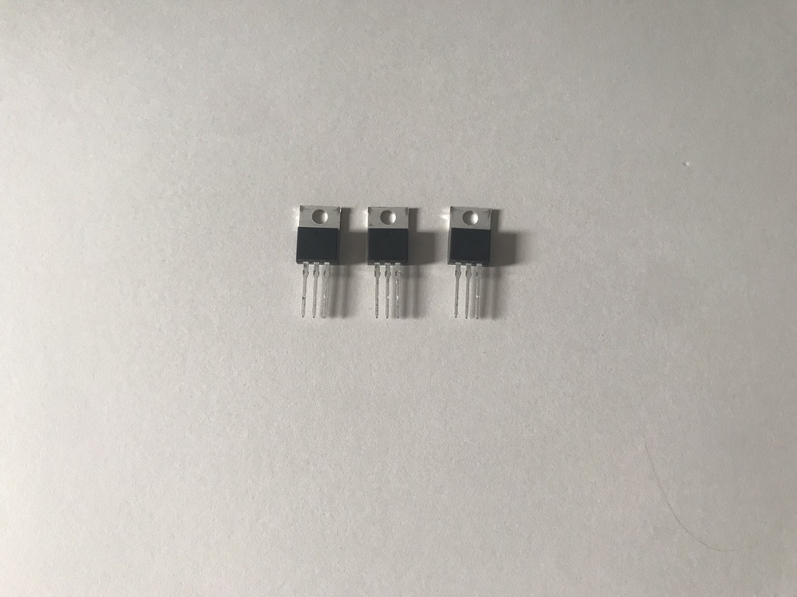
_Three 5V Voltage Regulators_

### LEDs

| Part Number      | Quantity | Datasheet                                                                           |
| ---------------- | -------- | ----------------------------------------------------------------------------------- |
| BL-BZX3V4V-1-B02 | 20       | [Datasheet](http://americanbrightled.com/pdffiles/throughhole/BL-BZX3V4V-1-B02.pdf) |

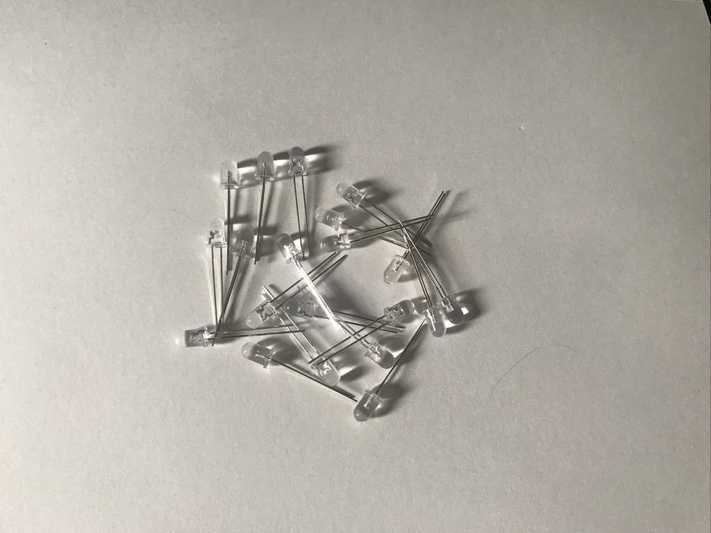
_20 White LEDs_

### Solderless Breadboard

| Part Number | Quantity | Datasheet                                                                                             |
| ----------- | -------- | ----------------------------------------------------------------------------------------------------- |
| TW-E40-1020 | 1        | [Datasheet](https://www.mouser.com/datasheet/2/416/Twin_Industries_Solderless_Breadboards-461560.pdf) |

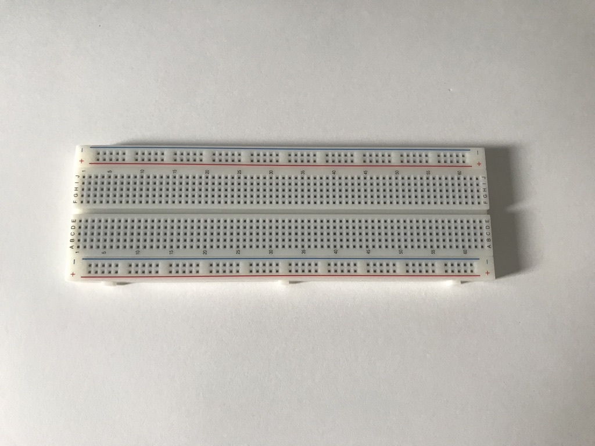
_Solderless Breadboard_

### Resistors

| Part Number      | Quantity | Datasheet                                                                                                      |
| ---------------- | -------- | -------------------------------------------------------------------------------------------------------------- |
| CFR-25JB-52-220R | 25       | [Datasheet](https://www.mouser.com/datasheet/2/447/Yageo_LR_CFR_1-1670055.pdf)                                 |
| CFR-25JB-52-1K   | 25       | [Datasheet](https://www.mouser.com/datasheet/2/447/Yageo_LR_CFR_1-1670055.pdf)                                 |
| CFR-25JB-52-10K  | 25       | [Datasheet](https://www.mouser.com/datasheet/2/447/yageo_yagos02873-1-1745585.pdf)                             |
| 30-81794         | 3        | [Datasheet](https://cdn2.hubspot.net/hubfs/3899023/Interlinkelectronics%20November2017/Docs/Datasheet_FSR.pdf) |

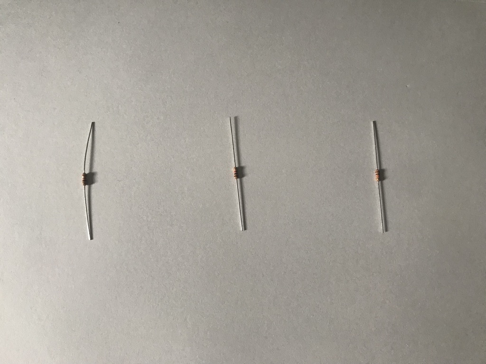
_Resistors (left to right: 220, 1k, 10k OHM)_

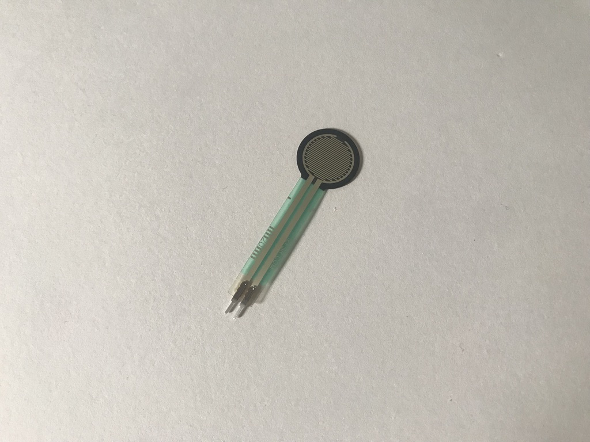
_Force Sensing Resistor_

### Potentiometers

| Part Number       | Quantity | Datasheet                                                            |
| ----------------- | -------- | -------------------------------------------------------------------- |
| P160KN2-4QC20B10k | 3        | [Datasheet](https://www.mouser.com/datasheet/2/414/P160-1545428.pdf) |

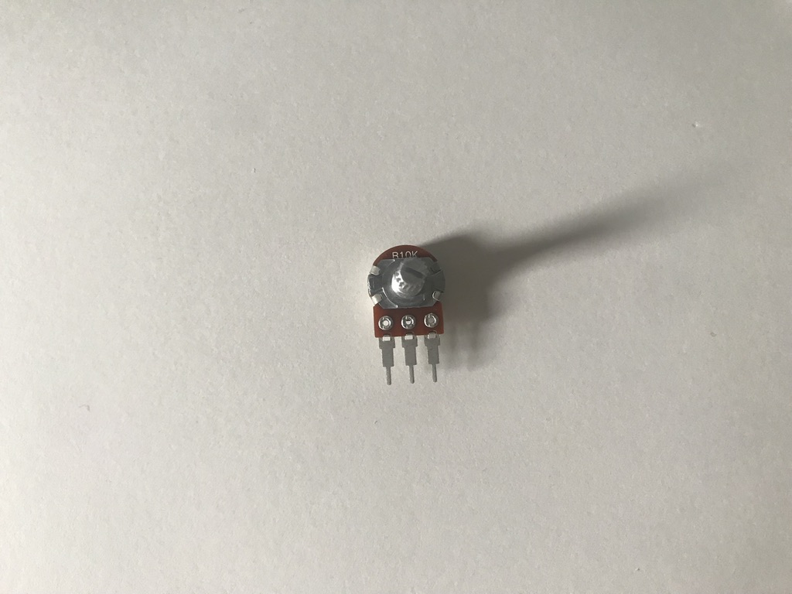
_10k Ohm linear potentiometer_

### Switches

| Part Number | Quantity | Datasheet                                                                             |
| ----------- | -------- | ------------------------------------------------------------------------------------- |
| PRT-14460   | 4        | [Datasheet](https://www.mouser.com/datasheet/2/813/MulticolorButtonModel-1223842.pdf) |

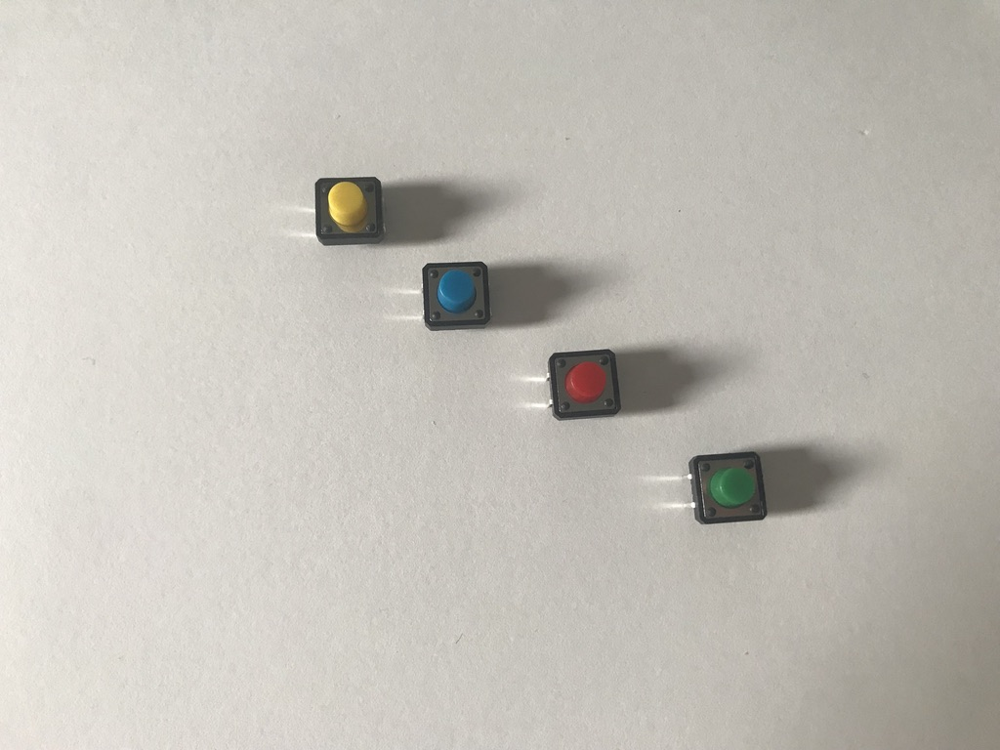
_4 multicolored momentary switches_

### Phototransistors

| Part Number      | Quantity | Datasheet                                                                                       |
| ---------------- | -------- | ----------------------------------------------------------------------------------------------- |
| ALS-PT243-3C/L17 | 5        | [Datasheet](https://media.digikey.com/pdf/Data%20Sheets/Everlight%20PDFs/ALS-PT243-3C,L177.pdf) |

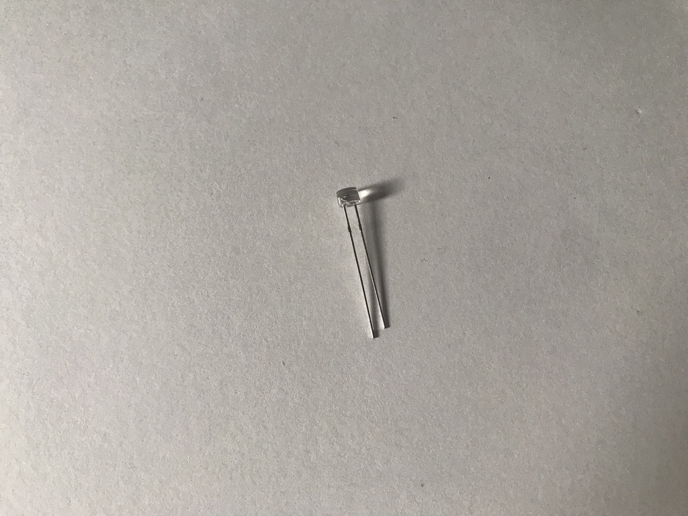
_1 Phototransistor_

### Thermistors

| Part Number      | Quantity | Datasheet                                                                |
| ---------------- | -------- | ------------------------------------------------------------------------ |
| NTCLE100E3103JB0 | 4        | [Datasheet](https://www.mouser.com/datasheet/2/427/ntcle100-1762452.pdf) |

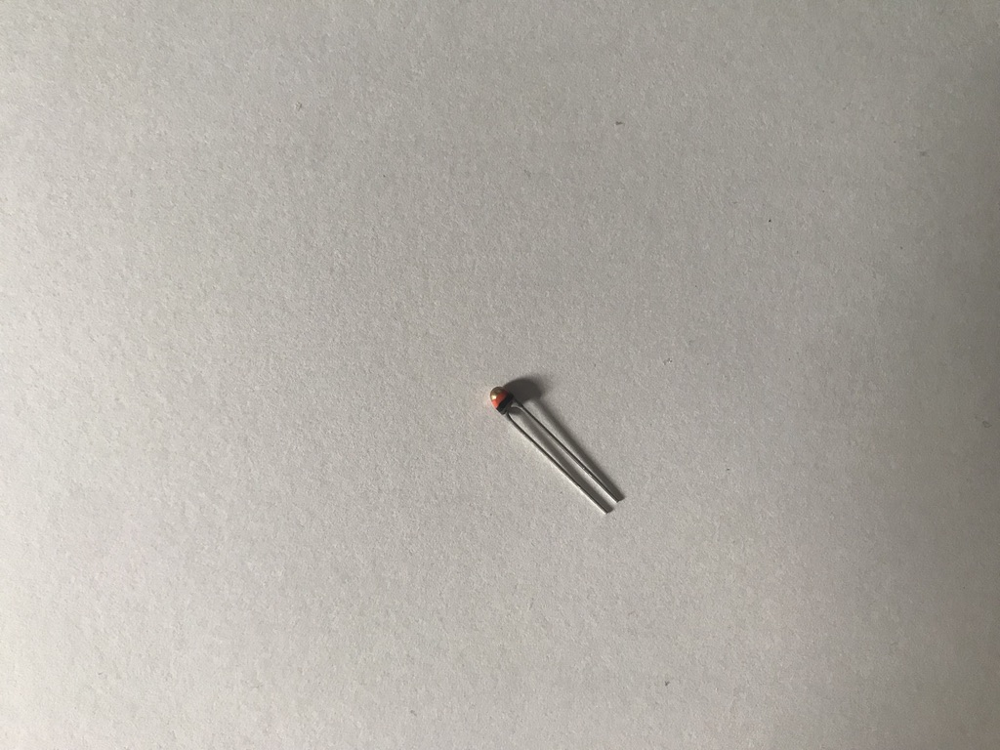
_1 10k Ohm thermistor_

### Diodes

| Part Number | Quantity | Datasheet                                                                                           |
| ----------- | -------- | --------------------------------------------------------------------------------------------------- |
| 1N4001B-G   | 10       | [Datasheet](https://www.comchiptech.com/admin/files/product/1N4001-G%20Thru.%201N4007-G%20RevB.pdf) |

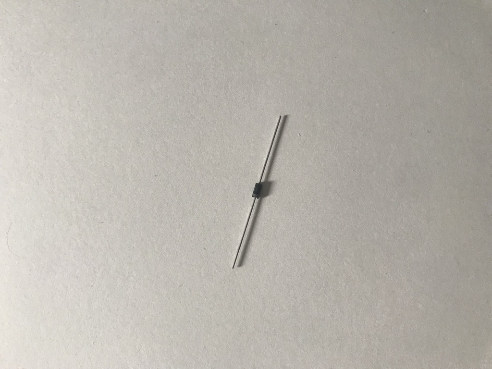
_1 Diode_

### Transistors (?)

NOTE: I am not entirely sure these are transistors since they are not marked as such.
[labeled as semiconductor]?

| Part Number | Quantity | Datasheet                                                                         |
| ----------- | -------- | --------------------------------------------------------------------------------- |
| FQP30N06L   | 5        | [Datasheet](https://cdn.sparkfun.com/datasheets/Components/General/FQP30N06L.pdf) |

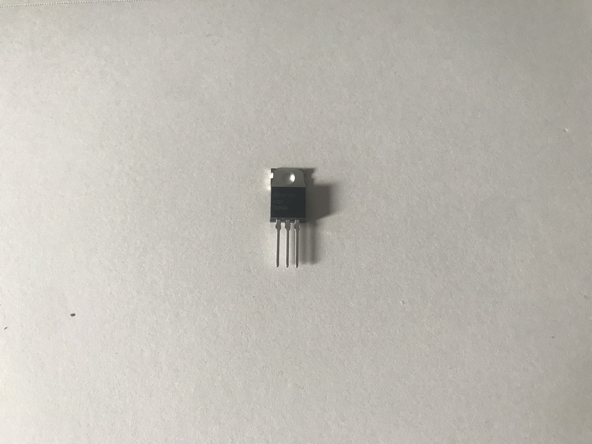
_FQP30N06L_

### Servo Motor

| Part Number | Quantity | Datasheet                                                                            |
| ----------- | -------- | ------------------------------------------------------------------------------------ |
| 1449        | 1        | [Datasheet](https://cdn-learn.adafruit.com/downloads/pdf/analog-feedback-servos.pdf) |

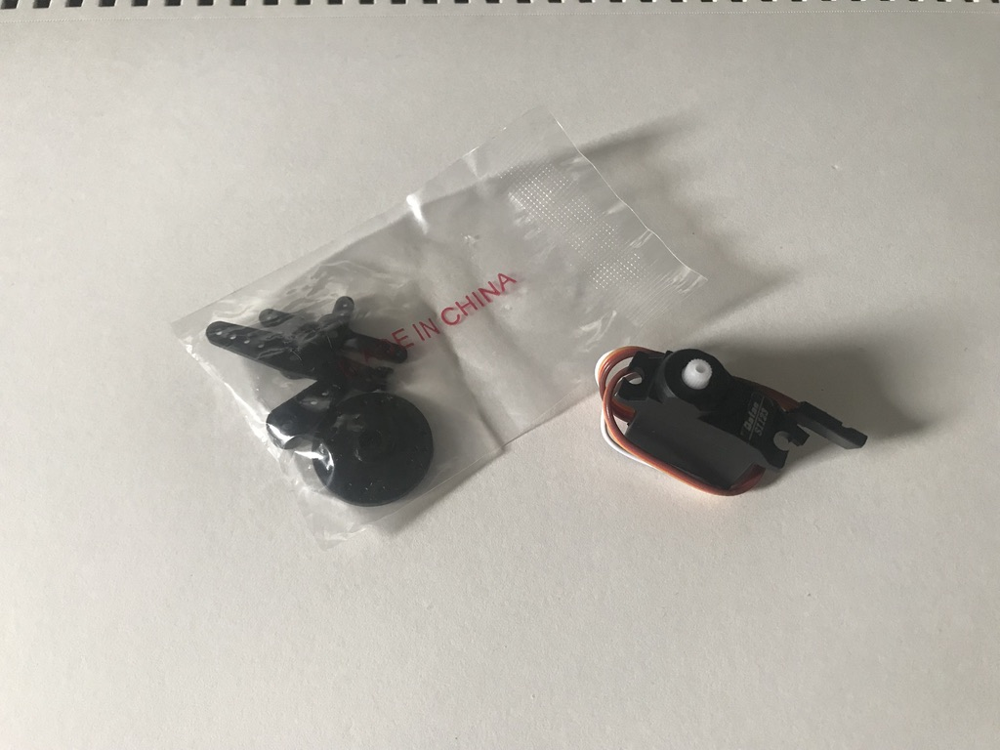
_Servo Motor_

### Speaker

| Part Number | Quantity | Datasheet                                                                             |
| ----------- | -------- | ------------------------------------------------------------------------------------- |
| 1314        | 1        | [Datasheet](https://media.digikey.com/pdf/Data%20Sheets/Adafruit%20PDFs/1314_Web.pdf) |

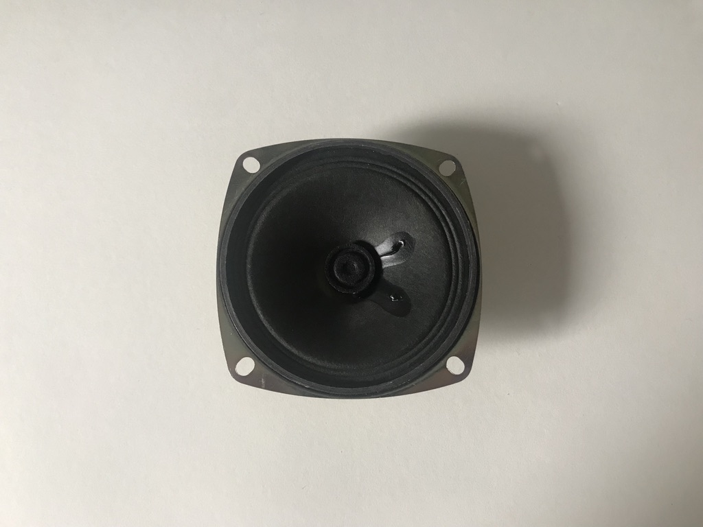
_4 Ohm Speaker_

### Other parts

These parts were included in the lab but I have either not ordered them or not received them: Capacitors, Rotary Encoder,
Photocells,
Power Jacks,
Battery holders,
DC Motor,
Motor Driver,
Electromechanical Relay,
Screw Terminal,
Accelerometer.
