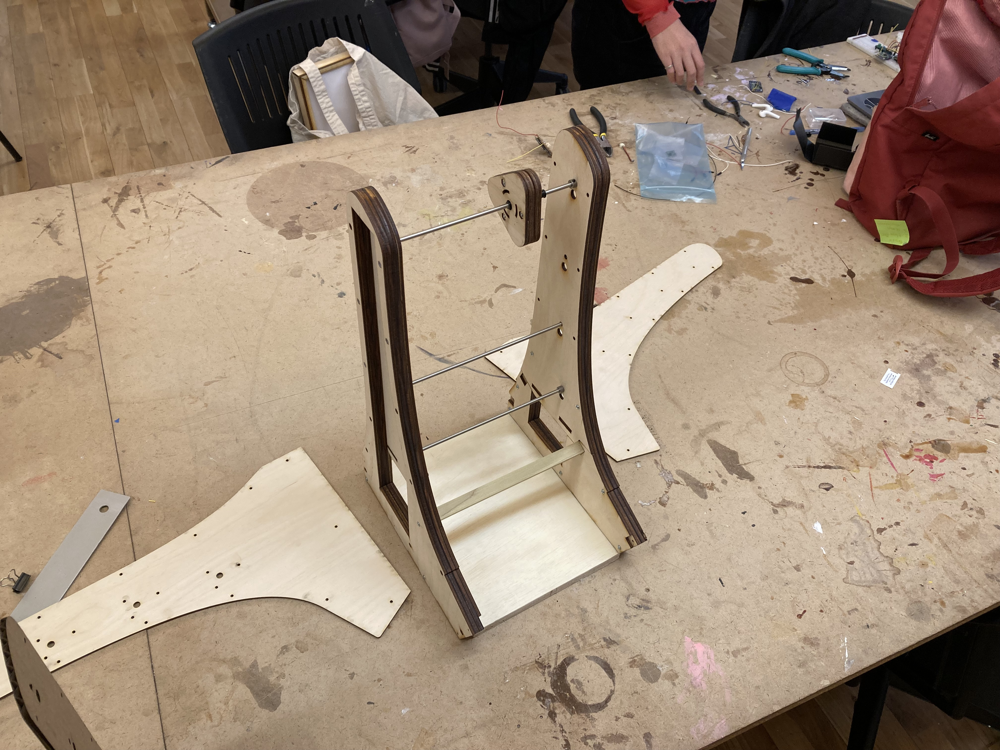

My thesis, the [Abacusynth](/abacusynth-overview), is a synthesizer inspired by an abacus.

## First Prototypes

I began with some scrap wood connected by a steel rod, and I used small breadboards mounted with rubber bands to hold the sensors in place. I was using a time-of-flight sensor to measure distance and a breakbeam IR sensor to measure rotation.

_Early Prototype_

_Prototyping the sensor with a rubber band_

## Designing the Enclosure

I sketched out what I wanted the final enclosure to look like. Initially I wanted knobs on both sides, one to control the waveform, and one to control the volume. This changed pretty quickly, since that added a lot of complexity. I opted for rotary encoders with push buttons so that I could combine multiple controls in a single knob.

_Sketch of the final design_

The first thing to do was to design the walls that hold the sensors and rods. I started with a cardboard rectangle with holes for the sensors: the distance sensor on top and the break-beam on the bottom.

_Testing the sensors with laser cut cardboard_

Once that was working a moved on to wood. The inner section would be removable, since it would not need any electronics -- it would just hold the rods and spinners.

_The first wooden inner section_

I used 1/2" standoffs to connect the inner and outer sections. The PCB boards fit pretty snugly inside.

_Building the wall structure with sensors in between two layers of wood_

## New Design

_Designing multiple layers in Vectorworks_

With the prototype working, I designed the final enclosure in Vectorworks. It consisted of multiple layers of wood that would stack to create the hollow walls.

_Side view of the new design_

The walls would be connected by 1/2" square dowels that I would cut by hand. They would fit within the square cutouts on the inner layer. The base would be 1/2" plywood, also cut by hand. I created a 3d render to make sure everything fit together.

_3D render of the new design_

I then arranged the panels for laser cutting. The inner wall sections would be made up of two 1/4" (really 0.2") pieces and one 1/8" (really 0.12") to add up to just over 1/2", and the outer panels are all on on 1/8" wood.

_Arranging the design for laser cutting_

Time to cut! I started with cardboard to make sure the design worked.

_Laser-cutting the new design in cardboard_

_All of the pieces_

_The assembled enclosure_

_The assembled enclosure -- back view_

_Enclosure with the rods_

_Front panel_

_Ports on the back_

The one mistake I noticed with the cardboard prototype is that I had reversed the PCBs in the design -- the holes for the encoders were closer to the back than the front. Switching this allowed the PCBs to fit and also made the design better by allowing more room for the cables and the interactive pieces to be closer to the user.

## Adding the Electronics

I could now add the electronics and see if everything worked. For more details on this, see the [PCB development post](/abacusynth-pcb-1).

_Attaching the first PCB to the inner wall_

<video controls name="Testing the electronics: Distance, rotation, and encoder" src="IMG_0455.mp4"></video>
<em>Testing the electronics: Distance, rotation, and encoder</em>

<video controls name="Testing with two rods" src="IMG_0456.mp4"></video>
<em>Testing with two rods</em>

_Connecting the wires and the speaker_

<video controls name="More testing" src="IMG_0459.mp4"></video>
<em>More testing</em>

## Final Wooden Version

Now that I was confident in the design, it was time to cut the wood. I taped over it to minimize burn marks.

_Laser-cutting the wood_

_The inner pieces on thicker wood_

The plastic standoffs fit into hexagonal holes in the inner walls, so that the outer walls could both screw in to the same hole.

_Plastic standoffs fit in the inner pieces_

_Inner section made up of three layers_

_The two assembled walls_

_The inner wall -- the large hole is for the wires and the small square holes hold the support beams_

_The front panel is cut out of the thicker wood to allow for a more rounded sanded edge (after sanding)_

_Profile view_

_I wasn't yet set on the front panel design so used the cardboard_

_Side view with the front panel_

_Assembling the removable inner section_

### Drilling it all Together

The inner walls are screwed to the base and the 1/2" dowel support rods. These screws are covered up by the outer wall.

_Drilling the walls to the base_

_Using the laser cut pilot holes_

_Making sure the angle was square_

_The structure connected by the base and square dowel_

_Closer view_

_The outer walls would cover up the screws_

<video autoplay muted loop name="Moving/Spinning is much more firm than with the cardboard prototype" src="IMG_0509.mp4"></video>
<em>Moving/Spinning is much more firm than with the cardboard prototype</em>

One quirk of the design is that the shaft collars holding the rods in place make it a bit difficult to remove the inner section. I had to cut out a slot in the top and glue it to the inner piece so that you could slide out the entire section.

_Cutting slots in the inner wall_

_Fitting rubber in the gaps_

_Glueing the cutout piece to the removable section_

_The notch_

<video autoplay muted loop name="Removing the inner section" src="IMG_0524.mp4"></video>
<em>Removing the inner section</em>

_The old and the new..._

### Sanding

I sanded the visible edges that were burnt during the laser cutting process. This revealed the wood grain and made the surface smooth to the touch.

_Sanding the edges_

_Looks and feels much better sanded_

_Sanding the outer-facing panels_

_Looking pretty good_

## Final Assembly

_Ribbon cables from the sensors_

_Holes for the sensors_

_Adding the spinners to test if everything works_

<video autoplay muted loop name="Testing the build" src="IMG_0530.mov"></video>
<em>Testing the build</em>

_All four spinners attached to the inner section_

<video controls name="All four rods working!" src="IMG_0541.mp4"></video>
<em>All four rods working!</em>

_caption_

<video controls name="Testing with the speaker mounted" src="IMG_0546.mp4"></video>
<em>Testing with the speaker mounted</em>

_The assembled, working enclosure_

_The front face, cut out of the thicker plywood_

_The back panel_

_Closeup of the front panel_

### Encoder Knobs

The final step was to build knobs for the four encoders on the left wall. I started by just sanding a piece of wood to get a feel for the size.

_Sanded cylinder knob_

I then used a drill bit to cut out cylindrical pieces. These were much cleaner and felt/looked nicer, however I needed a connection piece to hold firmly on to the potentiometer.

_Wooden knob v2_

_Four knobs cut from various scrap materials_

For the final design, I 3d printed an insert and laser cut circular layers of wood.

_Encoder insert_

_Half of the knob showing the insert_

_The four inserts_

_I glued the knobs together_

_All four completed knobs_

_The knobs after sanding_

## Finishing and Painting

It was now time to take everything apart so that I could finish the wood and paint the knobs and spinners.

_Ever so carefully removing the electronics_

I used a clear spray-on lacquer for the wood, since I wanted to retain its bright natural color.

_Lacquer for the wood_

I first sprayed multiple layers on to the disassembled pieces.

_Spraying lacquer onto the panels_

I then partially assembled it and added another few coats. I taped off the inner sections that I did not want finished (not pictured).

_The finished enclosure_

I primed the spinners and knobs in white to prepare them for acrylic paint.

_Priming the spinners_

_Priming the knobs_

After everything dried, I added the electronics back in and miraculously everything worked.

_Re-assembling the enclosure_

_The finished front panel_

I painted each pair of sliders and knobs a different color. I didn't really plan out the pallette in advance, but wanted something playful.

_Preparing to paint the knobs and sliders_

_Painting the first one blue_

<!--

_caption_

_caption_

_caption_ -->

_Letting them dry_

_The four spinners attached_

_Everything assembled!_

## Final Result

And here are some nicer photos of the final product!

_Front view_

_Closeup of the spinners_

_Side view_

_Closeup of the red spinner_

_The green spinner in motion_

_Multiple spinners in motion_

_Closeup of the left wall_
