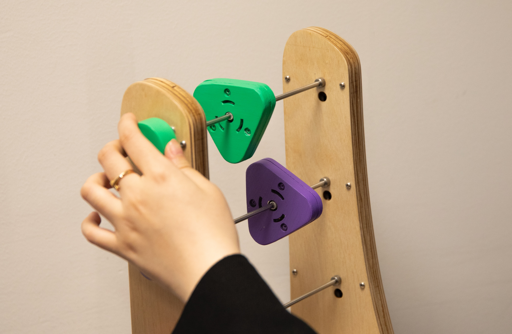
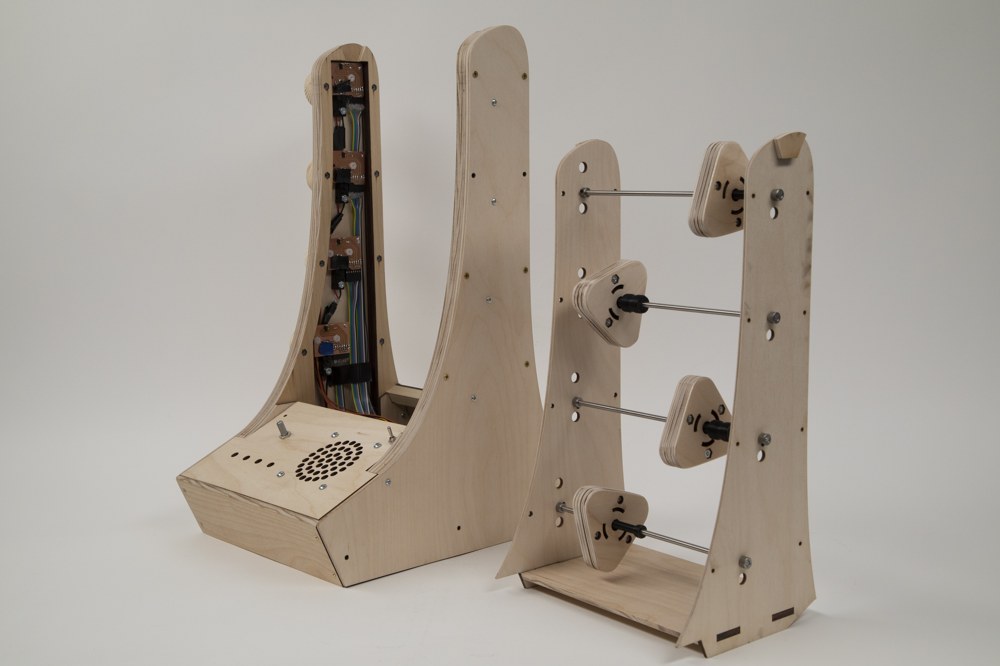

Abacuysnth is a synthesizer inspired by an [abacus](https://en.wikipedia.org/wiki/Abacus), the ancient counting tool used all around the world. Just like an abacus is used to learn the fundamentals of math, the Abacusynth can be used to explore the building blocks of audio synthesis.

For more on the process, check out my posts on the [fabrication](/abacusynth-fabrication), [spinners](/abacusynth-spinner), [electronics](/abacusynth-pcb-1), and [code](/abacusynth-software).

And you can check out a digital implementation of the same idea [here](https://eliasjarzombek.com/abacusynth-plugin).

<iframe width="560" height="315" src="https://www.youtube.com/embed/1lWUlo18B14" title="YouTube video player" frameborder="0" allow="accelerometer; autoplay; clipboard-write; encrypted-media; gyroscope; picture-in-picture" allowfullscreen></iframe>

Abacusynth is a synthesizer inspired by an abacus, the ancient counting tool used all around the world. Just like an abacus is used to learn the fundamentals of math, the Abacusynth can be used to explore the building blocks of audio synthesis. It exists in two forms, one [digital](https://eliasjarzombek.com/abacusynth-plugin) and one physical, that are both based on the same primary interaction: placing and manipulating shapes on rods. The visual and tactile control makes it easy and fun to create rich timbres sounds without having to fiddle with lots of knobs and sliders.

[Timbre](https://en.wikipedia.org/wiki/Timbre) refers to all qualities of a sound that are not its pitch or volume. It is what differentiates different instruments that are playing the same note. Acoustic instruments produce timbre with their physical vibrations and resonances, and you can often adjust it using a modifier – such as the pedals on a piano or a mute for the trumpet.

Synthesizers generate timbre electronically, meaning the control is not limited by any physical barrier. Large panels of controls allow for granular control over timbre, but the complexity can often be prohibitive for beginners (and even tiresome for experienced musicians). The kind of timbral control that synthesizers provide is arguably just as “musical” as melody or rhythm, but it’s not often emphasized for someone learning music.

This is because most synths cater to the “Big C” creator, the professional or virtuoso who requires granular control in order to achieve their goal, and who is either willing or required to learn complex interfaces in order to do so.

My target user is a “little C” creator, someone who is being creative just for the fun of it, and is more interested in feeling good while creating, instead of being focused on the outcome. This type of engagement is just as creative as “Big C”, but is not studied or considered as much when talking about design.

This idea is summed up in a [paper](https://www.galaxykate.com/pdfs/kcompton-dissertation-casualcreators.pdf) by [Kate Compton](https://www.galaxykate.com/), in which she introduces the term Casual Creator to define the class of systems that supports creativity for creativity’s sake. I used the principles laid out in Compton's research to guide my design and development.

Many of the casual creator music making tools out there focus on melody or song creation. My goal was to make an interface that explores synthesis and timbre.

The interface organizes the timbral building blocks in a visual and spatial interface that prioritizes interaction and invites experimentation. My goal with the physical device was to create an instrument that someone could interact with immediately and directly (as opposed to the software where you need a computer + general computer knowledge). And since the original inspiration is a physical object anyway, I already had a sense of how the interactions could translate.

Interpreting the Casual Creator ideas into the physical form meant building a standalone device with a built-in speaker. When you turn it on, it starts making sound so that you can immediately interact with it. As you explore the possibility space, you discover new sounds through your actions.

The encoder controls the discrete options (things that change instantly) – such as changing the waveform or harmonic. The spinning and sliding motions map to continuous parameters that are changed over time.

The spinning interaction takes advantage of physics to illustrate a sonic phenomenon. It’s what sets the interaction apart from any software, so it was the first thing I started developing.

### Modularity

Moving forward, I am thinking a lot about modularity. I designed the inner section to be removable (so it doesn’t have any electronics in it). Theoretically this could be swapped out for another more experimental design (maybe featuring one or two bigger spinners). Additionally, the core concept could be reduced to individual modules that could be stacked or linked together in some way.

### Color

I think the color adds an element of playfulness, but may be leaning too far towards a toy-like aesthetic, so I plan on experimenting with different palettes (since it’s not really for kids). The good thing is that the colored elements are easily replaceable so I could create multiple sets.
