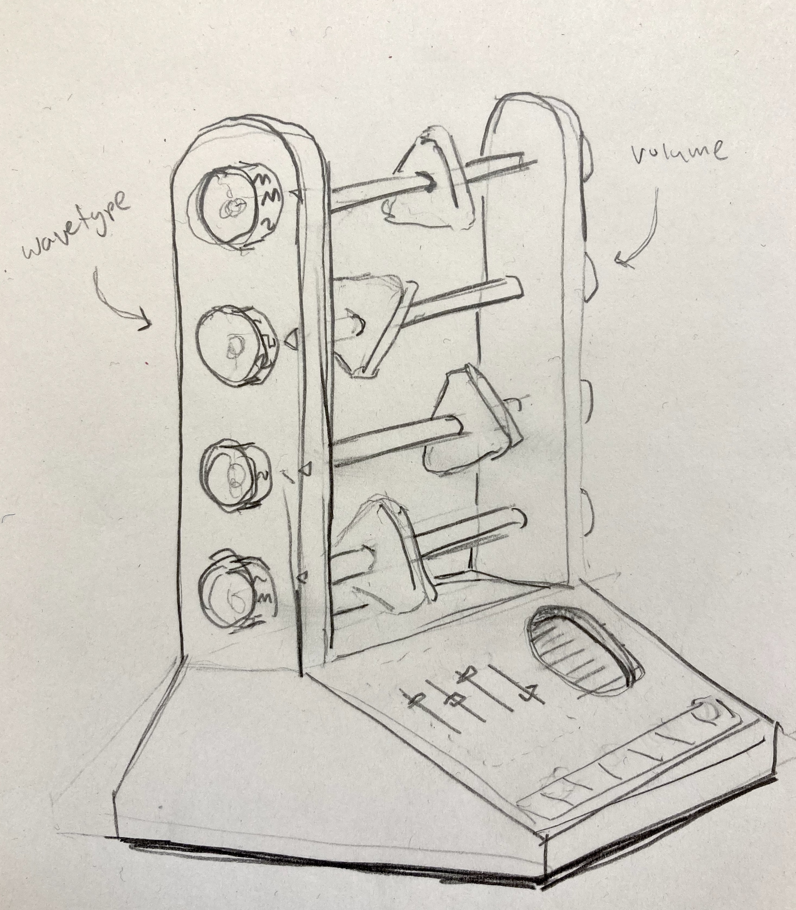

_Sketch of my thesis project: Abacusynth_

For my thesis project I am creating a synthesizer inspired by an abacus. Its interface consists of four rods, each holding a spinning object. These four objects represent oscillators in the synth. A user can spin them and move them left and right along the rod. Each rod needs a distance sensor facing inwards to measure the object's position and an encoder facing outwards which is used to adjust the harmonic of the oscillator and change the waveform. A breakbeam sensor is used to detect rotation, but this is separate from the PCB -- for that I am using [these sensors](https://www.adafruit.com/product/2167).

_PCB Schematic_

_PCB board design_

The board runs on 2.8V -- a requirement of the [VL6180X](https://cdn-learn.adafruit.com/assets/assets/000/037/608/original/VL6180X_datasheet.pdf) distance sensor. It is single sided, since the sensor faces forward and the encoder sits on the back, meaning all connections are on the front. The schematic is pretty simple, including pulll-up resistors for the SDA and SCL connections and capacitors to help smooth the signal.

[Bill of materials](https://octopart.com/bom-tool/UFXsHCWY)

## Milling V1

_The milled board_

To start I milled one board to make sure everything worked.

_Adding the components with solder paste_

I added the components by hand with solder paste and soldered them with the heat gun. I then soldered the larger components with the iron.

_Soldering using a heat gun_

_The back of the board_

Once everything was connected I tested the board by connecting 2.8V power and the sensors to my main board. It worked!

<video controls name="Testing the distance sensor" src="IMG_0392.mov"></video>
<em>Testing the distance sensor</em>

_The board mounted on the inner wall_

The mounting configuration with the breakbeam sensor attached.

_side view_

One limitation I noticed was that the distance sensor picked up on the inside of the wall if it was any thicker than a half inch thick. I had initially thought that the thickness would be a bit wider, giving me more room for the wiring.

_The distance sensor aligns with the hole_

_The other side screws into the board and encoder_

## Multiples

Now that I was sure the design worked, I needed to multiply it x4.

_4 Milled Boards_

The milling went pretty smoothly. Since there aren't too many parts, I added them by hand.

_The soldered components_

I then tested each one by connecting it to my circuit. Out of the four new boards, all but one worked. So I kept my first prototype and soldered the encoders to the 3 new working ones.

_Four working PCBs_

_Mounting the circuits_

I mounted the components fit in the new wooden housing and wired everything up. It was a little tight but everything fit.

_Wiring everything to the main board_
