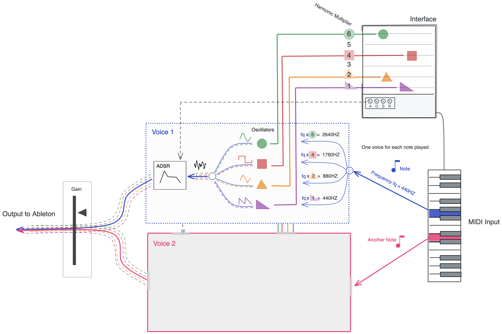
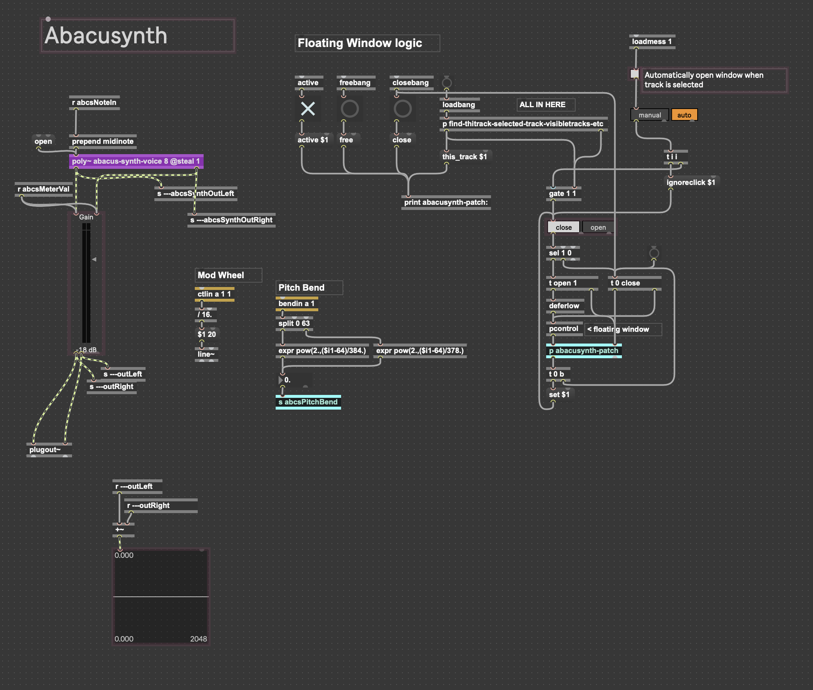
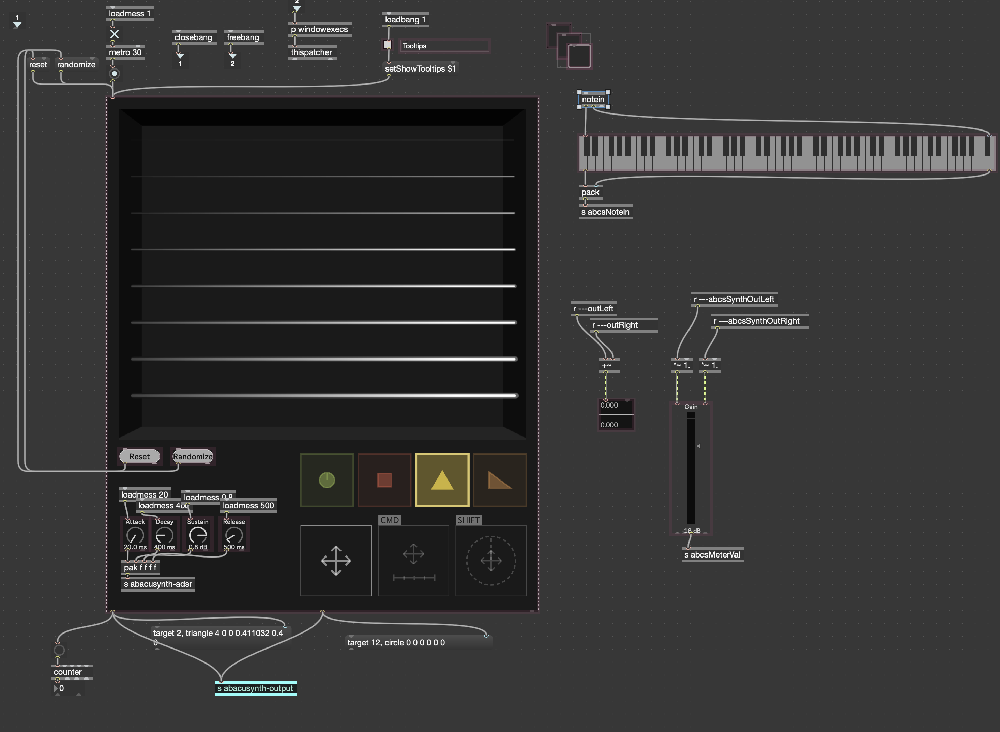
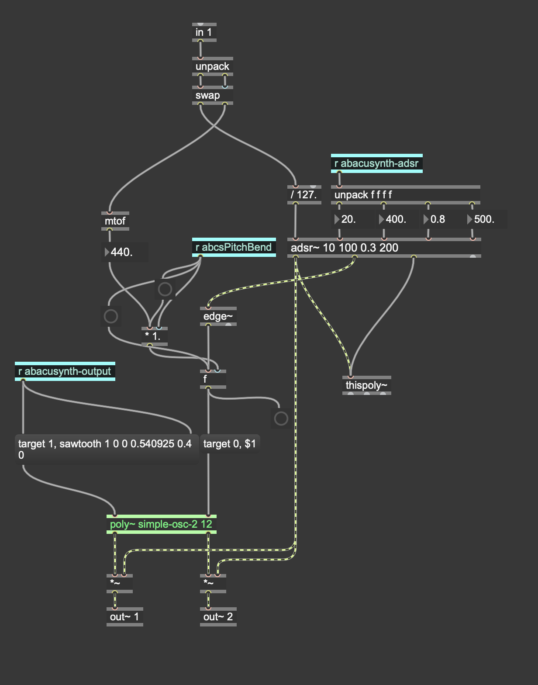
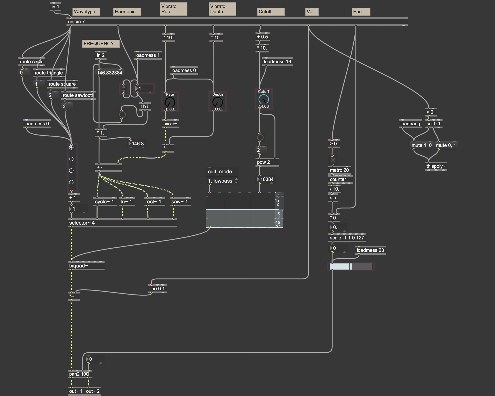

<iframe width="560" height="315" src="https://www.youtube.com/embed/b5UOwJX5gpk" title="YouTube video player" frameborder="0" allow="accelerometer; autoplay; clipboard-write; encrypted-media; gyroscope; picture-in-picture" allowfullscreen></iframe>

The Abacusynth is a polyphonic synthesizer plugin for Ableton Live. After creating the [initial version](/nature-of-code-oscillation/) using JavaScript, I wanted something that could be used as a part of the music making workflow because I liked the variety sounds that you could achieve with the device.

The interface is inspired by an [abacus](https://en.wikipedia.org/wiki/Abacus) in that the interaction centers around placing shapes on rods. My goal was to create a new way of visualizing synthesis that makes it easy to create rich sounds without having to fiddle with a lots of intimidating knobs and sliders.

## How it Works

A shape represents an oscillator. The rod it is on represents its [harmonic](https://en.wikipedia.org/wiki/Harmonic), so shapes on the lowest rod will oscillate at the fundamental frequency, those on the second rod will oscillate at twice the fundamental, etc. The type of shape (circle, square, equilateral triangle, right triangle) represents its waveform (sine, square, triangle, sawtooth, respectively).

In this diagram we see that four shapes have been placed using the interface. This means that four oscillators are active for each note played. The incoming frequency (the blue note) is multiplied based on the rod that the shapes are located, and the different types of shape produce different waveforms (as described above). The shape-specific effects also modulate the sound here -- these are described in detail below. The four signals are then combined and fed through the [ADSR envelope](<https://en.wikipedia.org/wiki/Envelope_(music)>), the parameters of which are controlled through the interface, and then sent to the output. This process happens for each "voice" of the synth. A voice only operates on one fundamental frequency, so multiple voices are required if we want to play more than one note at the same time -- this is called polyphony. The gray "Voice 2" box is meant to represent the same exact process as Voice 1, but for a different note.

### Effects

Each shape/oscillator also has several parameters that can be adjusted. This is done by dragging the shape while holding modifier keys.

In this video I demonstrate the modulations you can adjust on a shape.

<iframe width="560" height="315" src="https://www.youtube.com/embed/gvGFZSzaMGs" title="YouTube video player" frameborder="0" allow="accelerometer; autoplay; clipboard-write; encrypted-media; gyroscope; picture-in-picture" allowfullscreen></iframe>

Moving a shape left or right on the rod adjusts the cutoff frequency of a low pass filter so shapes on the left sound "darker" and shapes on the right sound "brighter". This effect reflected in the UI by displaying the rods as a gradient from dark to light. It's subtle but the shapes themselves also become lighter as you drag them to the right.

SHIFT+Dragging a shape lets you control its volume, as represented by size, and stereo pan effect, as represented by spin/rotation.

CMD+Dragging lets you adjust a shape's [vibrato](https://en.wikipedia.org/wiki/Vibrato), as represented by a ruler of varying length and divisions.

Though I really like the sounds you can make with this design, there are inconsistencies that I would like to keep exploring alternatives to. Since pitch is represented on the Y axis with the rods, it would make more sense for the vibrato effect to be moving up and down instead of side to side. Since it is moving side to side, you might think that it should be modulating the filter cutoff.

The reason I chose these specific effects is because when combined, they facilitate wide, rich sounds. I stuck with two modifier keys because I did not want to overload the user with too many parameters. In theory I could add up/down motion to modulate pitch but since there is not that much space on that axis, the interface would become extremely busy. I would like to explore modulating the frequency or even allowing the user to "plug in" different targets for modulation.

## The Code

The code in its current state is on [GitHub](https://github.com/ejarzo/abacusynth-m4l). Please note there are a few files in the directory that are not in use.

The device is written in Max, a visual coding language now integrated with Ableton Live. The [user interface](https://github.com/ejarzo/abacusynth-m4l/blob/master/abacusynth-max.js) is written in Javascript using a JSUI max object and is ported from the [web version](https://github.com/ejarzo/abacusynth) I created. See [this post](/mixd-timbre/) for more about the early process.

_The main patch_

The main patch contains logic for instantiating the synth voices and UI, sending parameters to the UI, sending the output to live, and code for managing the floating plugin window, modified from [this forum post](https://cycling74.com/forums/floating-window-2/replies/1#reply-58ed206fc2991221d9cc2d68).

_The UI Patch_

The UI patch is the floating window that the user interacts with (in presentation mode). It handles note in events and sends the gain and ADSR parameters to the synth. Most importantly it sends messages as the user interacts with the JavaScript interface.

_The Synth Voice Patch_

The Synth voice patch is a poly~ object that receives messages from the UI. It uses the shape messages to the manage the oscillator voices and uses the ADRS values to control the output. I used [this tutorial](https://cycling74.com/tutorials/polyphonic-synthesizer-video-tutorial) to help develop the polyphony logic seen here. It also receives pitch bend from the main patch which it sends to the oscillators.

_The Oscillator Patch_

The oscillator patch is where the sound is created. It contains logic for creating the different oscillator types and modulating their pitch for the vibrato effect as well as a stereo pan effect and a filter. The harmonic multiplier is used here to multiply the base frequency.

## Next steps

There are several bugs I discovered after user testing the device. The most problematic is that using multiple synths in the same Ableton project causes them to interfere with each other. This is due to the usage of the 'send' object which I need to fix so that it is only sending information within the patch and subpatch, not globally.

Ideally I would also like to tweak the drag mechanics so that the difference between up/down and left/right is more clear.

I also need to add the ability for the device to save its current state. Right now when you quit and re-open Ableton, the device will clear because it has no way of remembering the state is was in. Once I add that logic I should be able to create curated presets and the ability to save custom presets as well.

Once all that is done I hope to "release" the device and try to get more musicians to use it!
