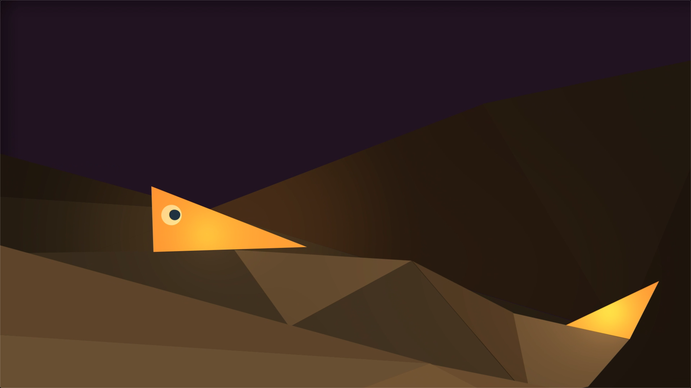
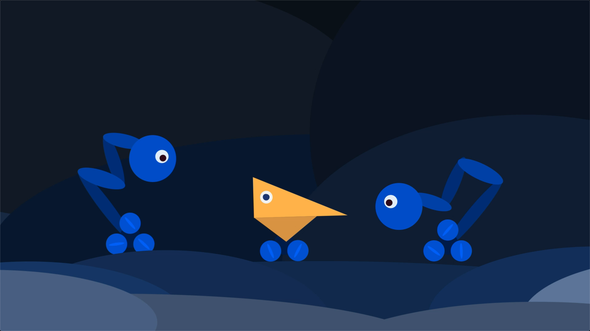
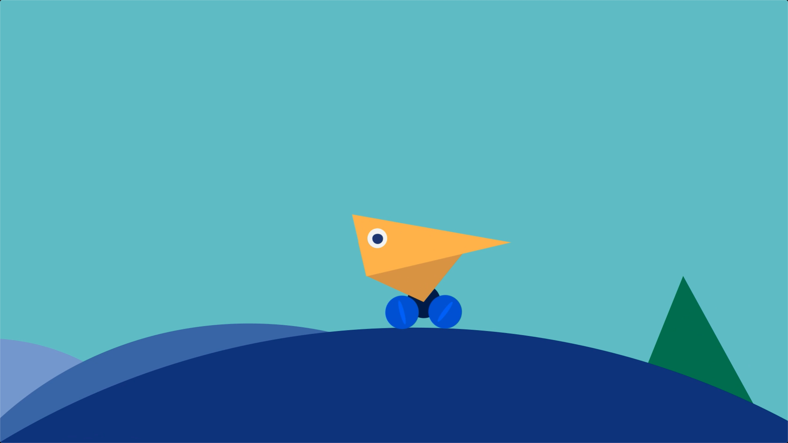
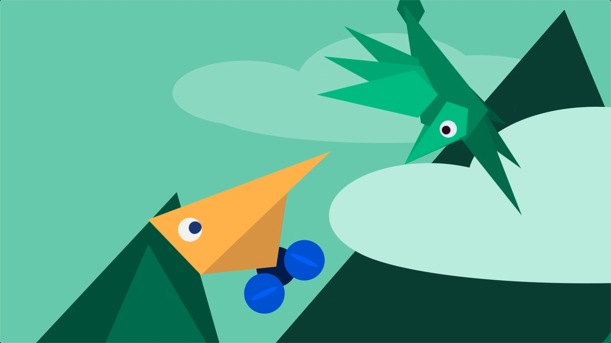
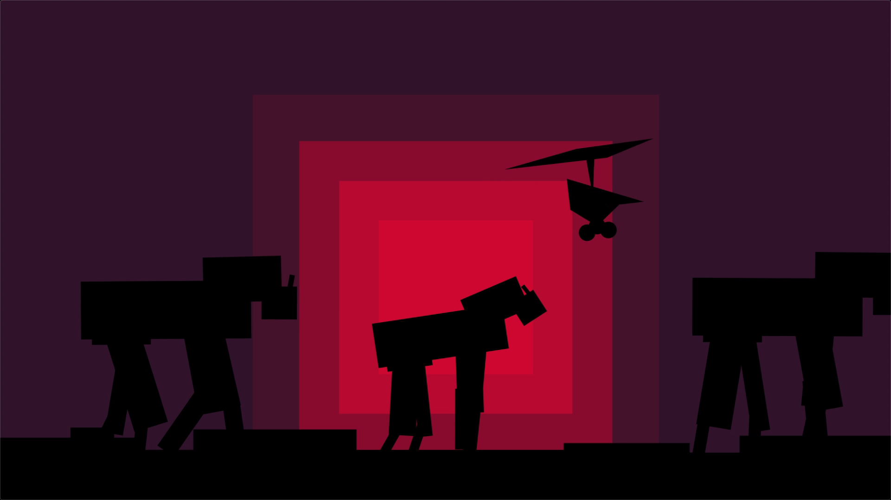

<iframe src="https://player.vimeo.com/video/483319830?color=eae6de" width="640" height="463" frameborder="0" allow="autoplay; fullscreen" allowfullscreen></iframe>

My animation tells the story of a ◣ who navigates a geometric world with the help of some friends. My [initial idea](/animation-project-1-progress) changed somewhat as I developed the scenes. Instead of having the main character build a body, it made more sense for the story to have characters help by presenting new parts that allow for a new way of moving. It also simplified things as I did not have to rig a complex form.

This project was mainly an exercise in the basics of animation and After Effects. I learned a lot about using null objects to achieve the motion I wanted and enjoyed tying the scenes, characters, and backgrounds together thematically.

There is still a lot I want to learn especially around looping and automating -- for example, writing an expression to rotate wheels based on the speed of the parent. I also want to get better acquainted with the effects, though I'm glad I kept things simple for this first project. Unfortunately I did not get the chance to add sound -- I think music and effects would really bring out the liveliness of the action.

