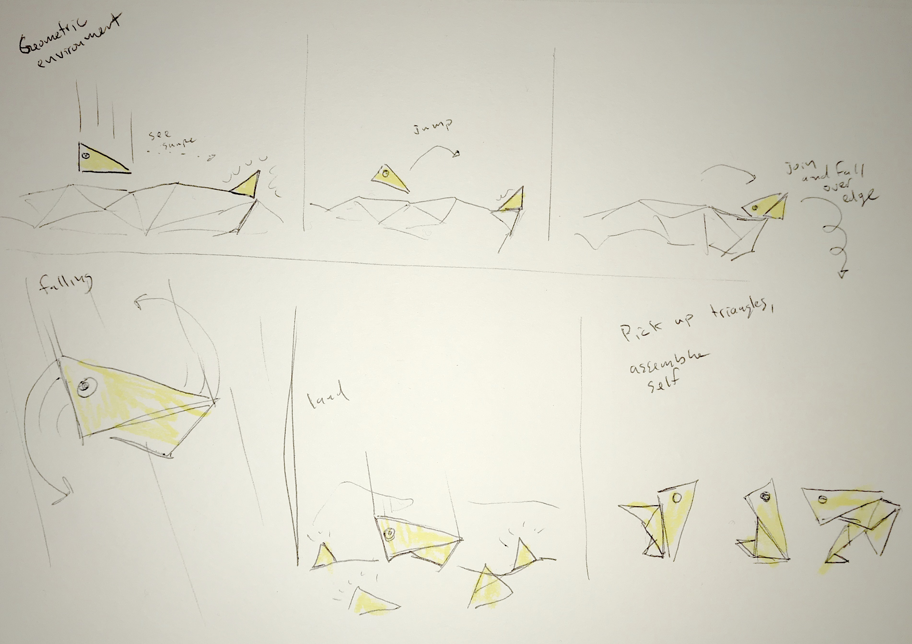
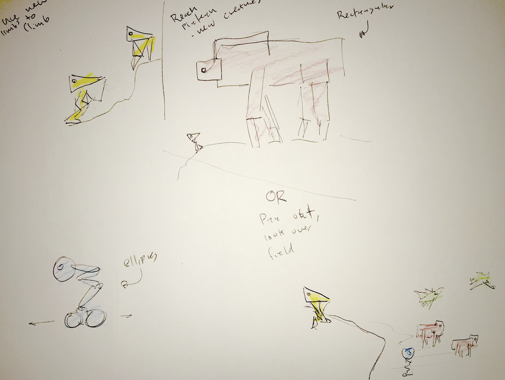
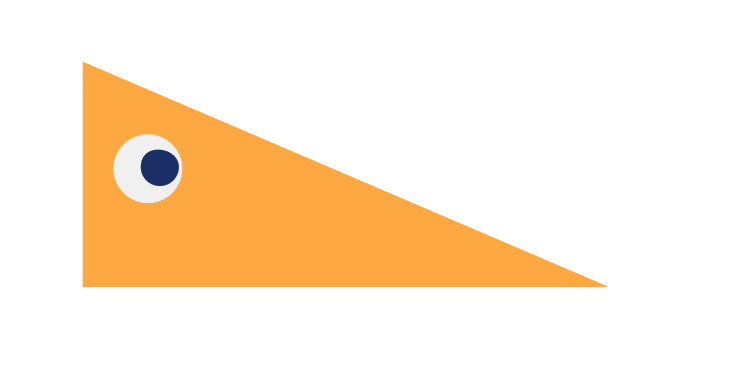
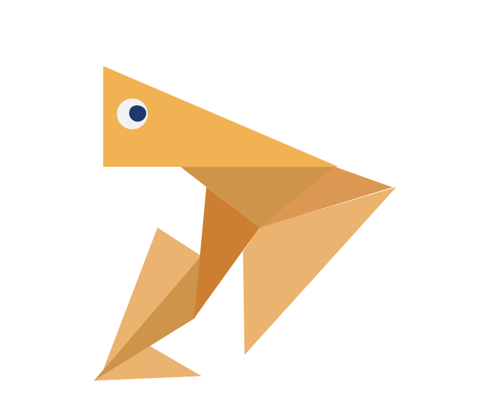
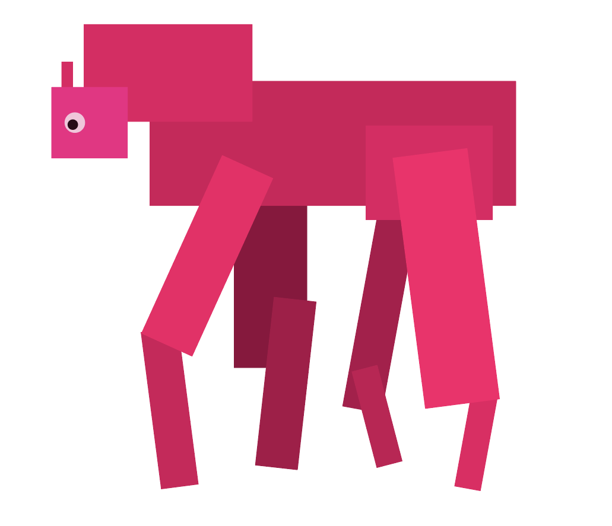
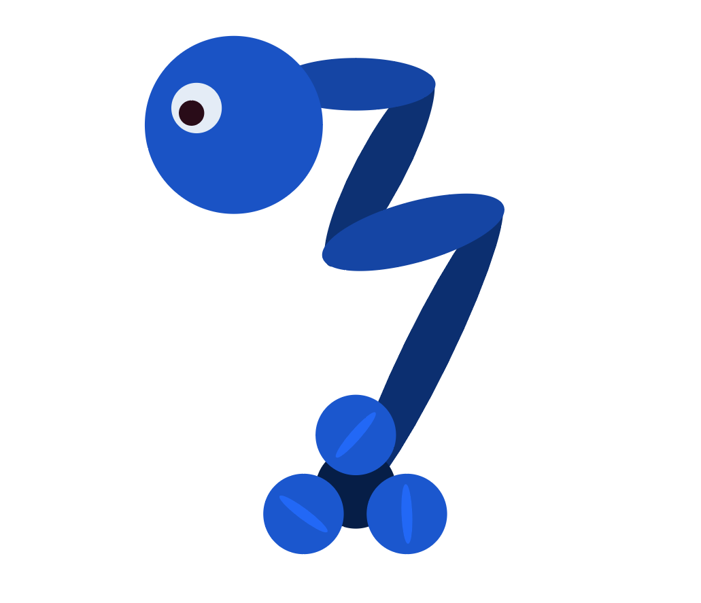
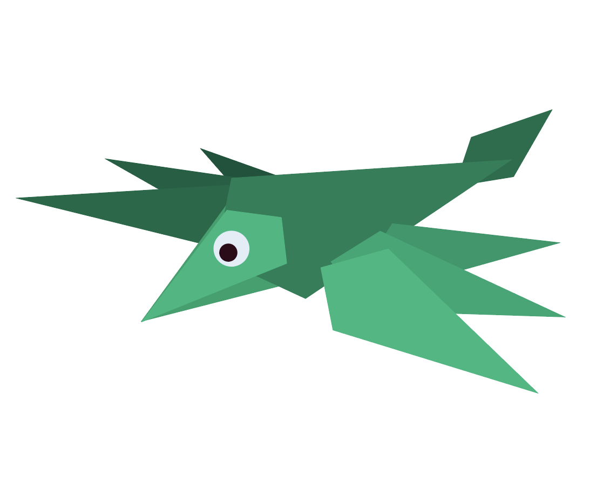
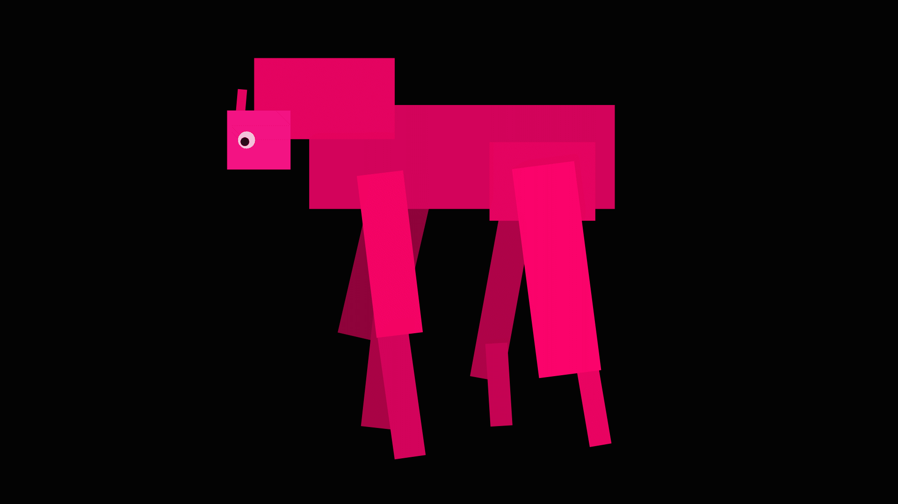

For my short animated video I am exploring how basic shapes can be dynamically combined to create new forms and motions. The story follows a triangular character who builds a body from pieces of the environment. I have fleshed out my story board since my [initial post](/animation-storyboard/) and worked on developing the characters and preliminary animations.

# Storyboard (updated)

In the storyboard the main character (who I will call "T") appears in a geometric environment and notices a glowing triangle on the edge of a cliff. T jumps and rolls towards it, joining with the new part but tumbling off of the side, eventually landing in an area surrounded by more yellow triangles that are used to assemble a body.

_Storyboard pt1_

The new limbs allows T to climb out of the pit and encounter a large number of other geometric creatures -- each with a different "base component" (ie rectangle, circle, diamond).

If I have time I wanted to have the main character become a mix of the different shapes by traveling through the different habitats -- one environment for each type of character.

_Storyboard pt2_

# Characters

_The main character, T_

_One possible configuration for the main character_

_Red quadruped made of rectangles_

_Blue rolling creature made of ellipses_

_Green "bird" made of diamond shapes_

# Preliminary Animation

I started with the intro sequence, focusing on trying to make the character feel life-like. I also added a basic 2.5D environment with a camera to produce the parallax effect.

<video muted autoplay loop name="Intro sequence" src="intro-sequence.mp4"></video>
<em>Intro sequence</em>

I also started working on some of the other more developed characters. For the quadruped I used a horse's walk cycle for reference.

