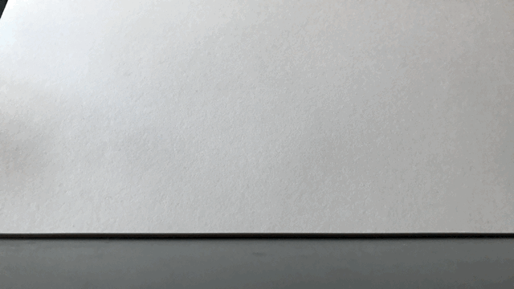

For my stop motion GIFs I wanted to animate a character walking. Using two action figures I had lying around, I first attempted to free-hand the motion. The results were quite zombie-like.

I then looked up [character animation techniques](https://founderu.selz.com/wp-content/uploads/2013/11/WalkingSheet-animation-methods.jpg) and modeled the characters more carefully based on the keyframes in the reference I found. The result was much a much more natural gait.

This was an informative exercise in learning how the body moves and I look forward to trying out more kinds of movement!
