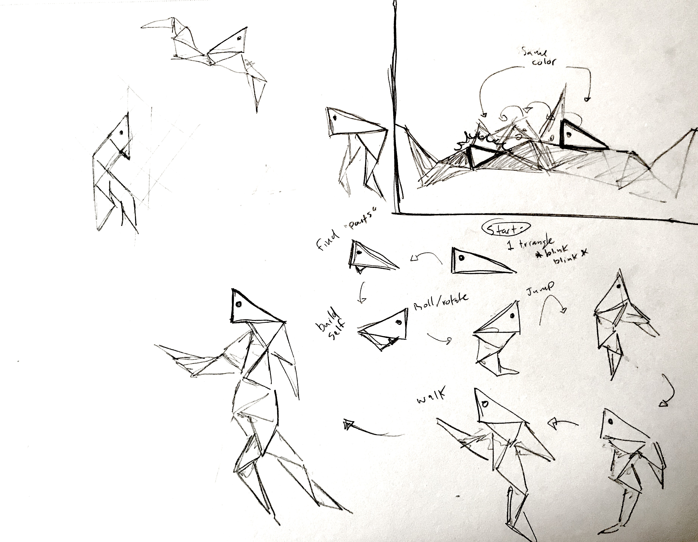

_Sketching and storyboarding the character_

For my short animation I aim to explore how forms can be broken down in to their constituent geometries. I will create a sequence in which a triangular character builds itself a body out of other triangles and learn how to move and walk. I was inspired by the [_Bottle_](https://vimeo.com/12155835) stop motion we saw in class where two amorphous forms become more expressive by taking and sharing items from their surroundings. In my film I will just have one character that finds and attaches parts of the environment to itself in order to create a more complex form so that it can perform more complex tasks.
