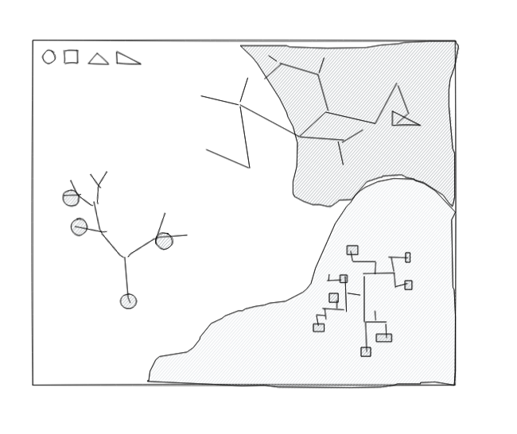
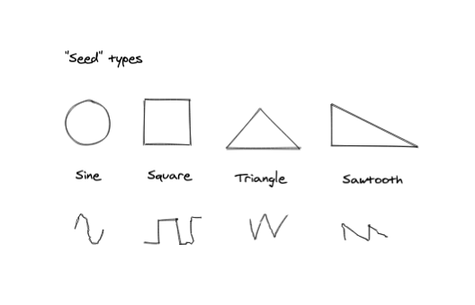

# Musical Garden

For my final project I am hoping to create a "musical garden" that allows someone to create sound by tending to musical forms resembling plants. I initially wanted this experience to be in 3D but think 2D is more feasible and will work fine as a first iteration.

_The UI will portray a plane with different ground materials_

The interaction will focus around "planting", "watering", and maybe "pruning". There will be several initial "seed" types representing different base waveforms -- circle for sine, square for square, and two types of triangles for sawtooth and triangular waves. These seeds can be planted at any place on the plane where they will grow into melodies and textures. The type of "soil" on which they are planted will affect how they sound.

_The different seed types -- sine, square, triangle, sawtooth_

The mouse will act as the "audio listener", so you will hear the different musical plants as you move the cursor around. I will use L-Systems to generate the visual growth and possibly MusicRNN to help generate melodies. The concept of time will be important -- I want to give control over how fast the plants will grow so that you can experience it as a slowly evolving ecosystem but also see how things progress without having to wait too long.

"Watering" will enrich the timbre of the sound, adding more harmonics and effects to differentiate from the base oscillator sound. If I have time, "Pruning" would be an interesting mechanic to explore -- it could allow you to manually adjust the melodies to your liking. It would also be nice to incorporate the concept of sun light but that will likely have to wait until the next iteration.
