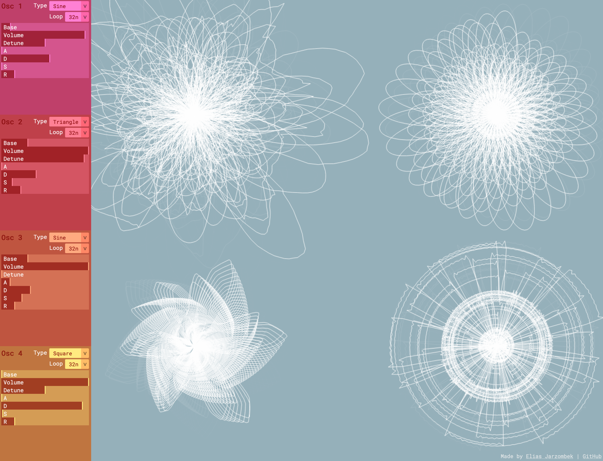
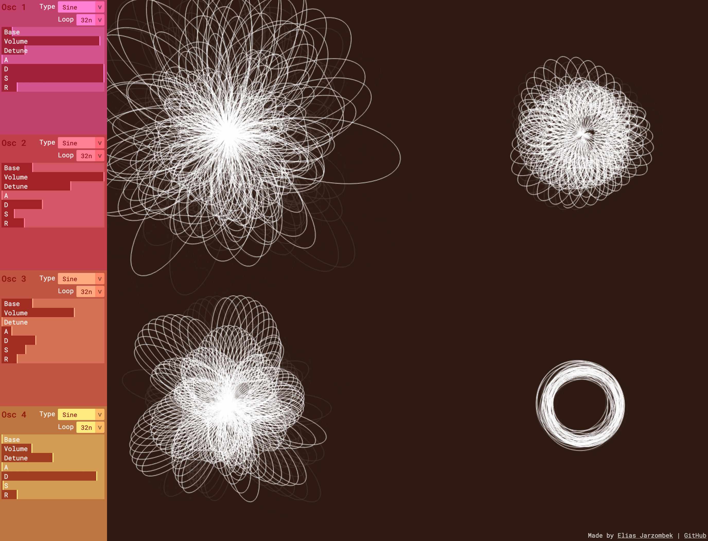
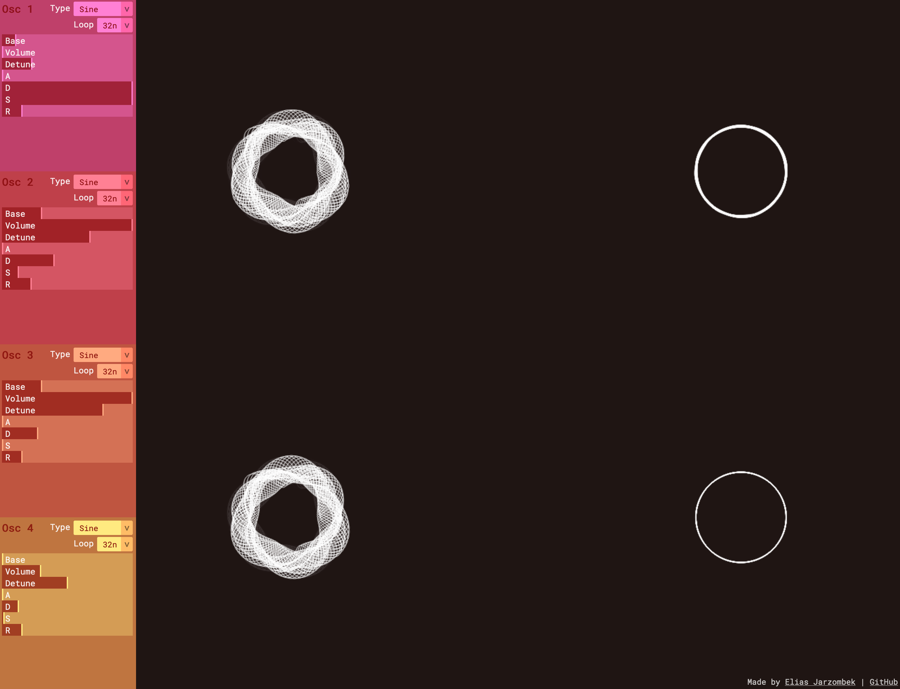
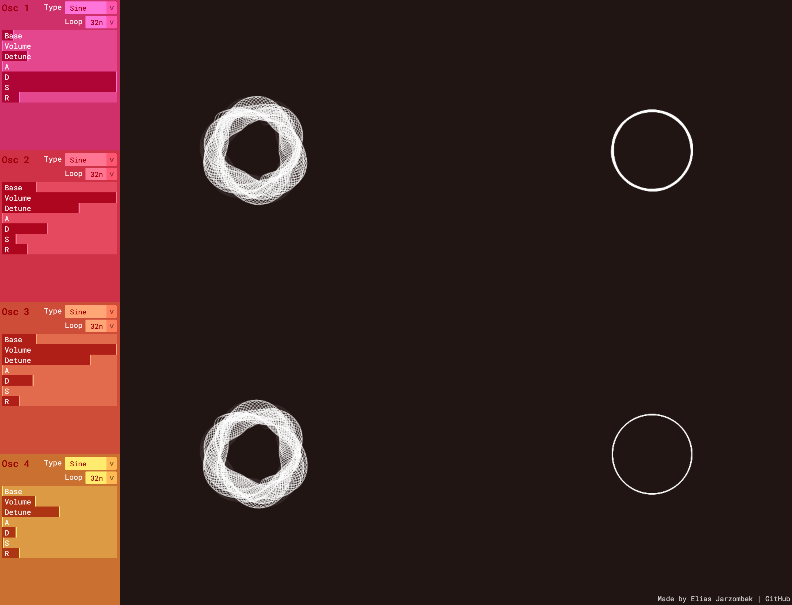
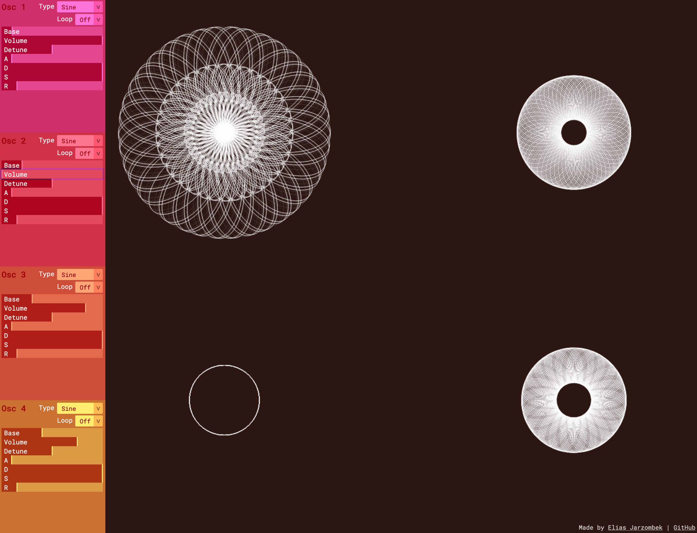
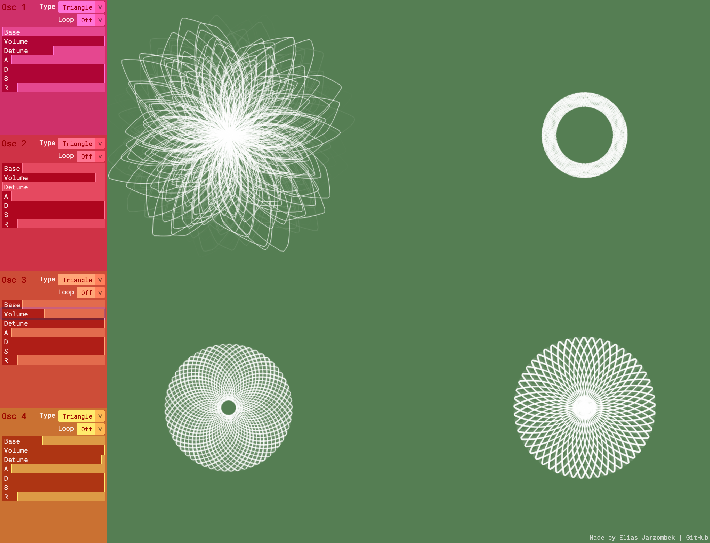
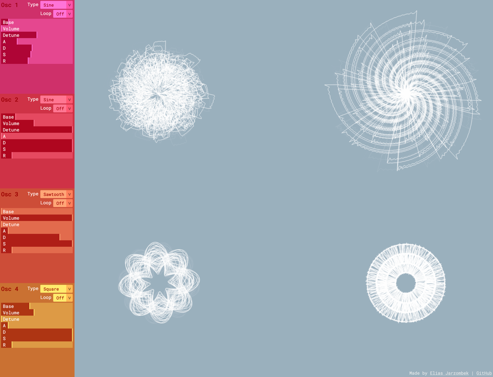
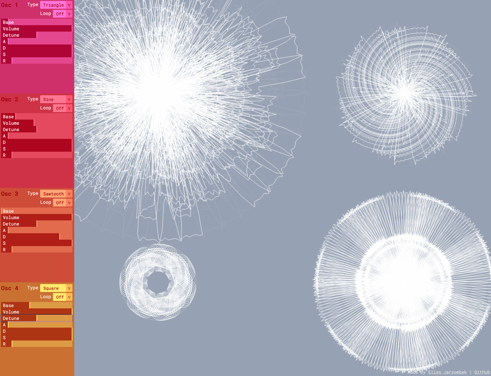
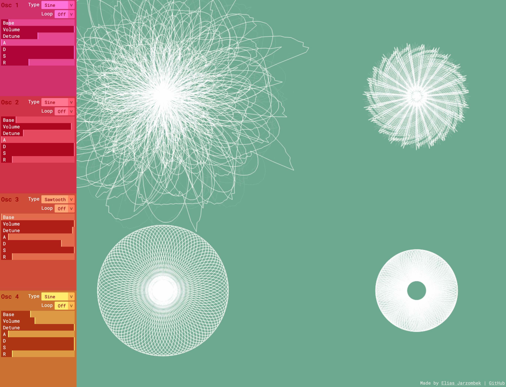

<iframe src="https://player.vimeo.com/video/468989364" width="640" height="480" frameborder="0" allow="autoplay; fullscreen" allowfullscreen></iframe>

For my melody study I extended my previous project, an [Additive Synth](/code-of-music-timbre-study), by adding visualization and control over the synth's tuning. Each oscillator's waveform is graphed in a circle. Since all oscillators route through the first oscillator, the top left graph represents the sum of all four - the output waveform.

You can control three synth voices to make chords and switch between [Just and Equal temperaments](https://pages.mtu.edu/~suits/scales.html) to see and hear how they are different. It is especially noticeable on the tonic chord, in this case A Major. There are audible pulses with Equal temperament, whereas Just temperament produces a smooth harmony. You can clearly see this in the graphs as they go from fluctuating to very even.

[Try it out](https://deploy-preview-1--additive-synth.netlify.app) or [view the source](https://github.com/ejarzo/additive-synth/pull/1).

