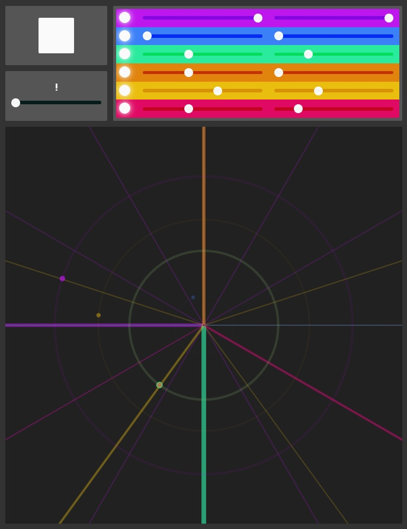

<!--  -->
<!--
 -->

<video style="width: 100%; max-height: none" controls name="Drum Radar capture" src="drum-radar-capture.mp4"></video>

The [Drum Radar](https://drum-radar.netlify.app/) is a drum machine that visualizes rhythm as circles and spokes. Each drum track plays at constant rate in a circle, 'hitting' spokes as it passes to trigger its sample. For each drum sound you can control how big its radius is (how long the loop lasts) and how many divisions it has (how many times it will play during that loop). This allows for some interesting combinations of synced and freeform polyrhythms.

[Try it out](https://drum-radar.netlify.app/) or [view the source](https://github.com/ejarzo/drum-radar).

I like the simplicity of the device, but there are a few things I am considering adding. It would be nice to control the offset of the loop because right now all loops start at 0 (the "up" position). This could be another slider that just controls the rotation of the initial point. I also thought it would be good to add a way of controlling the accents/volume of individual spokes to add some dynamics. A few other nice-to-have features would be an overall tempo control and the ability to swap out samples.
