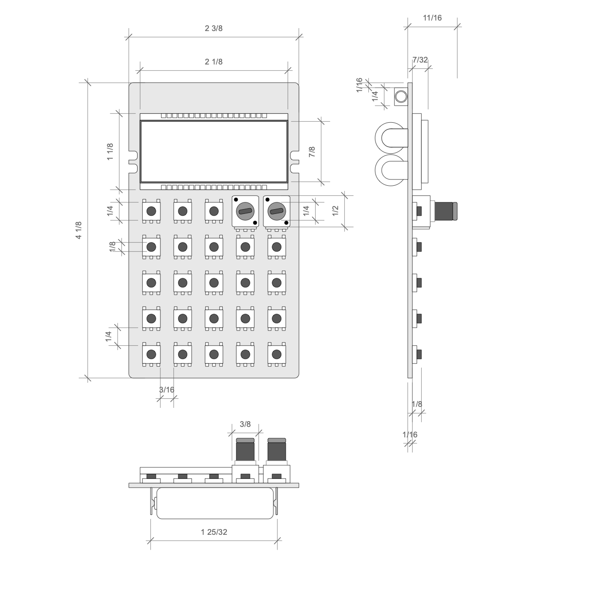

This week I created a 2D rendering of a [pocket operator](https://teenage.engineering/products/po) that I have.

_The device and ruler I used_

Using a ruler I measured the device and rendered it in VectorWorks, mostly by inputting the dimensions for the different components.

I created symbols for the buttons and potentiometers and used the duplicate array function to lay them out in the grid.

The two exports show the rendering with and without dimensions.

_The rendering without dimensions [View PDF](pocket-operator-drawing-no-dims.pdf)_

_The rendering with dimensions [View PDF](pocket-operator-drawing.pdf)_

A couple things that are missing from the rendering are the twisted wire stand that folds out, and more detail on the structure holding the batteries in place.
