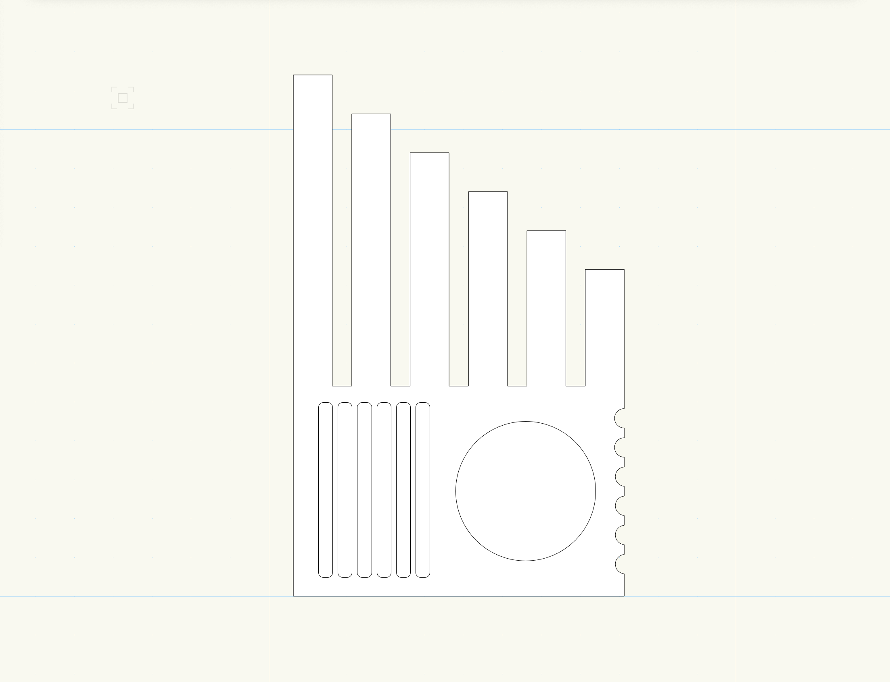
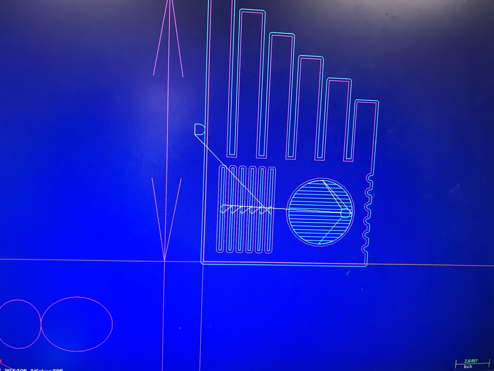
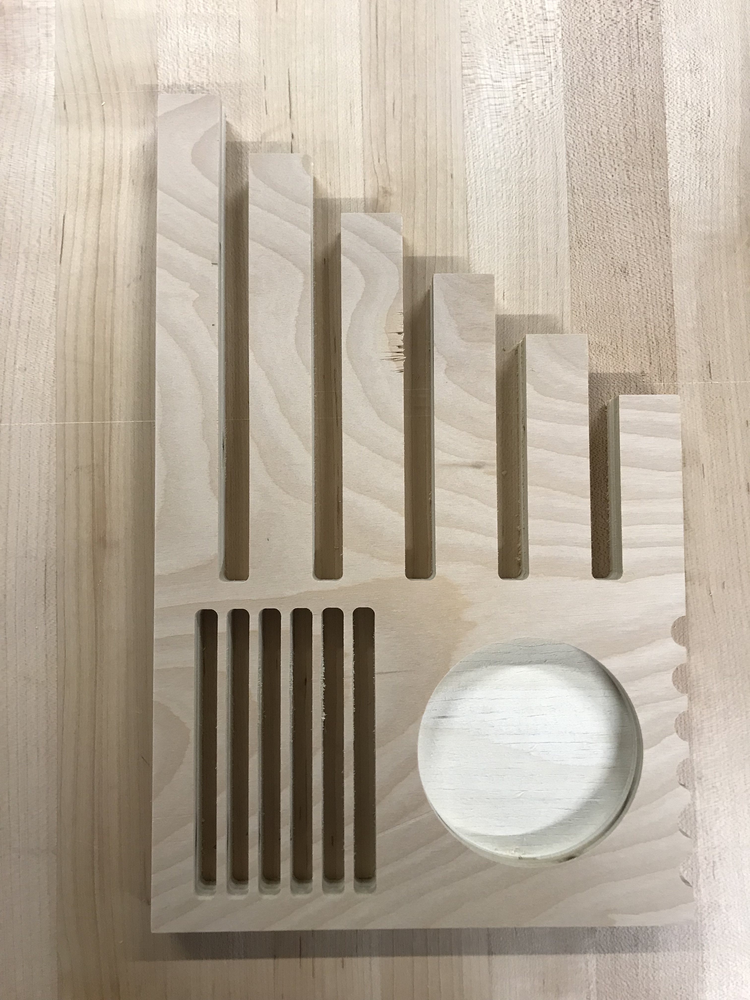
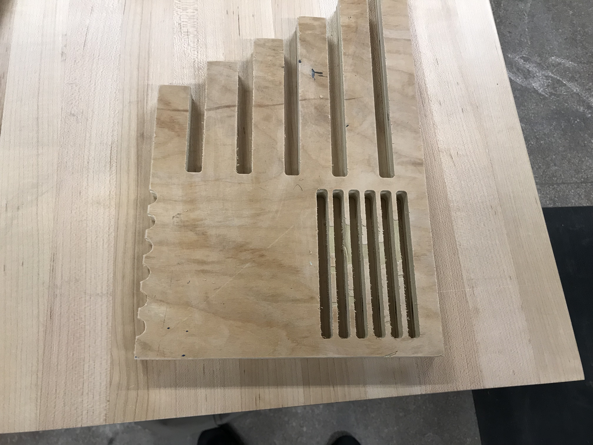

This week I milled a musical woodblock using the CNC. My goal was to create multiple textures that you could play by tapping or scraping the panel in different places. These sounds could be picked up by a contact microphone attached to the wood.

I created the design in Vectorworks, adding different sections to be cut or pocketed. I didn't do too much research into how to design a block that sounds good/harmonic, but I hoped that the "keys" of different length would sound noticeably different.

_Screenshot of the design_

_Toolpath_

_Front view_

_Back view_
