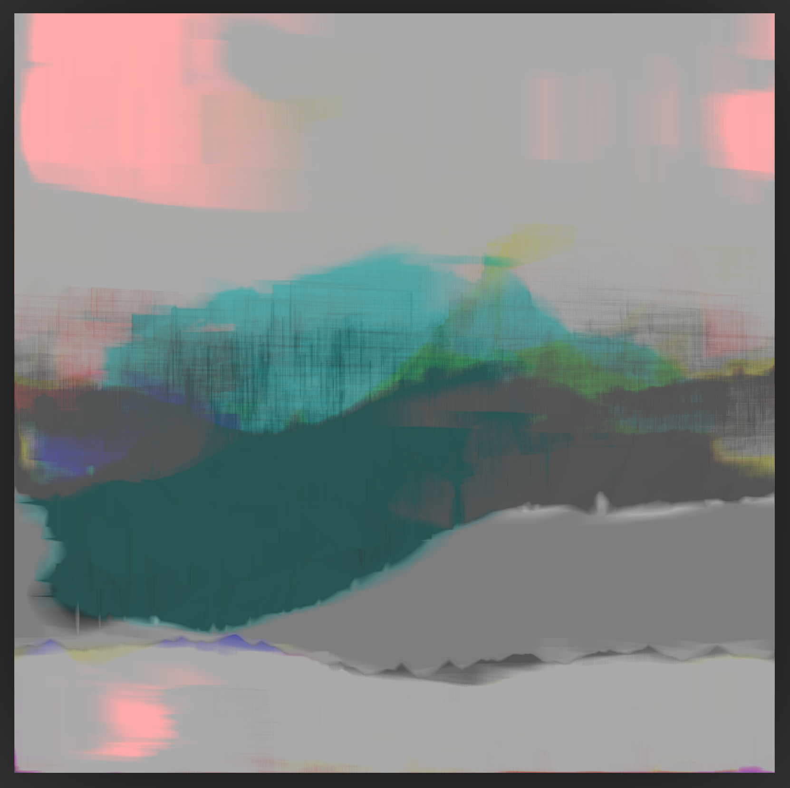
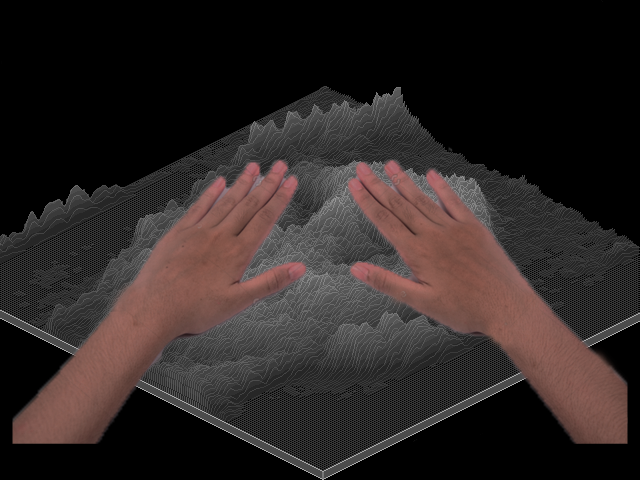
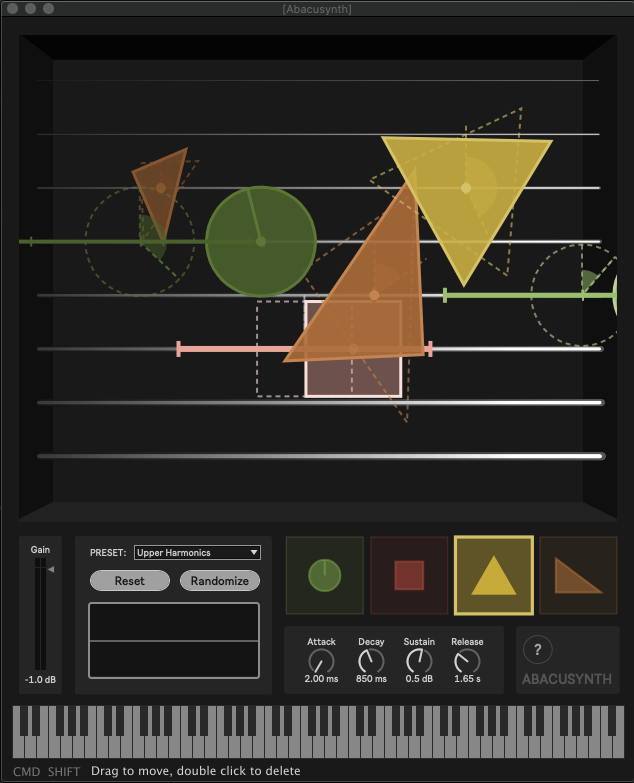
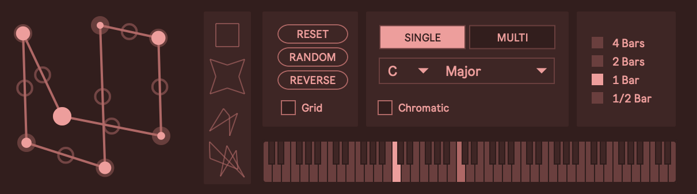

## 3D Painting

Last year I [created a program](/icm-week-1/) that generates a digital 'painting' from a photo. It would be interesting to create 3d sculptures out of these works (by translating the image into some arrangement of layers or a normal map). But I imagine it would be difficult to programmatically paint or color them, so I'm not sure the feasibility of this.

## Musical Devices

These are ideas for musical devices based on some past work -- They might be outside the scope of the class but since I am also in NIME, I might be working towards building something like this anyway.

### Physical Spectrogram/Sampler

_Mockup showing two hands touching a 3D spectrogram_

This device would allow someone to explore sound through physical touch. The object is a three dimensional spectrogram made up of an array of pins, similar to a pin art toy. The pins are motorized and can take the form of any sound file used as an input, creating a ‘landscape’ representing the sound’s frequencies over time. Like a plasma ball, the user interacts with the surface by touching it -- Capacitive sensors in the pins allow for touch detection across the surface.

[Read full proposal/description](Physical-Spectrogram-Proposal.pdf)

### Abacusynth

The [Abacusynth](/abacusynth-plugin/) is a software synthesizer inspired loosely by an abacus -- it would be fun to create a physical version where the user places/slides tokens on rods to create sound.

### Geoboard Sequencer

Another plugin I am working on is a [polygonal sequencer](/mixd-polygonal-sequencer/) where the user draws polygons to generate melodies. I would love to have this in physical form. I imagine a [geoboard](https://en.wikipedia.org/wiki/Geoboard) that senses (somehow) the position of a rubber band and this is used to generate MIDI data.
