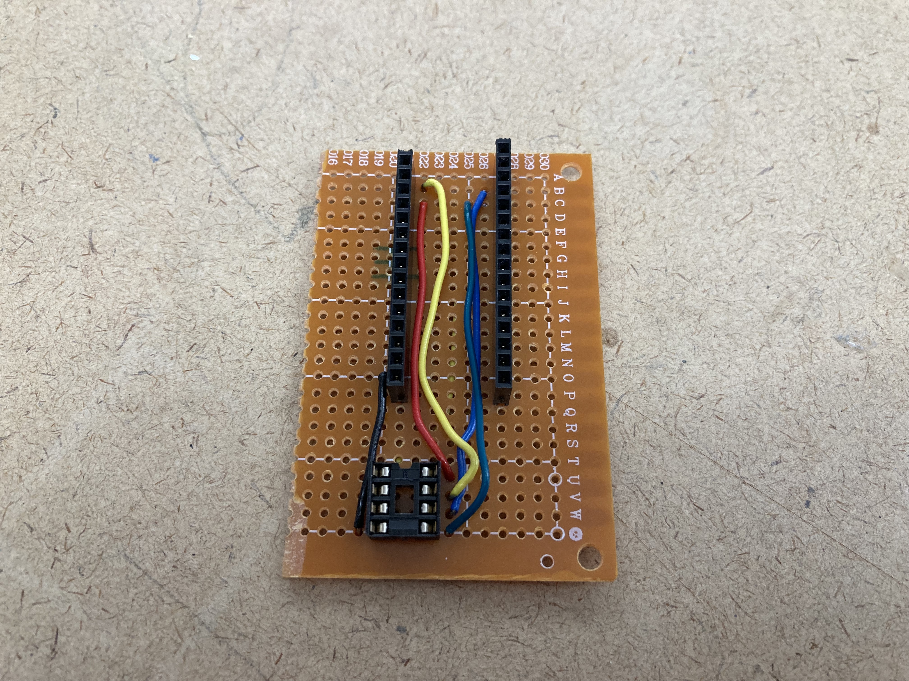
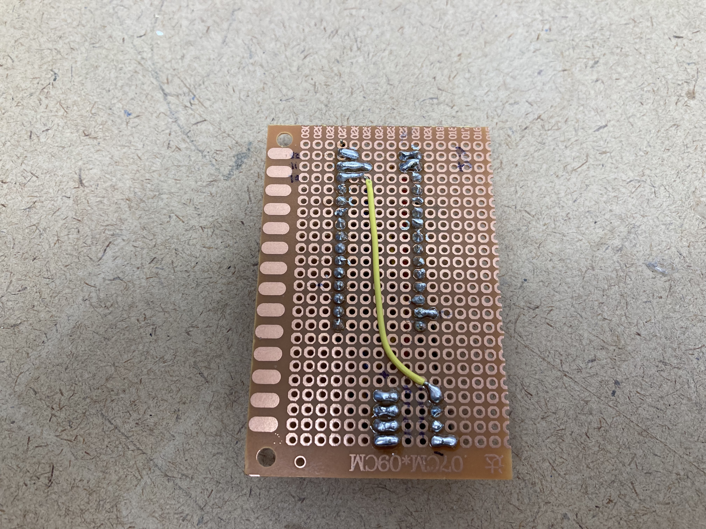

This week I programmed an ATtiny to create a proximity sensor. I used an [RCWL-1601 ultrasonic sensor](https://www.adafruit.com/product/4007) to detect proximity and illuminate an LED based on the distance.

<video autoplay muted loop src="IMG_0254.mov"></video>

### Programming Jig

The programming jig allows me to connect in my Arduino 33 IoT to the ATtiny and upload code using the Arduino as the ISP.


_Programming Jig -- front_


_Programming Jig -- back_

### Arduino Code

The program reads from the ultrasonic distance sensor and writes a brightness value to an LED. The output is on pin 0 -- one of the two that is capable of pulse width modulation, which allows for a range of values instead of just two.

```cpp
#define DEBUG 0

const byte DistTrigger = 3;
const byte DistEcho = 4;
const byte LED_PIN = 0;

const int numReadings = 20;

int readings[numReadings];      // the readings from the analog input
int readIndex = 0;              // the index of the current reading
int total = 0;                  // the running total
int average = 0;                // the average

float readDistanceSensor() {
  digitalWrite(DistTrigger, LOW);
  delayMicroseconds(2);
  digitalWrite(DistTrigger, HIGH);
  delayMicroseconds(10);
  digitalWrite(DistTrigger, LOW);
  float duration = pulseIn(DistEcho, HIGH);  // in microseconds
  float distance = duration * 0.0343 / 2.0;  // in centimeters
  return distance;
}

void setup() {
  if (DEBUG) {
    Serial.begin(9600);
    while (!Serial);
  }

  // smooth value by taking average
  for (int thisReading = 0; thisReading < numReadings; thisReading++) {
    readings[thisReading] = 0;
  }

  pinMode(DistTrigger, OUTPUT);
  pinMode(DistEcho, INPUT);
  pinMode(LED_PIN, OUTPUT);
  delay(100);
}

void loop() {
  float distance = readDistanceSensor();

  total = total - readings[readIndex];
  readings[readIndex] = distance;
  total = total + readings[readIndex];
  readIndex = readIndex + 1;

  if (readIndex >= numReadings) {
    readIndex = 0;
  }

  average = total / numReadings;

  int ledBrightness = map(average, 60, 2, 0, 220);
  ledBrightness = constrain(ledBrightness, 0, 255);

  if (DEBUG) {
    Serial.print("Distance: "); Serial.print(distance);
    Serial.println(" cm.");
    Serial.print("Brightness: "); Serial.println(ledBrightness);
  }

  analogWrite(LED_PIN, ledBrightness);
}
```
