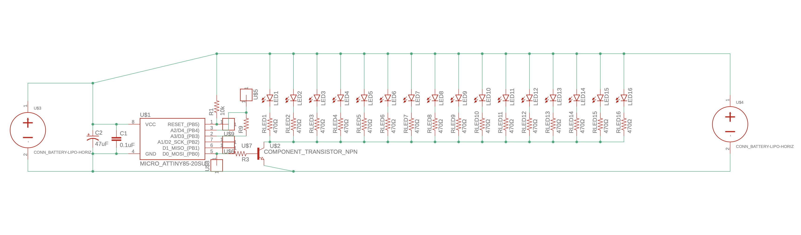
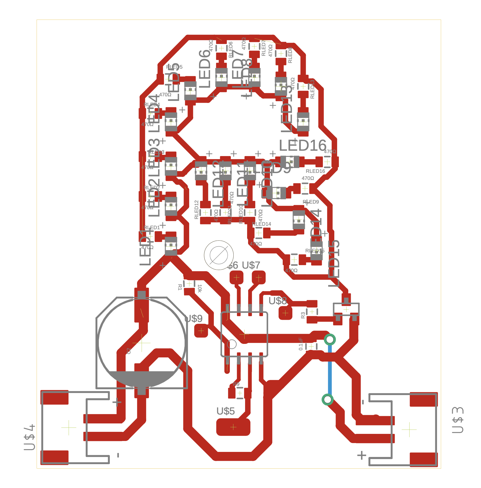
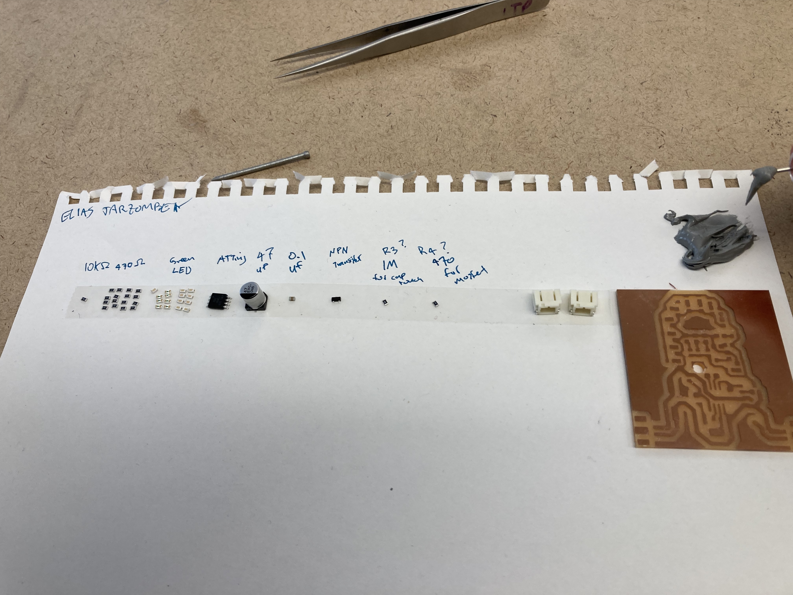
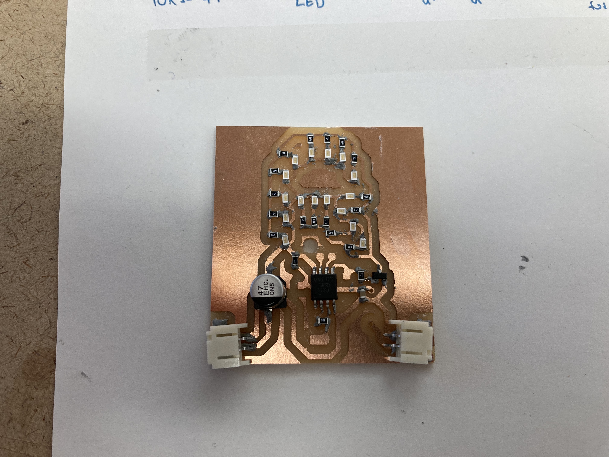

Finalizing the Marquee Letter project started [last week](/homemade-hardware-marquee-letter/).


_The updated schematic_


_The updated board design_


_The milled circuit board_


_Assembling the SMD parts_


_Placing the parts with solder paste_


_Soldering the circuit with the heat gun_


_Programming the ATtiny_

The Arduino Code:

```cpp
#include <Math.h>
#include <CapacitiveSensor.h>

CapacitiveSensor   cs_4_2 = CapacitiveSensor(2, 3);

void setup() {
  pinMode(0, OUTPUT);
  cs_4_2.set_CS_AutocaL_Millis(0xFFFFFFFF);
}

void loop() {
  long total1 =  cs_4_2.capacitiveSensor(30);
  int del = 0;
  if (total1 > 200) {
    analogWrite(0, 255);
  } else {
    analogWrite(0, 80);
  }
}
```

<p></p>


_Plugging it in_


_Adding the capacitive sensor_

<p>
<video style="width: 100%; max-width: unset" muted autoplay loop name="CapacitiveTouchTest" src="./IMG_0297.mov"></video>
<em>The finished board</em>
</p>
