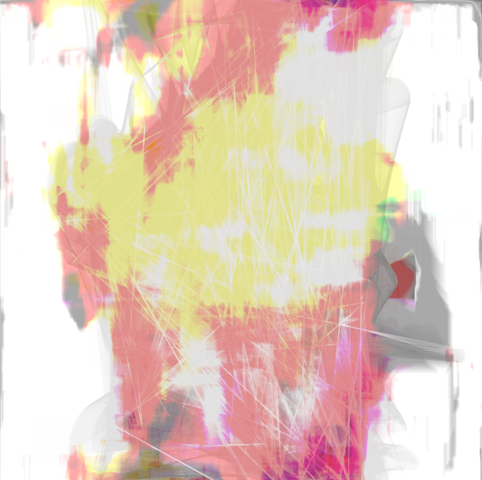
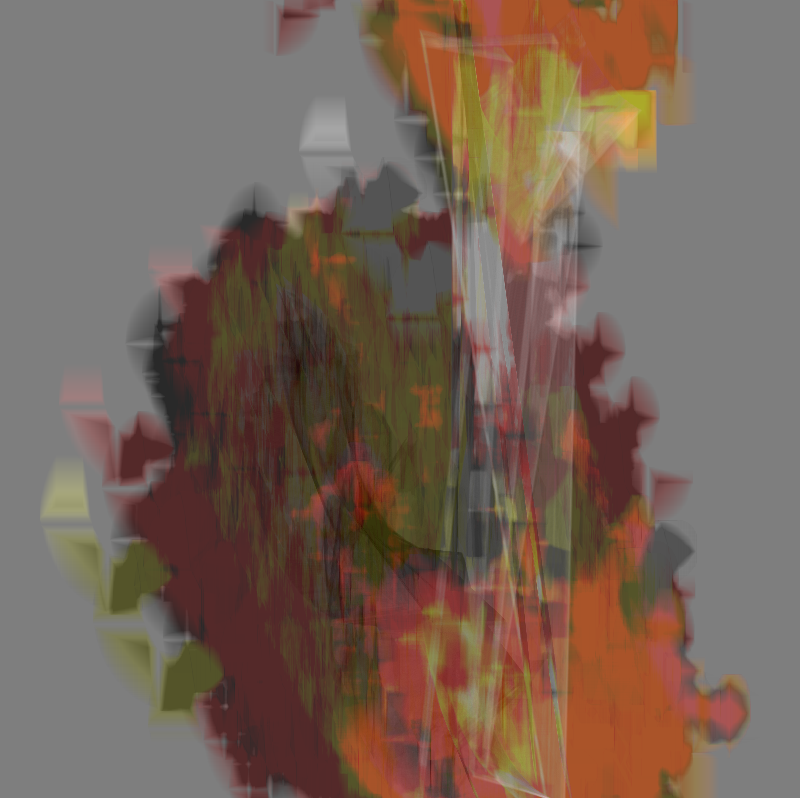

<iframe src="https://player.vimeo.com/video/478046644?color=eae6de" width="640" height="640" frameborder="0" allow="autoplay; fullscreen" allowfullscreen></iframe>

For my image project I have created [Texturizer](https://texturizer.netlify.app/), a program that generates moving textures from random stock images.

It uses the Unsplash [random endpoint](https://source.unsplash.com/random) to fetch a source image on user click and then begins "painting" based on that picture. The algorithm randomly selects 2000 points at which to begin drawing. Each point samples the original image and uses the color values to modulate the size and speed of a rectangle starting at that point. The rectangles are drawn almost transparently which leads to an "ink blot" type effect. Faint white lines connect pixels of extreme color (high red but low blue and green for example). Sometimes the result might resemble a modern abstract painting, other times it looks more like an early 2000s screen-saver. ¯\\\_(ツ)\_/¯

Here is a snippet of the update function for a particle. The position, width, and height are calculated based on the original pixel's color and brightness. I also added some `noise` which adds some natural movement to the motion.

```js
const noiseVal = noise(this.x, this.y);

this.w = sin(count / startColor[1]) * map(startColor[2], 0, 255, 30, 120);
this.h = cos(count / startColor[1]) * map(startColor[0], 0, 255, 30, 120);

this.x += (noiseVal * (mouseX / width - 0.5) * brightness(startColor)) / xDamp;
this.y += (noiseVal * (mouseY / height - 0.5) * brightness(startColor)) / yDamp;
```

<p></p>

Controls: Click to generate a new image. Move mouse to adjust painting direction.

[Try it out](https://texturizer.netlify.app/) or [view the source](https://github.com/ejarzo/texturizer/blob/master/script.js).

<!--  -->

<!--  -->


<!--  -->


<!--  -->


<!--  -->

<!--  -->

<!--  -->








<!--  -->
