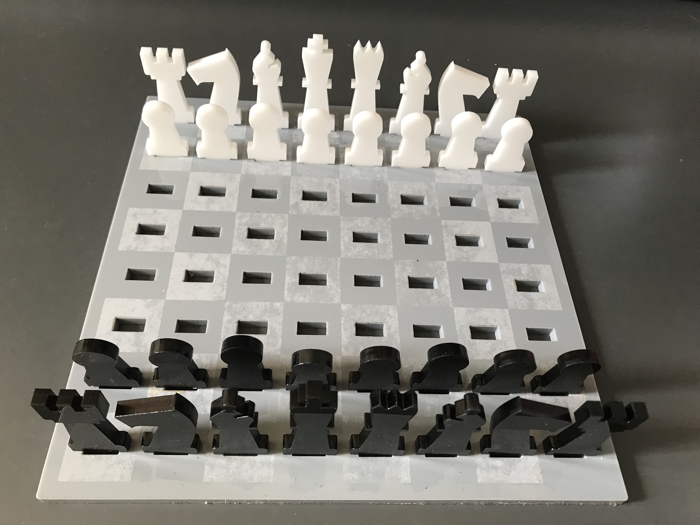

For this weeks' laser cutter assignment I created a chess set. I found some [inspiration online](https://www.instructables.com/Lasercut-travel-chess-set/) for a board with slots into which the pieces fit.

## Preparations

I designed the board and pieces in Illustrator, using the grid to make sure that they were proportional to each other.

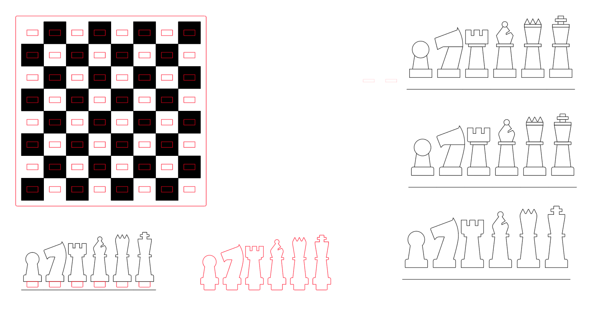
_Screenshot of the Illustrator file showing the board and chess pieces_

The pieces went through several iterations. In this screenshot you can see the semi final (top right, without rounded edges) and final (middle right) versions. I went for the classic silhouettes but tried to keep the design minimal.

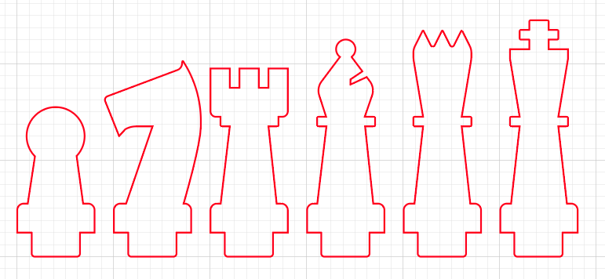
_The final piece designs_

I designed the pieces on the grid with a one inch wide base plus 1/8 inch padding on each side. The knight is the only piece that extends into the padding. I then scaled them down for the final version so that the total width including padding was one inch -- the same width as the board squares. The nubs and slots were 1/4 inch by 1/2 inch since I would be using 1/4 inch acrylic.

## Testing and Fine-Tuning

I tested the design with cardboard first and found that the slots were too big to snugly hold the pieces.

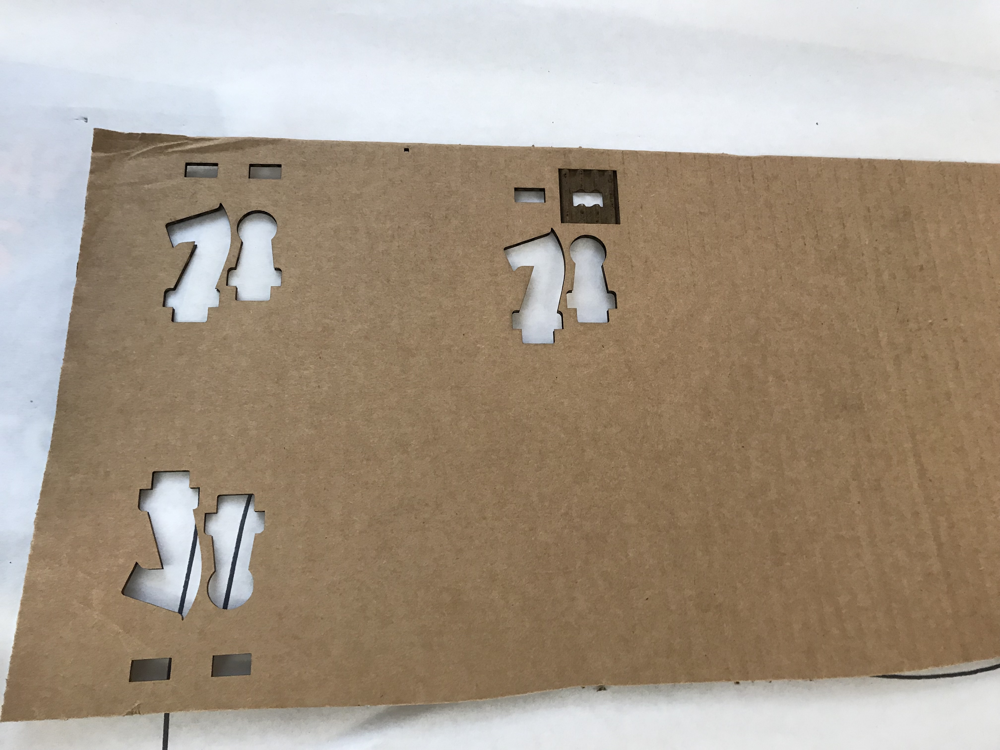
_Testing with cardboard_

After a few tests I reduced the size to 0.48x0.23 inches and tested with acrylic.

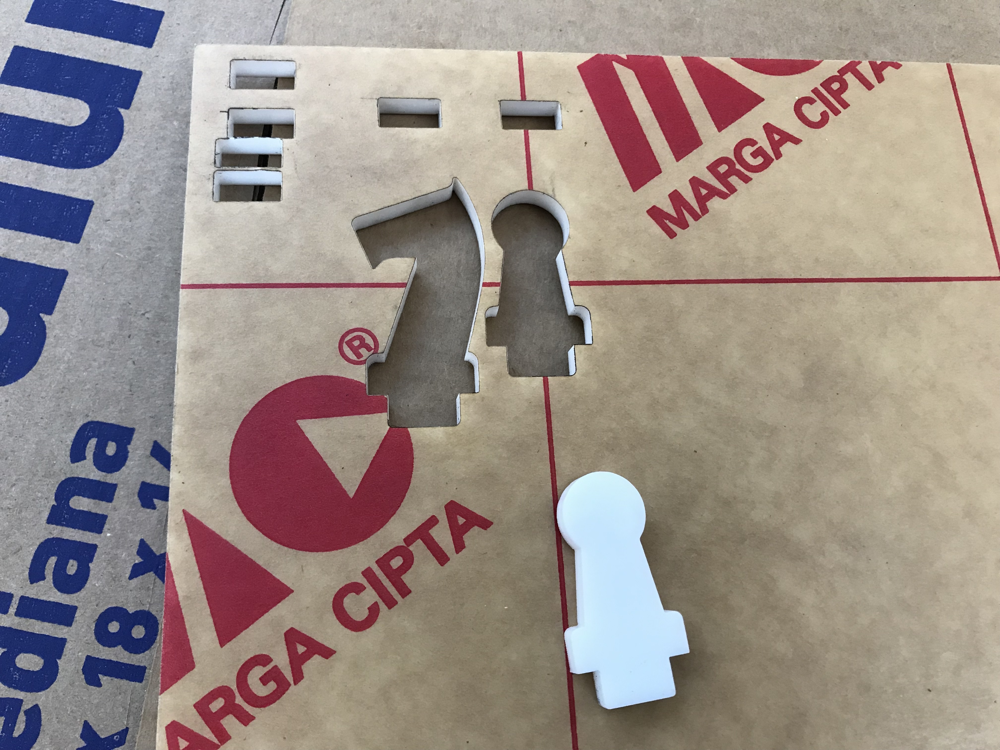
_Testing with acrylic_

After a few acrylic tests I was confident that the smaller size worked and was ready to cut the rest.

## Cutting

I started with the pieces with both black and white acrylic.

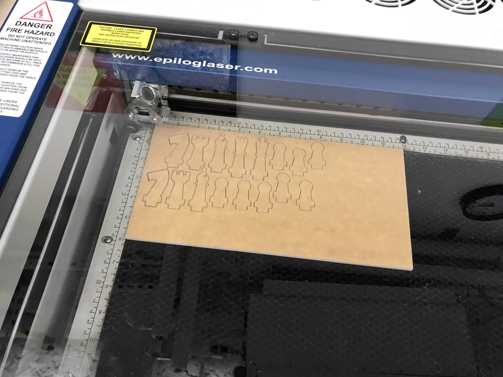
_Cutting the pieces_

I then cut and engraved the base -- every other square was engraved. The base took about 15 minutes.

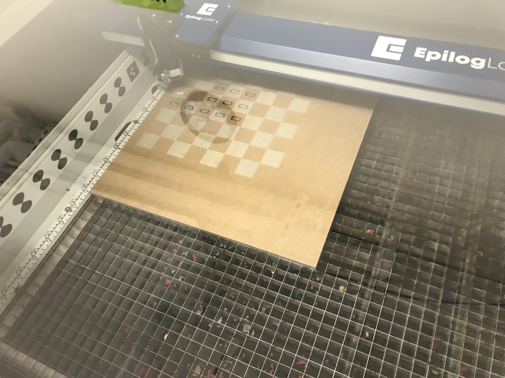
_Cutting and engraving the base_

Unfortunately I kept the paper on for this step which led to a partial engraving -- the paper was not completely removed from the engraved squares. Next time I will definitely remove the paper for an engraving like this.

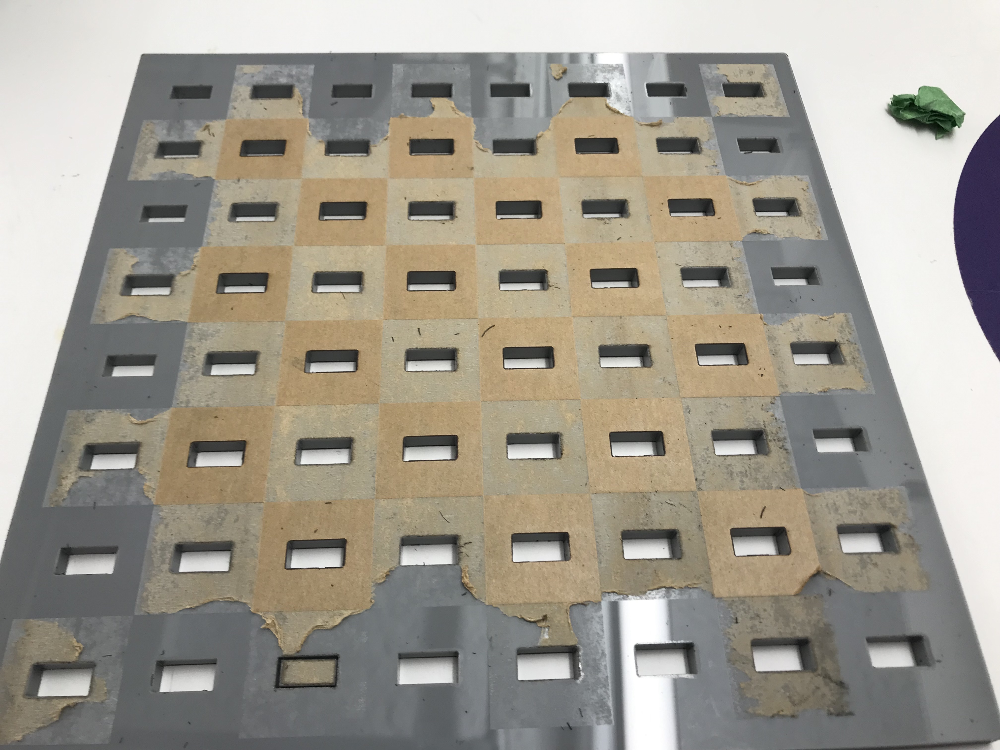
_Removing the paper from the engraved board_

## Result

The partial engraving created sort of an industrial/concrete effect which I don't mind. I really like how the pieces came out and they fit well in the slots.

<!-- 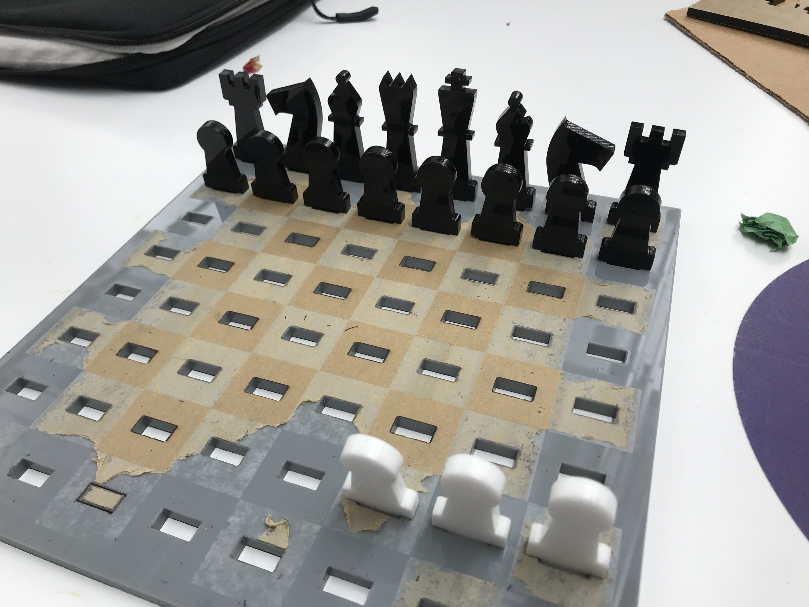
_caption_ -->

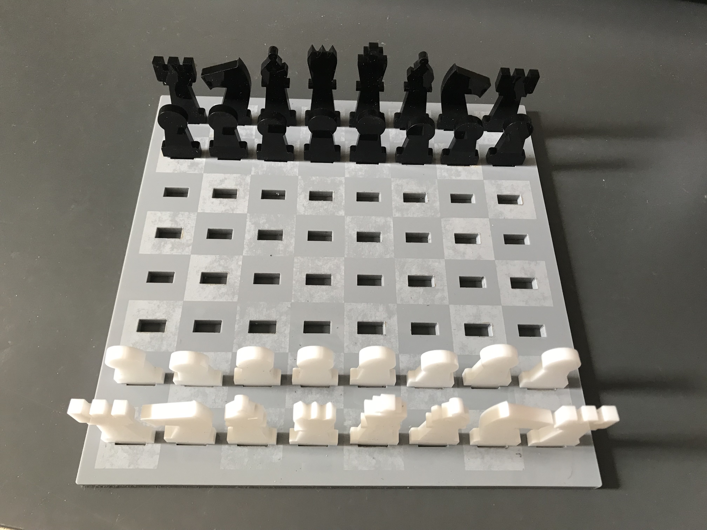
_The board from white's perspective_

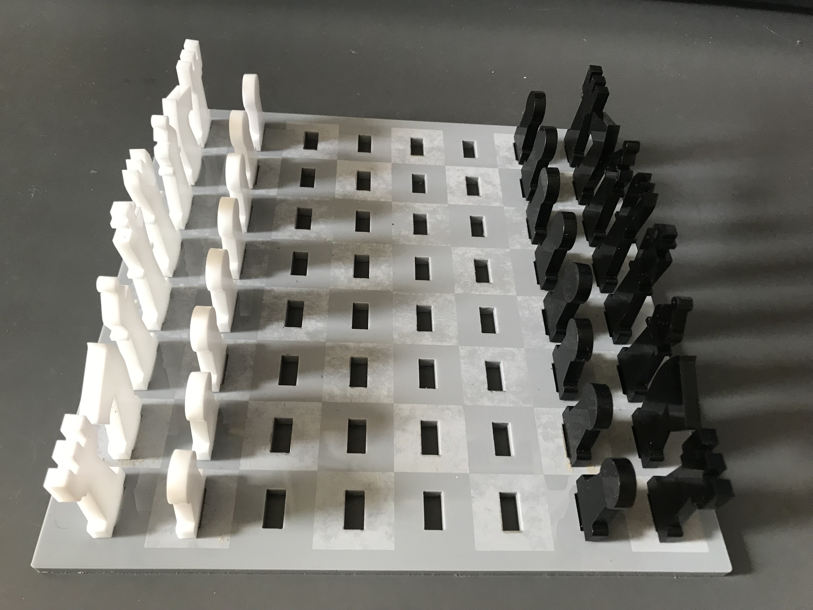
_Side view of the board with pieces_

_The board from black's perspective_

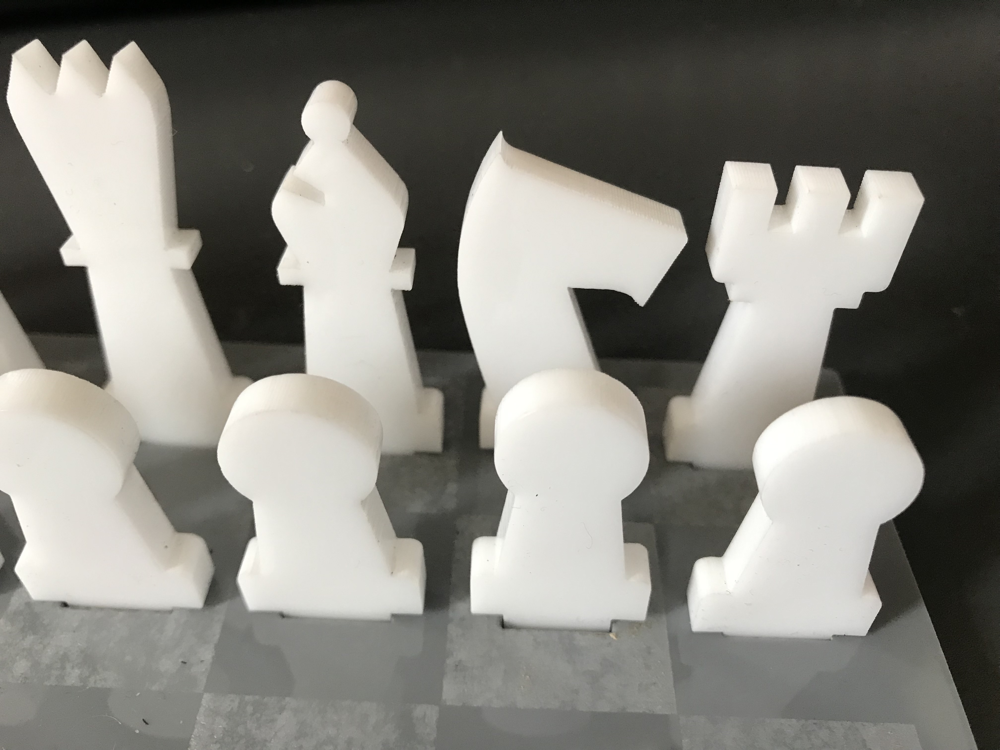
_Closeup of white pieces_

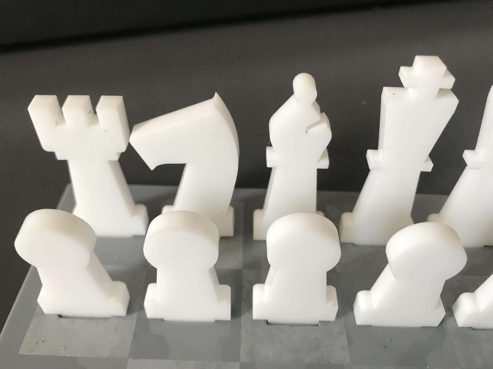
_Closeup of white pieces_

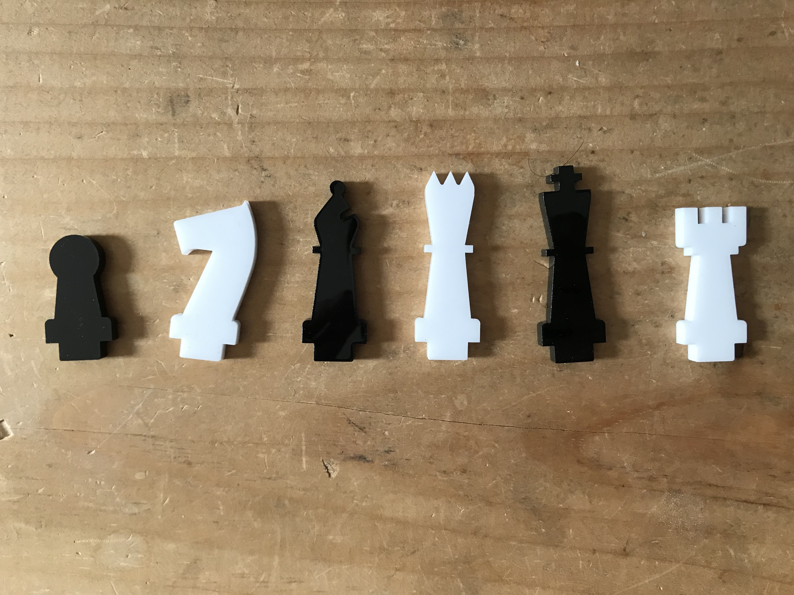
_One of each piece laying flat on the table, alternating colors_
