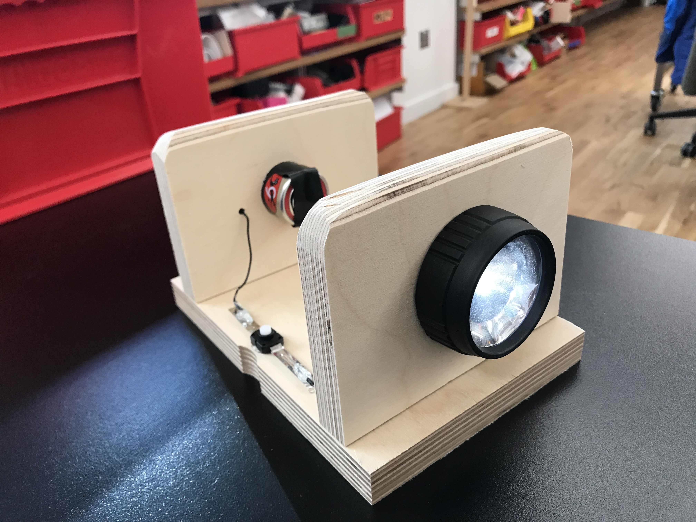

_Concept sketch_

This week I created a "Deconstructed Flashlight" out of a \$5 dollar flashlight from the hardware store. I drilled large holes in two segments of wood to fit around the flashlight's light and battery and connected them to the original toggle switch.

_The source flashlight_

I found a piece of scrap that I would use for the two walls. I drilled the holes using the drill press and a hand drill with Forstner bits approximately the same size as what I needed. I then used the Dremel tool to sand the holes by hand to make them the perfect size so that the components fit snugly within.

_Using the dremel to widen the holes_

Once the holes were ready I started on the electronics. In my first attempt, I tried soldering directly to the light fixture but ended up breaking an LED. I ended up using electrical tape for the light and battery connection, but did manage to solder the button connection.

_Soldering wires to the toggle button_

I used the belt sander to smooth the tops of the vertical segments and hot glue to attach them and the button to the base. I also drilled a small hole for the wire connecting to the back of the battery. The final result is simple but pretty much how I imagined. The toughest aspect was making sure the electrical connections were solid. If I were to do this again I would definitely spend more time creating more secure contact, maybe by using the spring included in the original flashlight.

