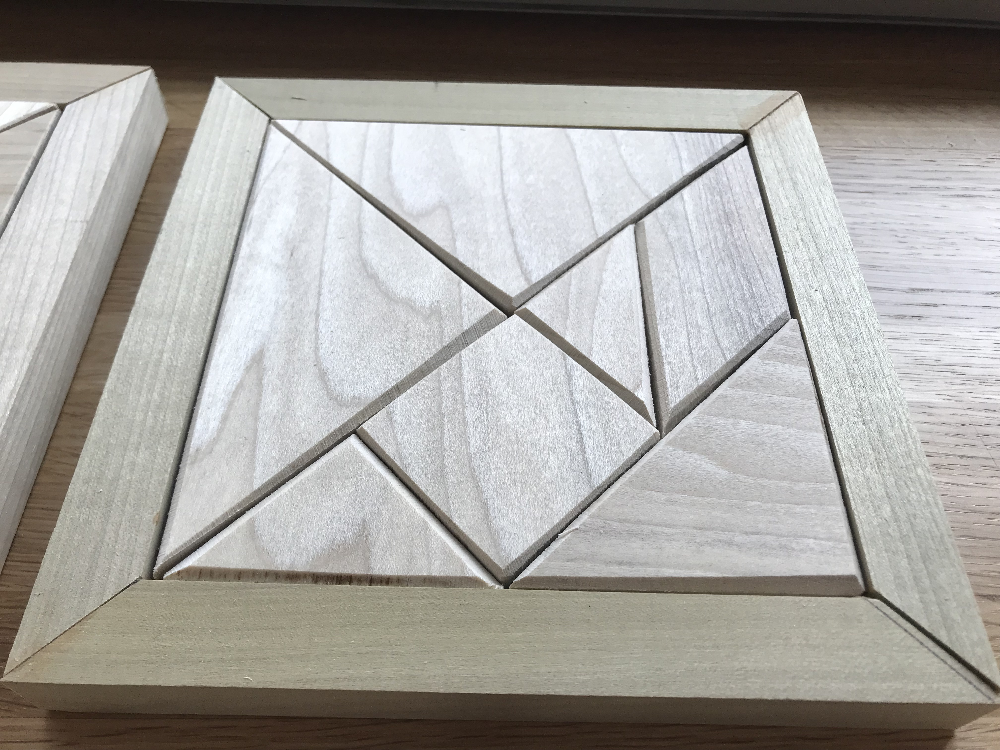

<!-- 

 -->

_5 sets of wooden tangrams_

<!-- 

</img>

 -->

<!-- 

 -->

This week I crafted 5 sets of [Tangrams](https://en.wikipedia.org/wiki/Tangram) -- a geometric "dissection puzzle" made up of various basic shapes that assemble into a square. For each puzzle I also created a frame to hold it.

## Preparations

_The raw materials_

I bought my materials (all poplar wood) from Home Depot: Two 5.5" x 0.25" x 24" sheets for the base, two 5.5" x 0.5" x 24" sheets for the tangrams, and six 0.75" x 0.75" x 36" square strips for the frame.

_Sketch of the design_

I used the material dimensions to inform the design. The base would be 5.5" x 5.5", glued to the inner edge of a 0.75" frame -- the total size would be 7".

## First Iteration

I started with the frame. I used the miter saw to cut square wood into equal segments. At first I measured the rod each cut -- later I used a piece of wood as a buttress helped create much more consistent lengths.

_Cutting the frame using the miter saw_

The first frame was a bit misaligned as the edges were not all exactly the same length.

_The first frame_

## Cutting the shapes

The shapes are arranged in this pattern on the square.

_Marking the tangram cuts_

To cut the tangram pieces I created a jig to hold the square -- simply a right angle cutout at 45 degrees to the edge.

<!--

_Creating a jig for the tangrams_ -->

_Creating a jig for the tangrams_

</img>

</img>

</img>

</img>

</img>

</img>

I used the jig to cut the square into the Tangram pieces. The wedge allowed my to hold the piece steady as I ran it through the band saw.

_The tangram pieces_

Even with the jig, the pieces were still a little mismatched.

_The assembled tangrams in the frame_

To assemble the frame I clued the edges in pairs, then glued the two pairs to each other and the base.

_Glueing the frame_

_Glueing the edges to the base_

## Making the Rest

Once I had the first prototype I had my process roughly defined. The one major improvement I made was using a guide for the frame cuts, which made the edges much more even.

_Repeatably process for cutting the frame_

_The remaining frames were much more consistent_

Following the same process, I glued the frame edges in pairs.

_The pairs of half-frames_

I glued the pairs to bases using the corner and quick clamps. Not all of the aligned perfectly -- I sanded the edges and bases to make sure the fit was snug.

_Glueing the frames_

<!--

_captionnn_

_captionnn_

_captionnn_ -->

While the glue dried I cut the remaining pieces.

_4 to go_

_The jig came in handy again_

I then sanded down each piece at an angle to give them a beveled edge.

_Sanding the edges with the belt sander_

_A closeup of a square piece_

The only thing I purposefully made different between the 5 puzzles is the amount I sanded the pieces because I wanted to see how the different versions felt. Some I left pretty straight, others I rounded more.

_3 sets with beveled edges_

<!--

_captionnn_ -->

## The Result

The final result!

<!-- 
_captionnn_ -->
