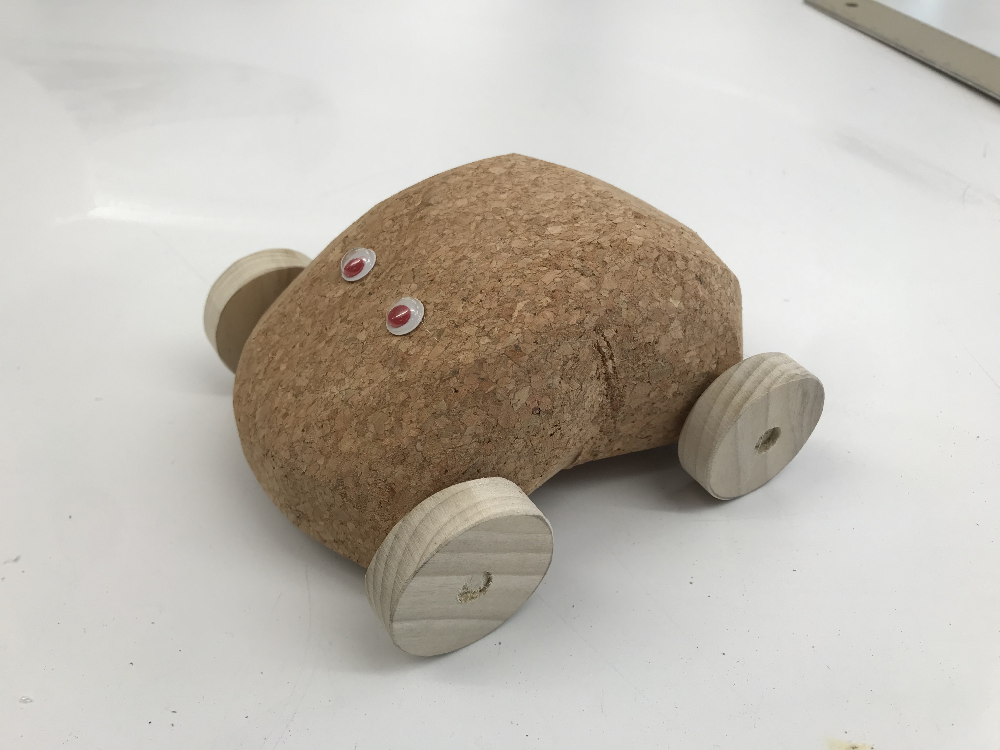

For my "Two Materials" project I made a toy car. Unfortunately the band saw was unavailable so I had to improvise on the shape and it turned out looking like a potato.

## Materials

I started with a yoga cork block for the body, a panel of 1/2" thick poplar for the wheels, and dowels for the axels.

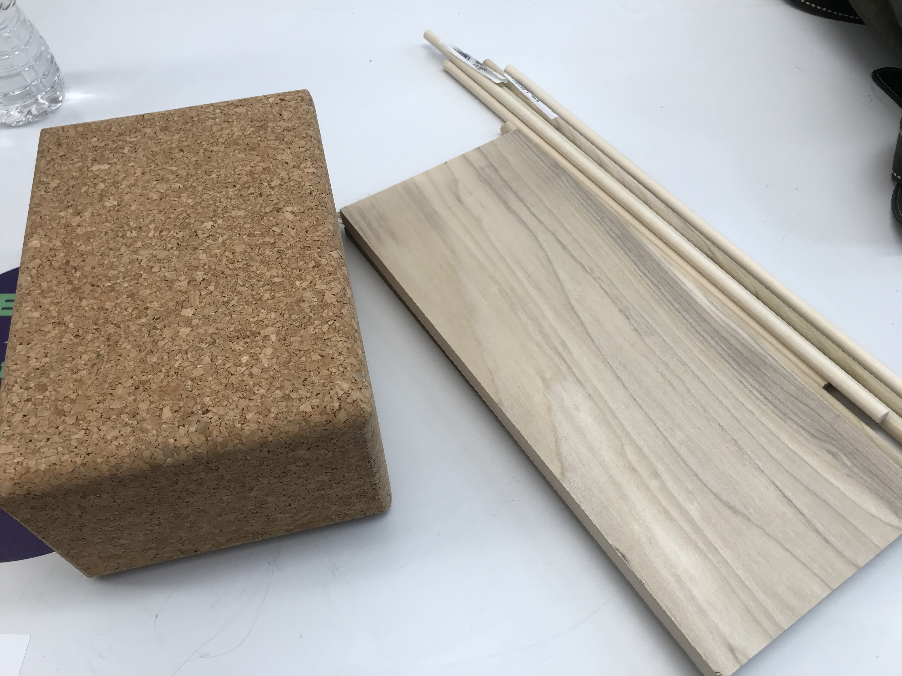
_The raw materials_

## The Wheels

I marked the wheel circles using a compass made of a nail and a wire set to a radius of 3/4".

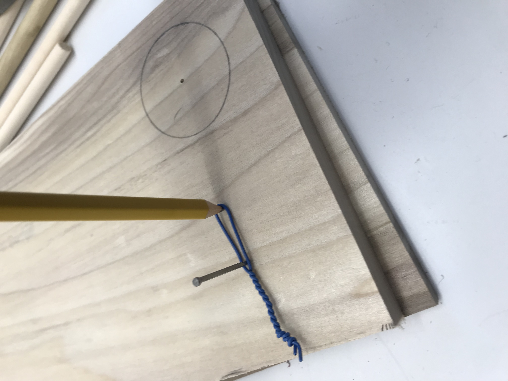
_Marking the wheels_

I started by drilling holes the size of the axel dowel at the wheel centers and then roughly cut around the discs using the band saw.

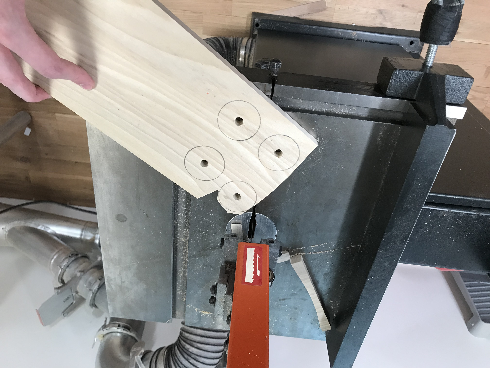
_Cutting out the wheels_

The final step was sanding down the edges until the pieces were round.

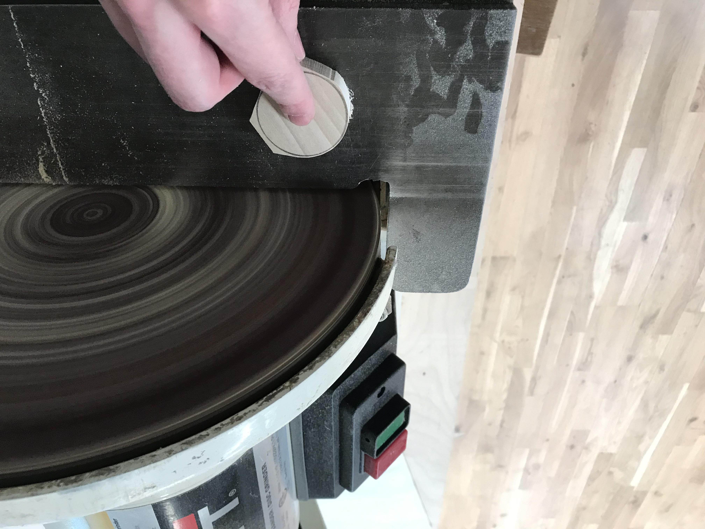
_Sanding the wheels_

Once they were all sanded I cut the dowels to size -- the dowel fit snugly enough in the holes so that I did not need any glue.

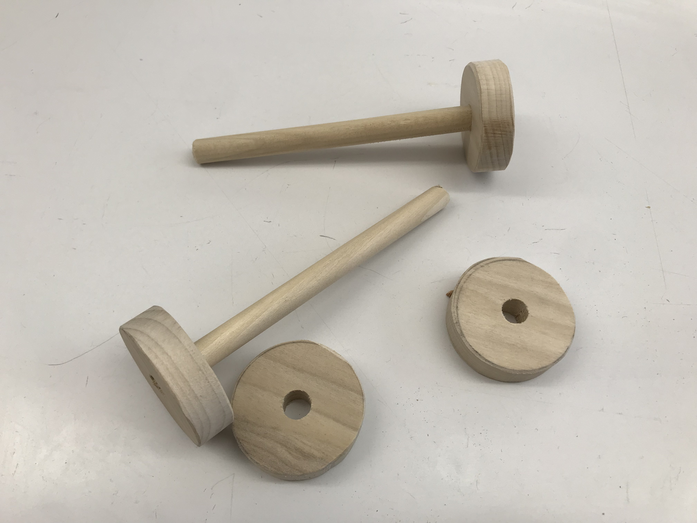
_4 completed wheels with two axels_

## The Body

I started by marking and drilling two holes for the axels using a drill bit wider than the axels so that they would spin.

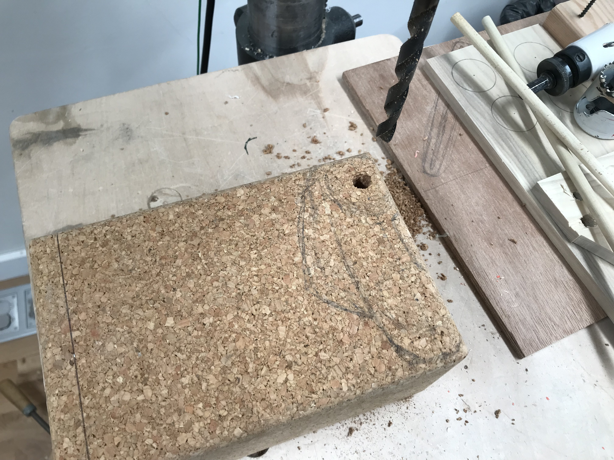
_Drilling the axel holes_

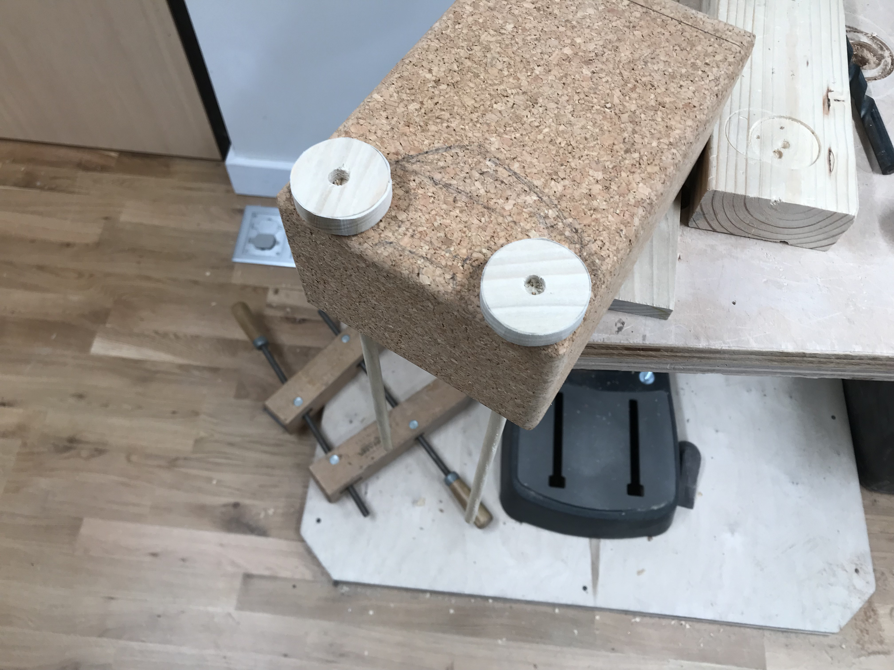
_Previewing the axels_

Once that was done I started shaping the body. This is where I had planned on using the band saw but it was stuck such that the guard would not raise enough to allow for the height of the cork block -- so I cut the block by hand. I tried different saws and got the best results using the Japanese hand saw (not pictured).

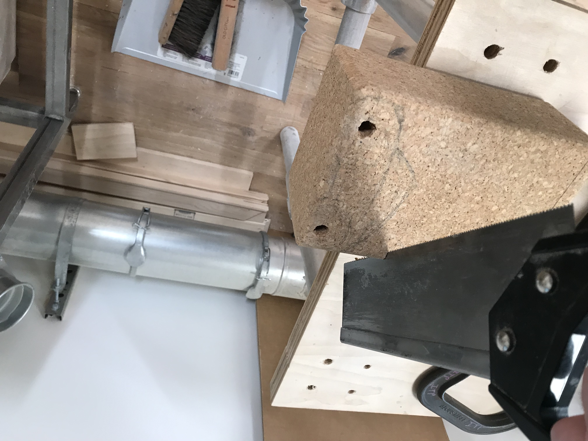
_Cutting the cork block_

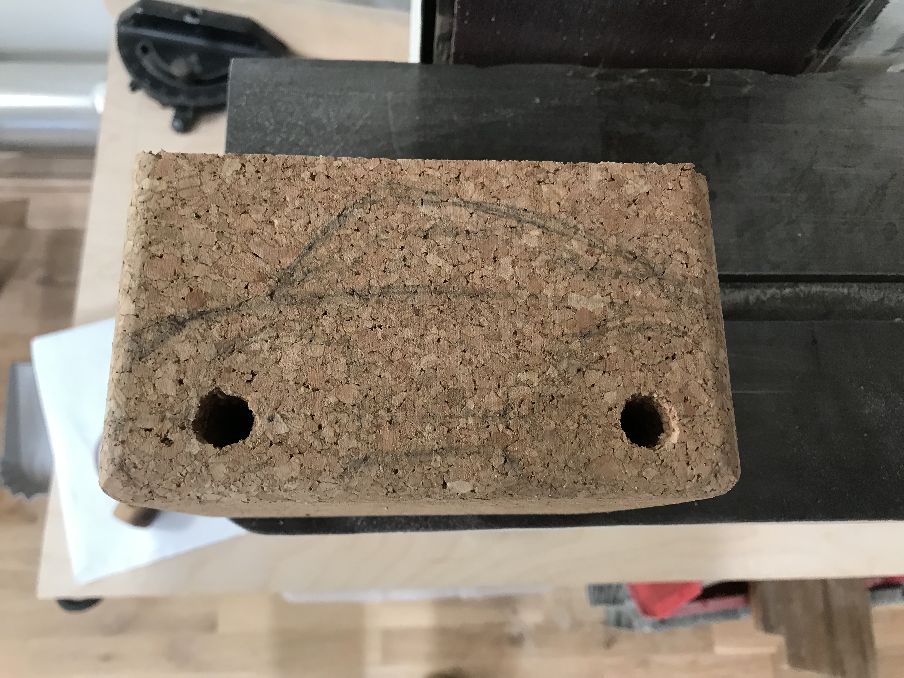
_The block cut to size_

After this I cut the top edges and then began sanding, eyballing the shape and trying to make it as symmetrical as possible.

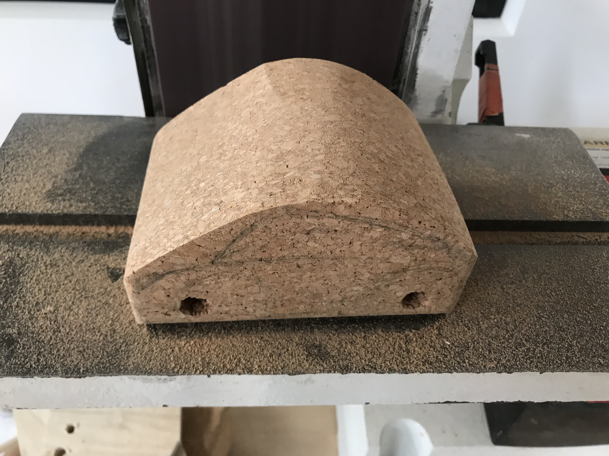
_Sanding the body_

I also cut into the sides and bottom to give it more of a shape.

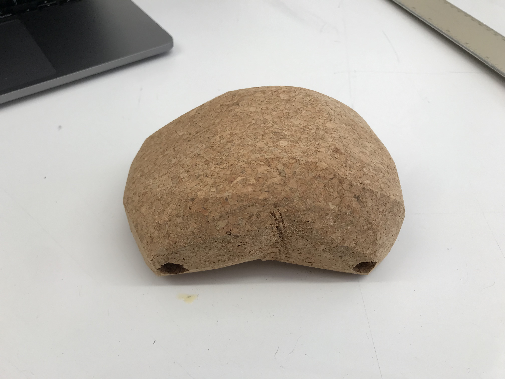
_The final body shape_

## The Result

I could now attach the wheels. It rolls!

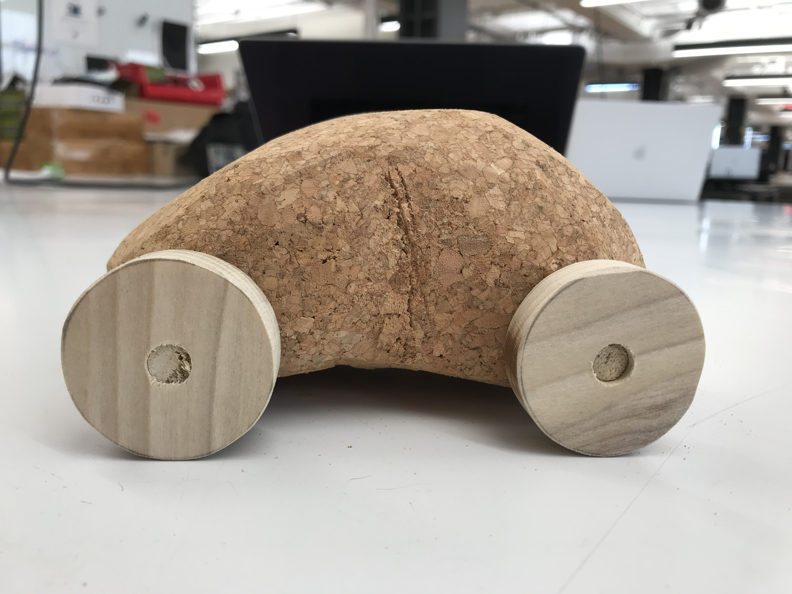
_Attaching the wheels_

It just needed one more thing: googly eyes.

_The final touch: googly eyes_
