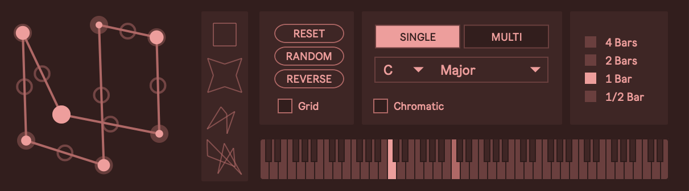
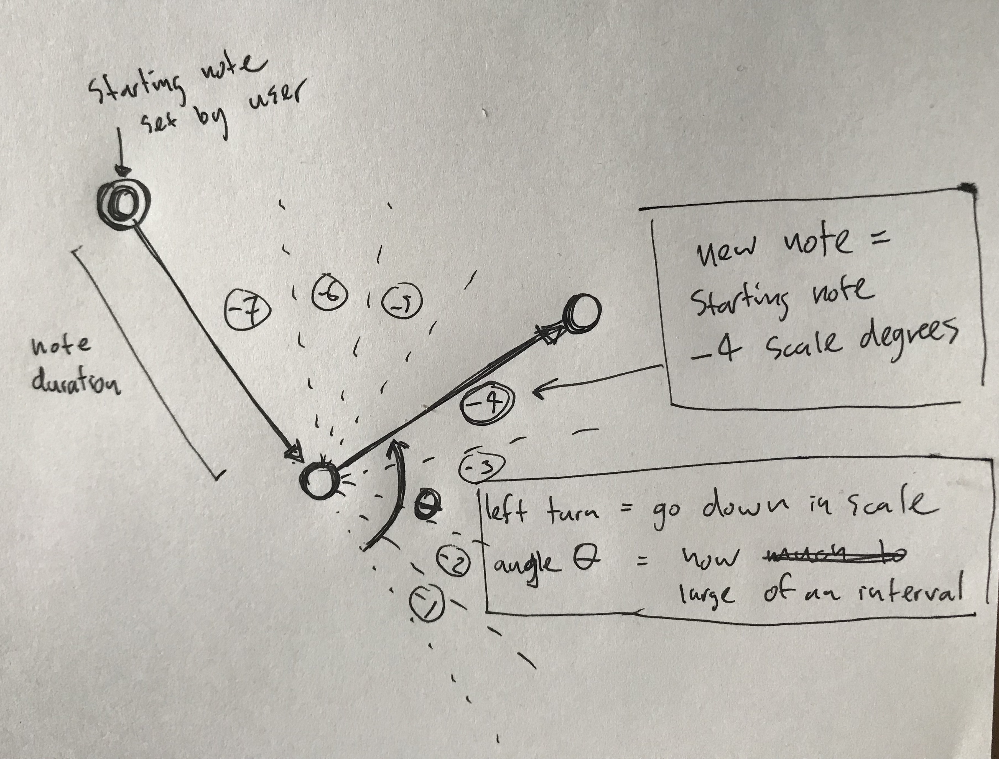
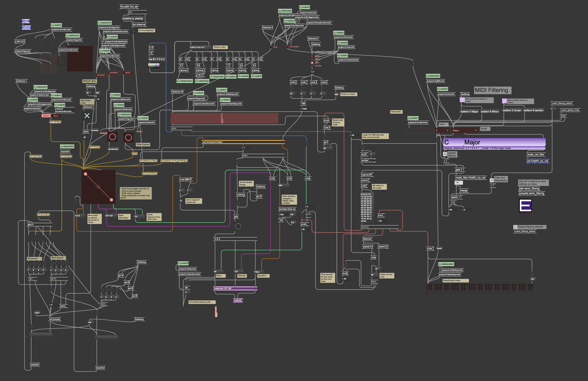
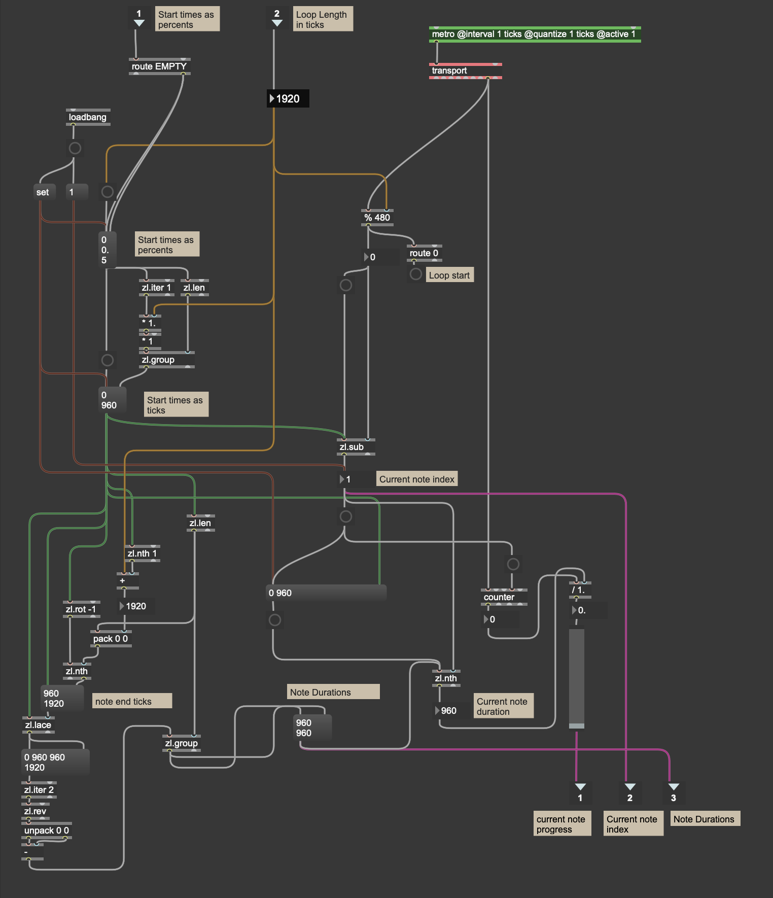

The Polygonal Sequencer is a [Max for Live](https://www.ableton.com/en/live/max-for-live/) device that allows you to create melodic and rhythmic sequences by drawing shapes. It is a version of my project [Shape Your Music](https://shapeyourmusic.dev) that can be used inside Ableton Live.

## Modes

The device has two modes: "Single" and "Multi". Single mode outputs a single note in a rhythmic loop determined by the drawn shape. Multi mode produces the same rhythm but with a melody determined by the angles in the shape.

## Demos

<video controls name="Multi Mode Demo" src="capture-multi-mode.mp4"></video>
<em>Multi Mode Demo</em>

<video controls name="Single Mode Demo" src="capture-single-mode.mp4"></video>
<em>Single Mode Demo</em>

### Audio Demos

Here is a song that I made with a few friends that uses the device:

<audio controls>
  <source src="./stringer_v1.mp3" type="audio/mp3">
</audio>

And here are some loops:

<audio controls>
  <source src="./padloop1.mp3" type="audio/mp3">
</audio>

<audio controls>
  <source src="./synthloop1.mp3" type="audio/mp3">
</audio>

<audio controls>
  <source src="./beatloop1.mp3" type="audio/mp3">
</audio>

<audio controls>
  <source src="./synthloop3.mp3" type="audio/mp3">
</audio>

## How it Works

The shape acts as a sequencer set to loop at a length set by the user. The loop length is synced to the Ableton Live BPM. When playing, a node traversed the perimeter of the shape, triggering a note at each vertex.

In Multi mode, the note's value is determined by the angle at that point. More specifically, the angles map to musical intervals, so given a starting note, each subsequent note is based on the previous note plus or minus a musical interval determined by the angle at that point. A right-handed turn will be a positive interval (a higher note) and a left-handed turn will be a negative interval. The size of the angle determines the size of the interval -- a shallow turn will be a note closer to the previous note than a large turn. Hopefully this diagram helps explain!

In this scenario there are two notes. The edge on the left is the starting note (set by the user) and the edge on the right is the second note. Since it is a left-handed turn, the second note will be a lower pitch thant the first. The possible angles are divided into slices corresponding to the number of notes in the scale (In this case 7). The angle between the edges falls in the "-4" slice, so the next note will be 4 notes lower in the scale than the initial note. So if the initial note was C3 and we are in the key of C Major, the next note will be F2 because F2 is 4 scale degrees below C3.

## Controls/Features

- Add points by clicking and dragging on edge midpoints
- A point's velocity can be set by holding CMD and dragging on the point
- While holding SHIFT, click a point to delete it
- While holding SHIFT, click a preset box to store the current shape
- Click a preset to load the shape
- Toggle grid to snap points to a grid (for perfectly proportional line segments)
- Click "Randomize" to generate random points and velocities
- Click "Reverse" to reverse the melody's direction. This will calculate new note values, not just play the same melody in reverse.
- Select a scale or use the chromatic scale
- Set different loop lengths

## Source

The patch code is available on [GitHub](https://github.com/ejarzo/polygonal-sequencer). The main patch handles the UI, preset storage, loop length, and scale filtering. I used the [Modal Object Library](https://cycling74.com/tools/modal-object-library) to assist with the logic for setting the notes in a scale.

The [main JavaScript input canvas](https://github.com/ejarzo/polygonal-sequencer/blob/master/max-shape-canvas-2.js) accepts a variety of messages and outputs the note start times as a percent of the total time, as well as the note velocities and scale scale degrees calculated by the angles. These values are used to trigger notes in sequence. The presets are rendered by [another simple JavaScript renderer](https://github.com/ejarzo/polygonal-sequencer/blob/master/shape-preset.js).

_The main max patch ([source](https://github.com/ejarzo/polygonal-sequencer/blob/master/sym-rhythm-3.amxd))_

The sequencing is handled in a `transport-helper` subpatch. It translates the note start time percents into tick values based on the loop length. Checking every tick, it increments the current note when it hits one of the values. It also outputs the current note progress which is used to render the moving dot along the perimeter of the shape.

_The sequencing logic ([source](https://github.com/ejarzo/polygonal-sequencer/blob/master/sym-transport-helper.maxpat))_

## Next Steps

One key feature I want to add is the ability to set the note duration. Right now it's set to 80% of the total duration between notes. I'm also hoping to improve the preset interface, since I don't think it's super clear how to store/load shapes. I also want to add looping modes that would let you optionally reverse the loop when it ends. I also think the ability to turn off the closed shape would lead to interesting melodies, since they would not necessarily have to return to the original position.
