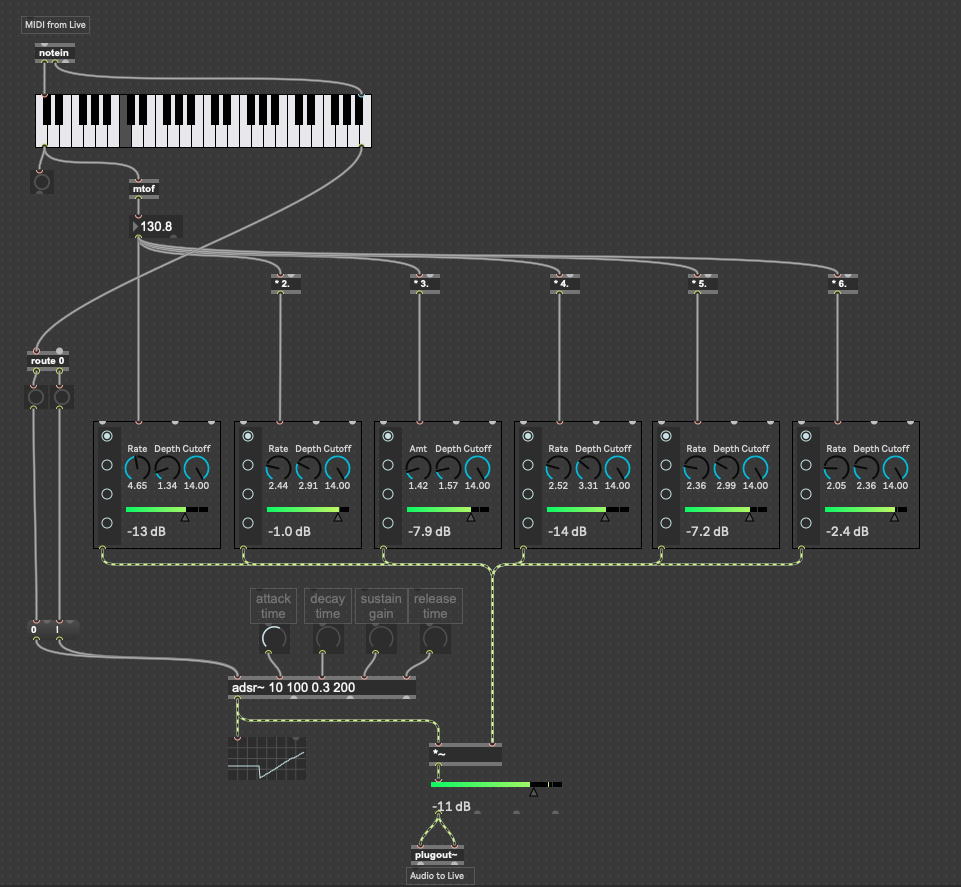
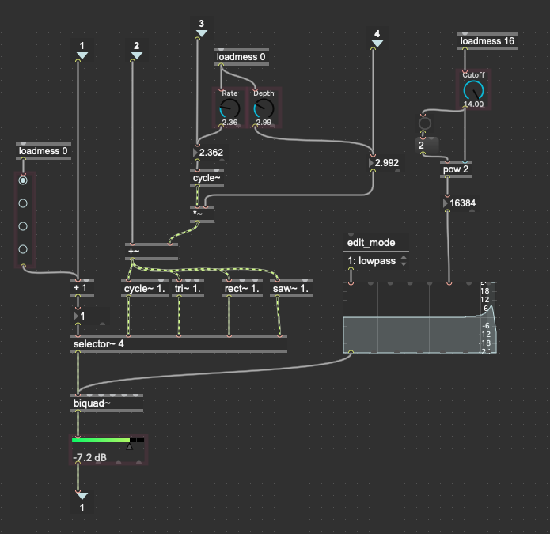

This week I began to port a JavaScript synthesizer I made a few weeks ago for my Nature of Code class to a Max for Live device. The synthesizer is laid out like an Abacus and involves placing shapes on rods corresponding to the harmonic series. Read more about the original [here](/nature-of-code-oscillation/).

<iframe src="https://player.vimeo.com/video/517974442?color=eae6de" width="640" height="463" frameborder="0" allow="autoplay; fullscreen" allowfullscreen></iframe>

Though the UI is fairly complex, the audio aspect is relatively simple. Each shape represents one oscillator set to a certain frequency (which bar it is on) and a waveform (what kind of shape it is). The horizontal motion corresponds to a vibrato effect and the spin corresponds to a panning effect.

In Max I started by creating multiple oscillators set to the harmonics of the fundamental. The volume, wave type, cutoff frequency, and vibrato depth and rate are all manually adjustable. These parameters will eventually be controlled by the custom UI.

<video controls style="width: 100%; max-width: unset" name="Screen capture" src="./abacusynth-max-demo.mp4"></video>

The main synth contains 6 harmonics routed through an ADSR envelope.

_Screenshot of main synth_

Each oscillator contains logic for modulating the pitch (vibrato) as well as a filter and selector to switch between wave types.

_Screenshot of oscillator logic_
