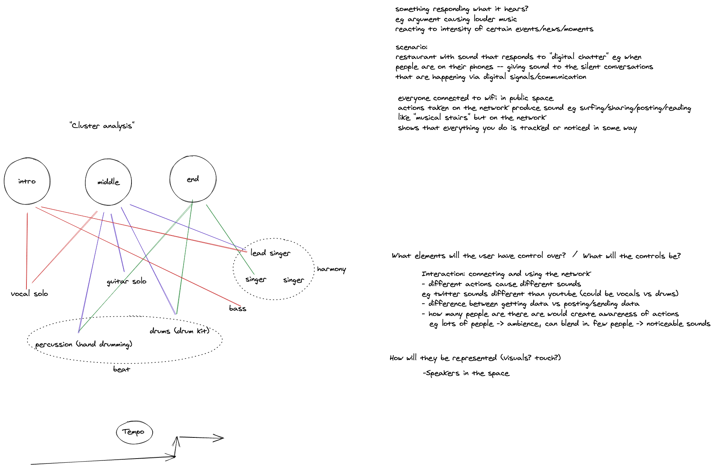
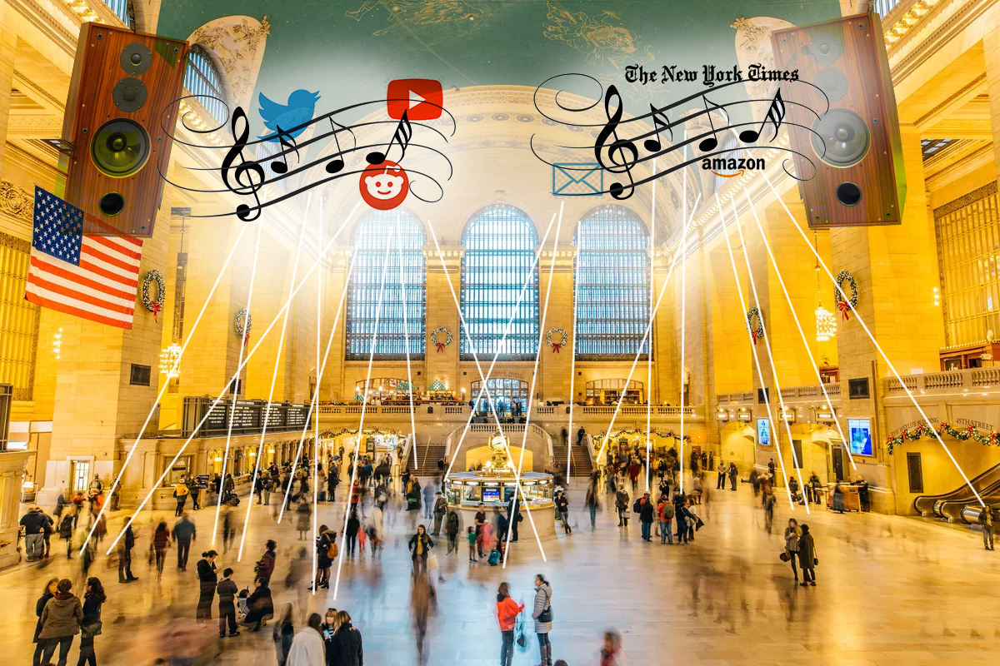

# Music Interaction Design: Week 1

This week I worked with Stuti to formulate an installation concept based on communal network activity.

## Listening

<iframe width="560" height="315" src="https://www.youtube.com/embed/PYSVIvVVUUY" frameborder="0" allow="accelerometer; autoplay; clipboard-write; encrypted-media; gyroscope; picture-in-picture" allowfullscreen></iframe>

We started by listening and analyzing _Bandeh_ by Indian Ocean, noting the different components and aspects of the track (rhythm, melody, instruments, harmony, tempo, etc). We used our [Oblique Strategy](https://www.joshharrison.net/oblique-strategies/) of **Cluster Analysis** to frame our work and graphed the elements and the distinct sections of the song in a series of connected nodes.

This led to discussion about how different interactions could cause different sounds to be made. One idea was drawing a continuous line, and depending on how you drew, different musical elements would play. The idea that we eventually landed on was having a public space react to network activity -- having some way of hearing the 'digital chatter' that surrounds us. We imagined a restaurant that played ambient sound every time a text message/tweet/post was sent.

## I Spy

I Spy is an installation that responds sonically to activity on a digital network (eg public wifi). Everyone that is connected to the network contributes to a communal composition that can be heard from speakers throughout the space.

Browsing, posting, watching videos, and other actions that can be monitored will all produce some sort of musical expression. With enough people the sounds will become more ambient and it will be difficult to hear what sounds your actions are producing -- but with a small amount of people the musical translations will be more evident.
