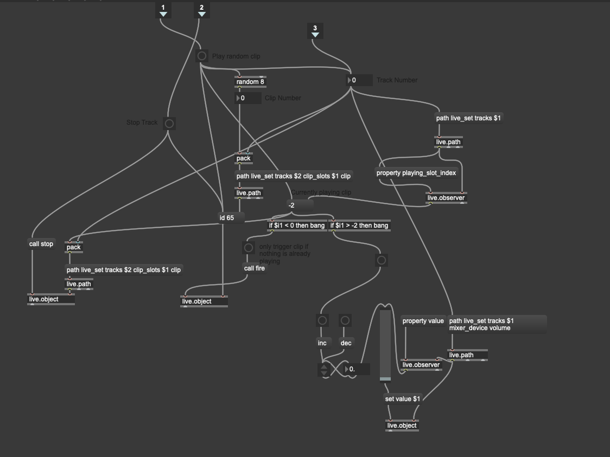

Continuing our [I Spy](/mixd-week-2-i-spy) project, Stuti and I created a Max patch to control our Live set. The patch works by triggering a random clip in a track for each type of network event (connecting, disconnecting, sending a request, etc.). If a clip is already playing in the track, the track's volume increases instead of triggering a new clip.

This is the patch for individual tracks. Much of the logic has to do with adjusting different parameters based on if a track is already playing. One question we had was whether it was possible to retrieve the current number of clips in a track so that we could get a random clip regardless of how many there are total. Right now we made all tracks have the same number so that we could set the maximum.

Running all of the tracks through this patch allows us to simulate events by clicking the buttons. There's still some issues to work out with when we change the volume vs when we trigger new clips.

<video style="width: 100%; max-height: none" controls name="Screen capture" src="mixd-i-spy-capture-max-control.mp4"></video>

