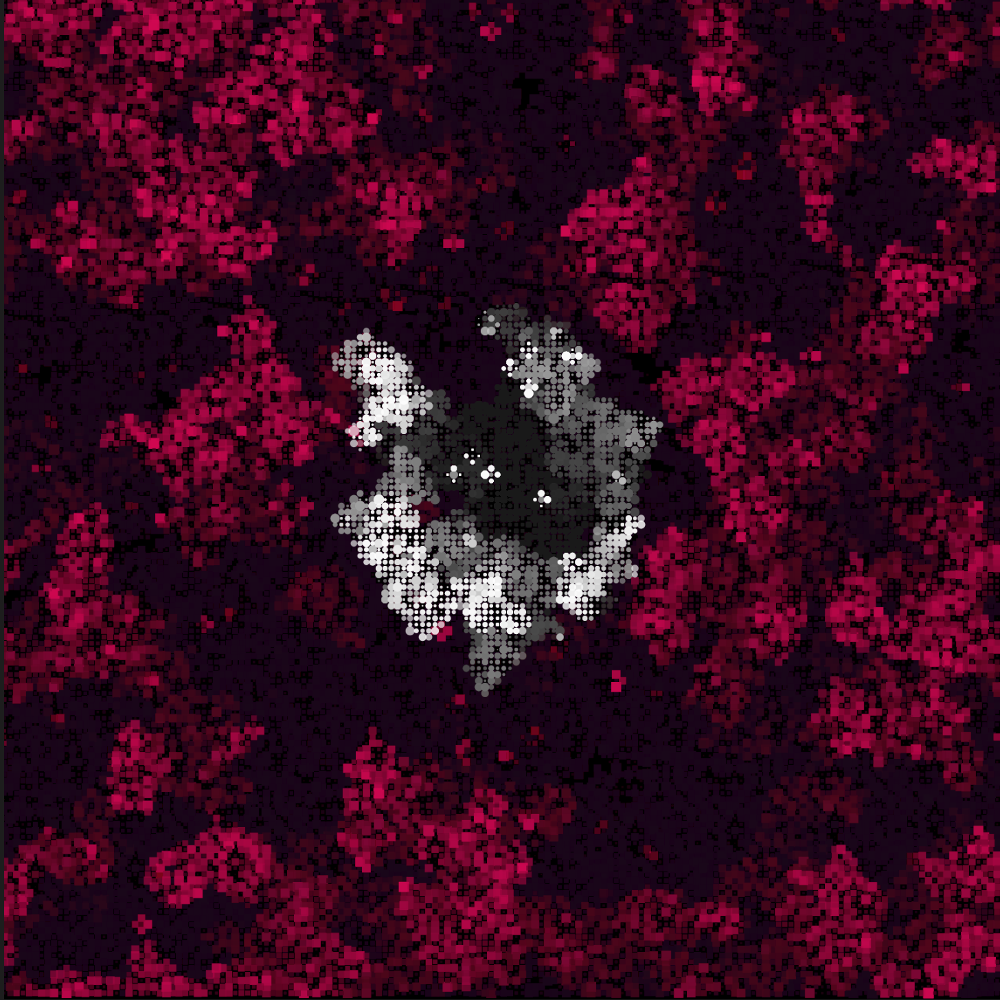

[Open sketch](https://editor.p5js.org/ejarzo/sketches/0PPTVdjTs)

This week I explored [Conway's Game of Life](https://en.wikipedia.org/wiki/Conway%27s_Game_of_Life). I started with the [Coding Train code](https://thecodingtrain.com/CodingChallenges/085-the-game-of-life.html) and was interested in implementing multiple types of cells and their interactions. The result is basically an "infection" simulator where a small group of infected cells spreads from the center of the screen. A cell becomes infected if it shares two or more neighbors with an infected cell. A small square in the center is initialized as infected. I also modified the logic by adding a lifetime to the cells, causing them to fade out over time. The lifetime is reset when a cell is "born".

I would love to explore adding multiple types and interactions between them. One thing that could be easy to add would be "antidote" cells which neutralize the infection. I didn't get to adding user interaction but drawing walls or other obstacles could be a fun addition as well.
