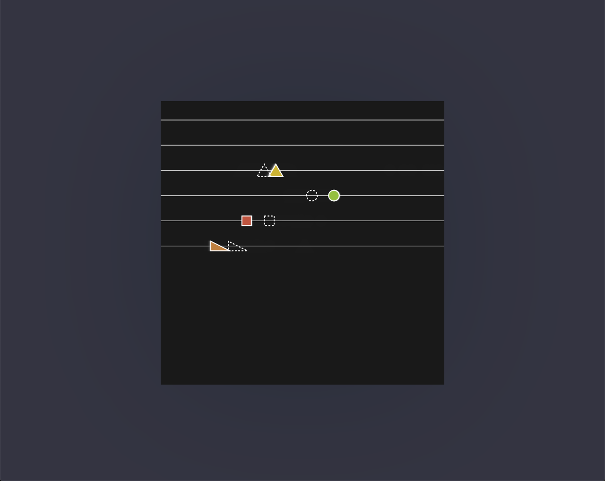

<!--  -->

<iframe src="https://player.vimeo.com/video/517974442?color=eae6de" width="640" height="463" frameborder="0" allow="autoplay; fullscreen" allowfullscreen></iframe>

[Try it out](https://abacusynth.netlify.app/) / [view code](https://editor.p5js.org/ejarzo/sketches/csuQmsrSY)

For this week 'Oscillation' theme I created a synthesizer. Its layout is inspired by an [abacus](https://en.wikipedia.org/wiki/Abacus) and the interaction is centered on placing shapes on rods. Each rod is set to a frequency in the harmonic series, and each shape represents an [oscillator](https://www.innovativesynthesis.com/basic-synthesis-part-1-%E2%80%93-oscillators/) oscillating at that frequency. The different shapes represent the oscillator's wave type (sine, square, triangle, sawtooth).

_First prototype_

Apart from the audio aspect I tried to use 'Oscillation' in different aspects of the device -- by 'pulsing' UI components to indicate interactivity and in the way the shapes move and spin.

_Adding color and movement_

I hope to implement it as a plugin for another class which is why I developed this idea much more than previous sketches -- I'd be interested to hear thoughts about interface because I'm not sure if the controls are clear. I had some fun adding sounds to the UI itself but I'm not sure if it's distracting.

_Current Version_

## How to use

Place shapes on the rods to start producing sound. Shapes on the lowest rod produce the fundamental frequency. You can change the note by pressing the keys `asdfghjk`.

Drag shapes will move them from left to right or from rod to rod.

If holding the `ALT` or `OPTION` key on your keyboard, dragging a shape adjusts it's vibrato rate (dragging up/down) and depth(dragging right/left). This will cause the shape to move on the rod.

If holding the `SHIFT` key, dragging adjusts the shape's size panning speed which correspond to the sound's volume and panning speed, respectively.

Click "Randomize" will clear the current state and randomly generate shapes.

<!--  -->
