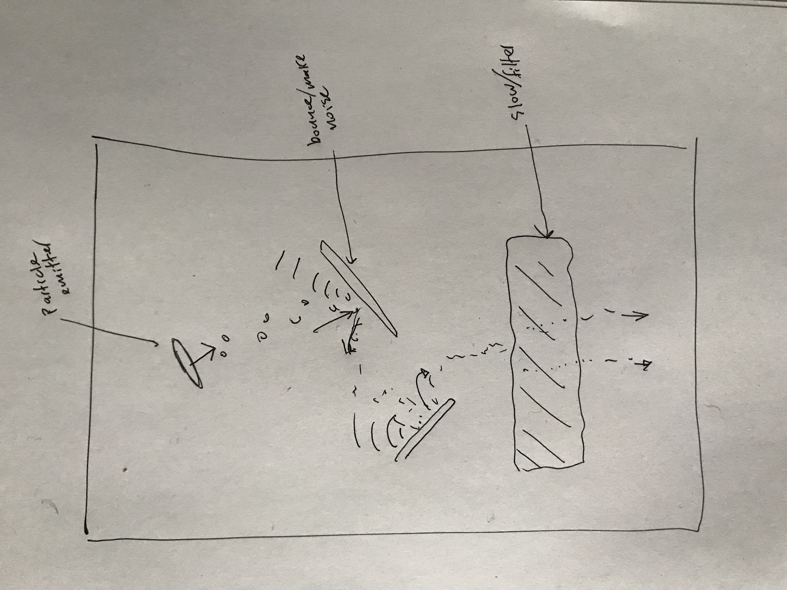

<video controls name="falling-sound" src="falling-sound-demo.mp4"></video>

[Open sketch](https://editor.p5js.org/ejarzo/sketches/dsNdGZt0n)

For my Simulation project I was inspired by falling sand games (like [this one](https://boredhumans.com/falling_sand.php)). I wanted to make something with many small particles interacting with the environment to create sound. This idea made me think of and reference [Zimoun](https://zimoun.net/)'s work as well.

My sketch allows you to place different kinds of Emitters which emit particles at regular intervals and Platforms that the particles bounce off of. When a particle makes contact with a platform it makes a sound. The properties of the sound (pitch, volume, etc) are determined by the particle's velocity, how long it has existed, what kind of particle it is, and the type of platform. For example, larger particles make a deeper sound, and the faster they are moving, the louder the sound.

_Concept sketch_

There's still a lot to add, like more variations in what effects the platforms have on the sound. I also want to expand on the interface to allow for more detailed control of the objects already placed -- so that you can change the emitter properties such as rate and spread, or the platform properties such as bounciness or size.

Additionally I would like to add other physics interactions like wind forces or "liquid" areas that slow down the particles and modulate their sound.

If I flesh this out further I will probably need to use a real physics engine (I just used [p5.collide2D](https://github.com/bmoren/p5.collide2D) for this version) to avoid glitches and improve performance.