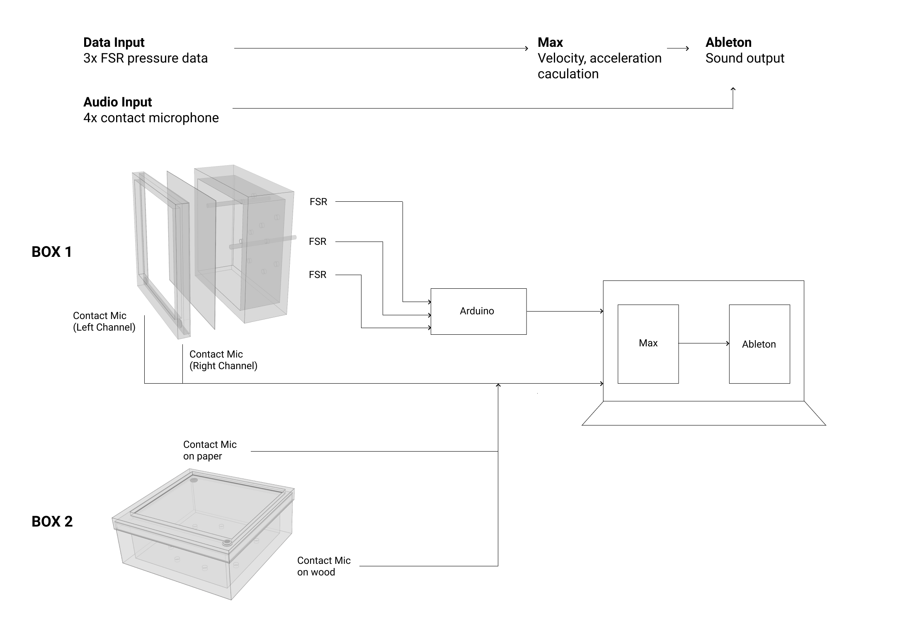

<iframe src="https://drive.google.com/file/d/1un_cwMHzlkvqVCmCZxNifhO-jf4i9zJt/preview" width="640" height="480" allow="autoplay"></iframe>

<em>Puncture live performance</em>

For the midterm show [Marcel](https://www.marcelwang.site/) and I developed _Puncture_, an interface and performance that explores pressure, tension, and release.

## Background

This piece expands on Marcel's previous work entitled [_“ ”_](https://yiranwang.art/untitled/) that employs the distortion and crumpling of paper to reflect on emotional stress that cannot be undone. In her words:

> The initial idea comes from my unfortunate experience when I was in senior school. The reason for the outlook(box shape)is because it has a similar shape to the student locker in my school. It took me a long time to get rid of the shadow of the locker because something bad happened with it which was deeply affected me at that time. The intention of the paper is pretty obvious as its materiality: easy to be broke and tortured which makes me feel it is fragile like a human being. Although it is from my personal experience, I don't want it to be "my personal" somehow. I didn't include any specific direction in either description and project title. I intend to encourage the audience to recall their own memories, some painful and broken moments in their own lives instead of thinking like "this is the experience of the artist, having nothing to do with me".

Our piece extends these themes into the sonic realm. The paper (and box) becomes the interface through which we create sound and music.

## Puncture

_Rehearsing the performance_

The title _Puncture_, or "cause a sudden collapse of (mood or feeling)", provides a blueprint for how we wanted the experience to feel. The words we used to describe the feeling were "uncomfortable, annoying, chaos, anxious, not beautiful". "You have to push it very carefully to touch the boundary and breaking point." We discussed a lot about what it should sound like and pushed the sound to an extreme point, and it seemed to be effect based on people's feedback.

_System diagram showing the relationship between the two boxes and the software_

Performing with this device involves exploring the paper's texture and resistance by inserting 'prods' into holes in the back of the box and pressing against the paper surface. From the front, the audience sees a paper sheet being poked and stretched from under the surface. The sound of the paper crinkling, stretching, and tearing is blended with synthesized and recorded audio that is modulated by the pressure being exerted on the different prods. The harder you press, the more intense the sound becomes until eventually you puncture the surface and are left with silence.

Our performance also featured a second box, an early prototype that we repurposed to create a duet. The second box is positioned flat on the table and is played like a percussion instrument, using the box frame and paper surface to create texture and rhythm.

## Fabrication

_Box construction_

The box frame was laser cut. We started with a 12x12 prototype and then scaled up to 16x16. The paper is friction-fit beneath a removable face that fits over the front of the box.

_Both boxes_

From the front all that is visible is the paper sheet and black frame.

_Front view_

In the back we have the three pressure-sensitive prods that fit into the holes. Also visible are the cables connecting to the contact mics positioned on the bottom corners of the paper.

_Back view_

The prods are wired to an Arduino which sends the pressure data over serial connection to the computer.

_The wiring_

Once we had the main box working, we experimented with adding the older prototype to the performance so that we could each operate one device. It contains just two contact microphones -- one on the box frame and one on the paper.

_Experimenting with using the second box_

## Sound Design

The sound consists of a mixture of raw audio from the contact microphones and synthesized/recorded audio from Ableton Live. We use Max/MSP to map the pressure sensors to various parameters in Ableton. In addition to the raw pressure values, we also calculate the velocity and acceleration of the values. This allows us to explore many more sonic avenues than with just the raw values -- for example, quick presses affect the sound differently than long slow presses.

Here's a capture of the Ableton session. The FSRs were not hooked up so I controlled the pressure sliders with the mouse.

<video controls name="Ableton Screen Capture" src="puncture-ableton-demo.mp4"></video>
<em>Ableton Screen Capture</em>

A rough overview of the mappings is as follows

**FSR1** controls a bass and synth drone. Higher pressure raises the volume and engages distortion and vibrato. Pressing quickly increments the note value and releasing quickly decrements the note. Velocity is mapped to a high pass filter, so the sound is filtered only while the pressure is changing.

**FSR2** controls a vocoder effect on the contact microphone inputs. The higher the pressure, the more the vocoder is engaged, and the sounds from the paper become filtered through an arpeggiated synth melody. Velocity is mapped to the timing of an a delay effect. Quick presses will randomly select the looped melody that is acting as the vocoder input.

FSR2 also controls a resonator effect on Box 2, so the more pressure applied, the more tonal the sound becomes.

**FSR3** controls a synth pad that is playing a looped chord that matches the melody controlled by FSR2. Higher pressure shortens oscillator loop times, opens a filter, and adds vibrato. Velocity is mapped to a detune setting so the pitch becomes detuned during pressure changes but not when the pressure is constant.

FSR3 also controls a vocoder effect on Box 2, so the more pressure means less ambience and more high end on the paper.

## Performance and Demo

Our performance was improvised based on a rough arc: ambient buildup into the break-through moment followed by quietness, repeat maybe once. In an [earlier test](https://drive.google.com/file/d/1iaD9wArP5x9N9zmxzkyE3zL0jmHtCn5C/view) we played a bit more freely in comparison to the final performance, which was a bit more restrained. Our collaboration was really fun and we felt very in sync during the whole process. A key moment was realizing our opportunity for a duet (which was made possible by scaling up our prototype, giving us an extra box to use).

Our main feedback from the performance is that the flat box was not visible from the audience. Perhaps angling it down could have helped, or maybe I could have sat facing sideways. Other than that, the overall effect seemed to come across well.

All images and videos can be found [here](https://drive.google.com/drive/folders/1kHWJwKXdFzx632RbAtp7kyHmOE2CxWeR).
