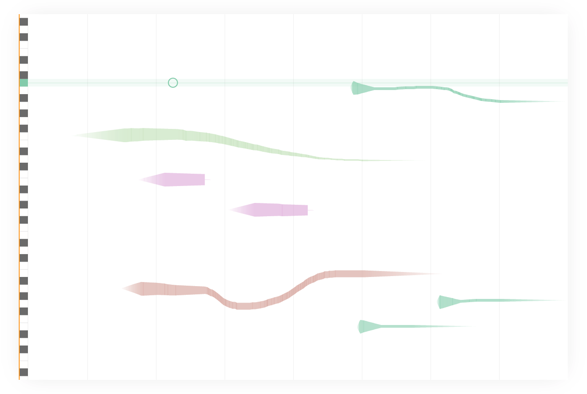

The [Musical Sketchpad](https://musical-sketchpad.netlify.app/) is a sequencer designed for short improvisations/performances.

Whereas most sequencers let you place notes on a grid, this interface allows you to freely draw frequencies. The keyboard provides a visual guide but pitches are not locked in to the notes (unless you hold SHIFT). This allows for expressive possibilities with micro tonal shifts and slides. One other quirk of the interface is that the notes fade over time, so you have to 'keep up' by adding new phrases, similar to how DJ needs to stay on top of the transition before the end of a track. There are 5 instruments that are represented visually by their ADSR envelope (sounds with higher sustains are thicker for example).

### Controls

SPACE to play/stop. Use the keys 1-5 to change instrument. Hold SHIFT to lock to the nearest note.
