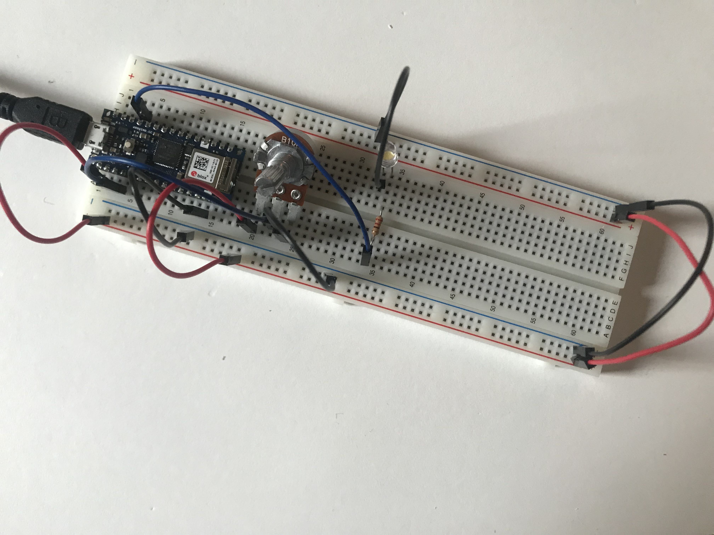
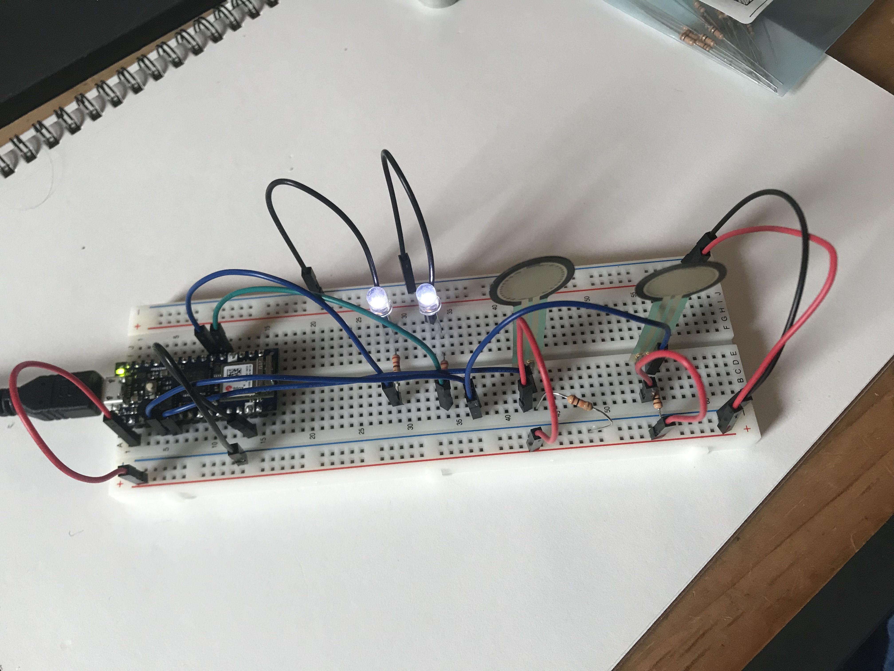

[Lab Guide](https://itp.nyu.edu/physcomp/labs/labs-arduino-digital-and-analog/analog-in-with-an-arduino/)

In this lab I learned how to read analog input using an Arduino. I wired two circuits, to digitally control LEDs using variable resistors.

## Reading a Potentiometer

For the first circuit, I connected a rotary potentiometer to the `A0` pin and a 220Ω resistor in series with an LED to the `D9` pin. The potentiometer also needed to be connected to pulldown resistor in series with ground.

<div class="portrait">


_The potentiometer and LED connected to the Arduino_

</div>

The following code reads the pot's value and writes a `brightness` value to the LED.

```cpp
const int ledPin = 9;
int analogValue = 0;
int brightness = 0;

void setup() {
  Serial.begin(9600);
  pinMode(ledPin, OUTPUT);
}

void loop() {
    // read the pot value
    analogValue = analogRead(A0);
    //divide by 4 to fit in a byte
    brightness = analogValue / 4;
    // PWM the LED with the brightness value
    analogWrite(ledPin, brightness);
}
```

With the code uploaded, rotating the potentiometer controls the brightness of the LED.

<p>
<video muted autoplay loop name="Rotating the potentiometer changes the LED's voltage" src="IMG_6337.mov"></video>
<em>Rotating the potentiometer changes the LED's voltage</em>
</p>

## Reading Force Sensing Resistors

Next I wired the breadboard to read two Force Sensing Resistors (FSRs) so that each one controls the voltage of an LED. Following the [schematic](https://itp.nyu.edu/physcomp/wp-content/uploads/LabTwoAnalogIn_schem.png), I connected FSRs to pins `A1` and `A2`, and the LEds to pins `2` and `3`.


_Both LEDs illuminate faintly by default_

I then uploaded the following code. It controls the brightness of the two LEDs by mapping the values coming from the FSRs to the correct range.

```cpp
const int leftLED = 2;
const int rightLED = 3;
int rightSensorValue = 0;
int leftSensorValue = 0;

void setup() {
  Serial.begin(9600);
  pinMode(leftLED, OUTPUT);
  pinMode(rightLED, OUTPUT);
}

void loop() {
  rightSensorValue = analogRead(A1);
  // map the sensor value from the input range to the output range (0-255).
  int brightness = map(rightSensorValue, 400, 900, 0, 255);
  analogWrite(leftLED, brightness);  // set the LED brightness with the result

  // same logic for the other FSR
  leftSensorValue = analogRead(A2);
  brightness = map(leftSensorValue, 400, 900, 0, 255);
  analogWrite(rightLED, brightness);
}
```

Pressing on the FSRs now changes the voltage of the LEDs.

<p>
<video muted autoplay loop name="Pressing on the FSRs changes the LED voltages" src="IMG_6339.mov"></video>
<em>Pressing on the FSRs changes the LED voltages</em>
</p>
