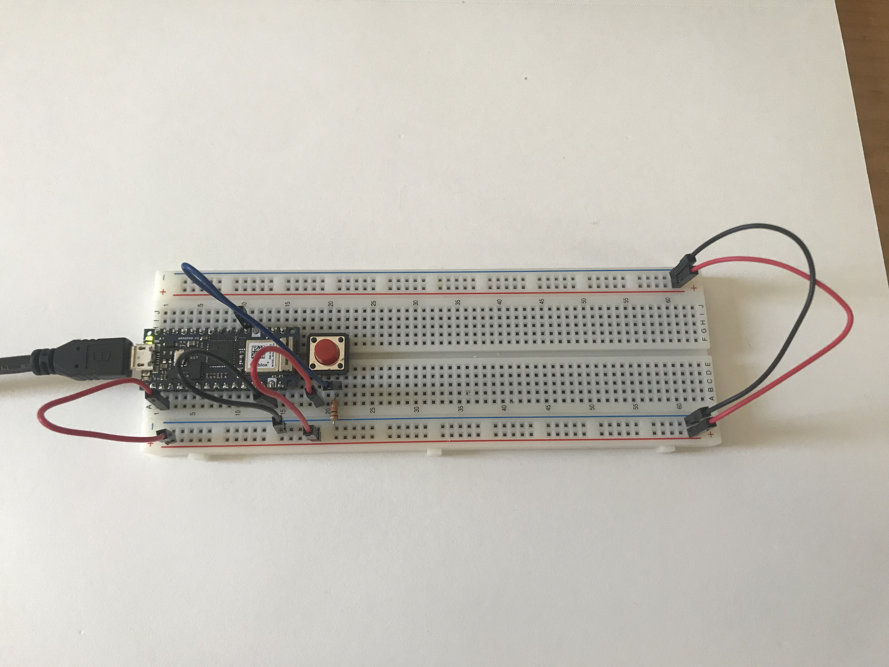

[Lab Guide](https://itp.nyu.edu/physcomp/lab-intro-to-serial-communications/)

In this lab I learned the basics of interfacing Arduino code with other programs via serial communication.

I used the accelerometer in the Arduino so I only needed to wire up a pushbutton to the controller.



I experimented with viewing the Serial stream in the terminal via `cat`, as well as with different output formats (Binary, Hex, and Octal). I then implemented a two way communication so that the Arduino waits for serial input before sending output. The following code begins sending accelerometer data when it receives any sort of serial input.

```cpp
#include "Arduino_LSM6DS3.h"

const int BUTTON_PIN = 2;


void setup() {
  Serial.begin(9600);
  if (!IMU.begin()) {
    Serial.println("Failed to initialize IMU");
    // stop here if you can't access the IMU:
    while (true);
  }

  while (Serial.available() <= 0) {
     Serial.println("hello"); // send a starting message
     delay(300);              // wait 1/3 second
   }
}

void loop() {
  // values for acceleration and rotation:
  float xAcc, yAcc, zAcc;
  float xGyro, yGyro, zGyro;

  // if both accelerometer and gyrometer are ready to be read:
  if (IMU.accelerationAvailable() &&
      IMU.gyroscopeAvailable()) {
    // read accelerometer and gyrometer:
    IMU.readAcceleration(xAcc, yAcc, zAcc);

    // print the results:
    IMU.readGyroscope(xGyro, yGyro, zGyro);
    Serial.print(xAcc);
    Serial.print(",");
    Serial.print(yAcc);
    Serial.print(",");
    Serial.print(zAcc);
    Serial.print(",");
    Serial.print(xGyro);
    Serial.print(",");
    Serial.print(yGyro);
    Serial.print(",");
    Serial.println(zGyro);
  }
}
```

<p></p>

Here it is in action:

<p>
<video mute autoplay loop name="Two-way Serial Communication" src="IMG_6385.mp4"></video>
<em>Two-way Serial Communication</em>
</p>
