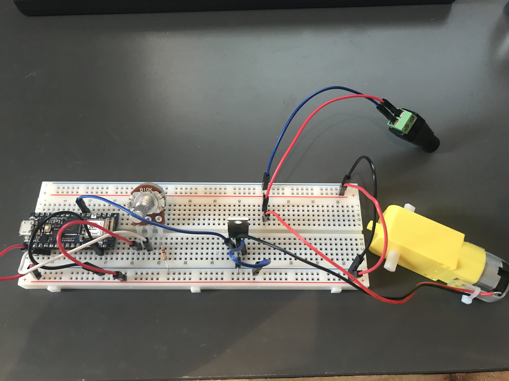

[Lab Guide](https://itp.nyu.edu/physcomp/labs/motors-and-transistors/using-a-transistor-to-control-high-current-loads-with-an-arduino/)

In this lab I used a transistor to control a DC motor. The DC motor requires a high current load, supplied by a 9V power jack. I used a potentiometer along with the transistor to regulate how much of that load reaches the motor. I used a MOSFET transistor -- the [FQP30N06L](https://cdn.sparkfun.com/datasheets/Components/General/FQP30N06L.pdf).


_Wiring the circuit_

I first wired the circuit, connecting the transistor's gate to the microcontroller, the source to the DC motor and a diode, and the drain to ground.

I then uploaded the following code to see if everything was connected properly.

```cpp
const int transistorPin = 2;

void setup() {
  // set  the transistor pin as output:
  pinMode(transistorPin, OUTPUT);
}

void loop() {
  digitalWrite(transistorPin, HIGH);
  delay(1000);
  digitalWrite(transistorPin, LOW);
  delay(1000);
}
```

<p></p>

<p>
<video style="width: 100%; max-height: none" controls name="capture1" src="./IMG_6448.mp4"></video>
<em>Starting and stopping the motor</em>
</p>

Then I implemented logic to control the speed of the motor using the potentiometer:

```cpp
const int transistorPin = 3;

void setup() {
  pinMode(transistorPin, OUTPUT);
}

void loop() {
  int sensorValue = analogRead(A0);
  int outputValue = map(sensorValue, 0, 1023, 0, 255);
  analogWrite(transistorPin, outputValue);
}
```

<p></p>

<p>
<video style="width: 100%; max-height: none" controls name="capture2" src="./IMG_6449.mp4"></video>
<em>Controlling the motor's speed using a potentiometer</em>
</p>
