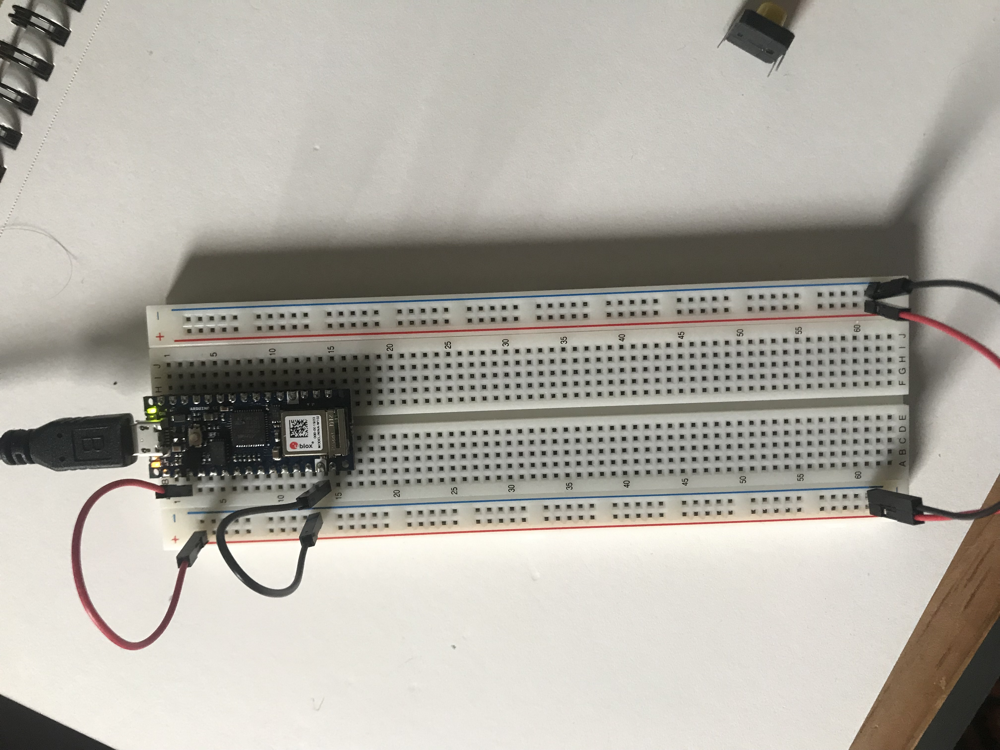
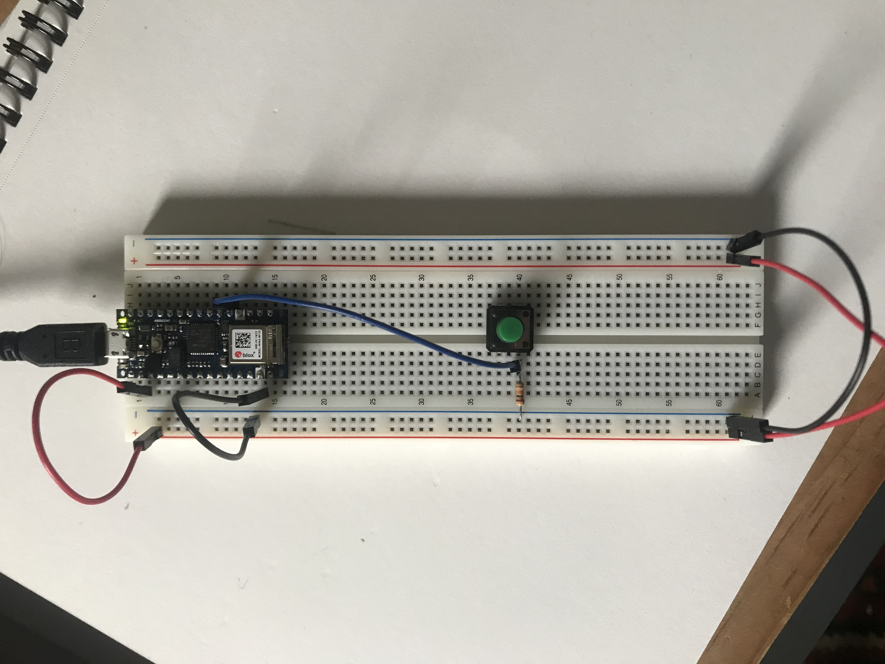
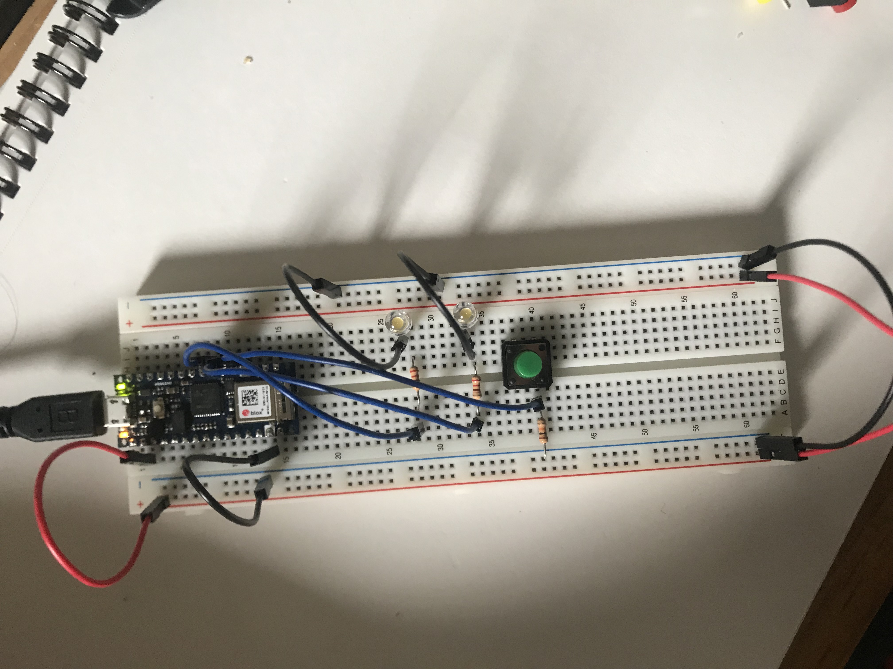
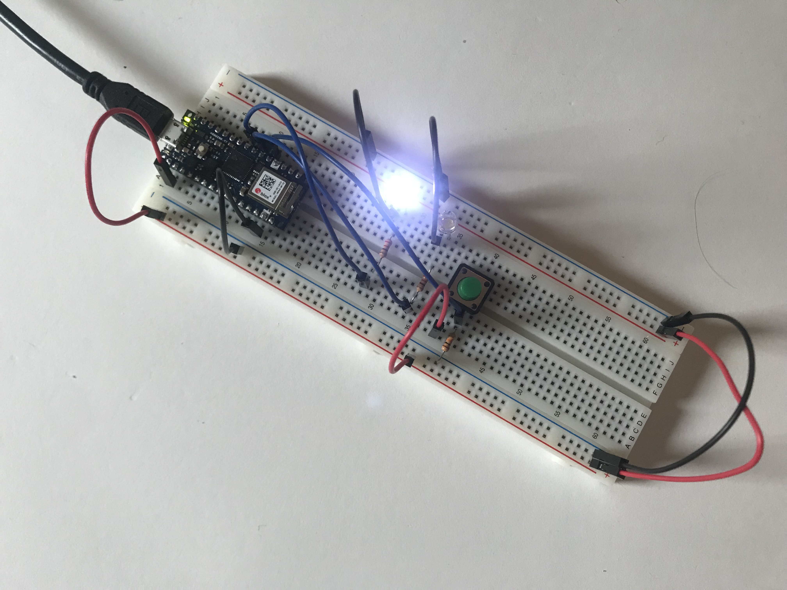
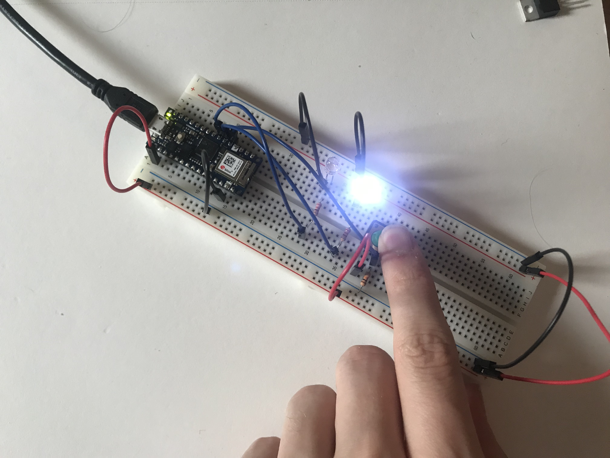

[Lab Guide](https://itp.nyu.edu/physcomp/labs/labs-arduino-digital-and-analog/digital-input-and-output-with-an-arduino/)

In this lab I familiarized myself with the [Arduino Nano 33 IoT](https://content.arduino.cc/assets/NANO33IoTV2.0_sch.pdf) by wiring a basic circuit and uploading code that would allow me to toggle two LEDs by pressing a button. I began by attaching the Arduino to the breadboard and connecting its +3.3V and ground pins.


_Attaching the Arduino to the breadboard_

I started my circuity with a pushbutton connected to the D2 pin and a 10KΩ "pulldown" resistor connected to ground, which prevents the input from behaving unreliably.


_Connecting a pushbutton to pin 2 with a 10KΩ pulldown resistor_

Next I connected two LEDs to pins D3 and D4, each wired in series with a 220Ω resistor. These would serve as my digital outputs.


_Wiring two LEDs to pins 3 and 4_

I was then ready to upload code to the device. Using the [Arduino IDE](https://www.arduino.cc/en/Main/Software) I uploaded this code, which toggles the two LEDs based on whether the pushbutton is pressed:

```cpp
void setup() {
  pinMode(2, INPUT);    // set the pushbutton pin to be an input
  pinMode(3, OUTPUT);   // set the left LED pin to be an output
  pinMode(4, OUTPUT);   // set the right LED pin to be an output
}

void loop() {
   // read the pushbutton input:
   if (digitalRead(2) == HIGH) {
     // if the pushbutton is closed:
     digitalWrite(3, HIGH);    // turn on the top LED
     digitalWrite(4, LOW);     // turn off the bottom LED
   }
   else {
     // if the switch is open:
     digitalWrite(3, LOW);     // turn off the top LED
     digitalWrite(4, HIGH);    // turn on the red bottom
   }
 }
```

When the code was finished uploading, the first LED turned on.


_The first LED lights up after uploading the code_

The LEDs toggled when I pressed the button.


_The second LED lights up when pressing the button_

<p>
<video muted autoplay loop name="Pressing the button causes the LEDs to toggle" src="IMG_6335.mov"></video>
<em>Pressing the button causes the LEDs to toggle</em>
</p>
