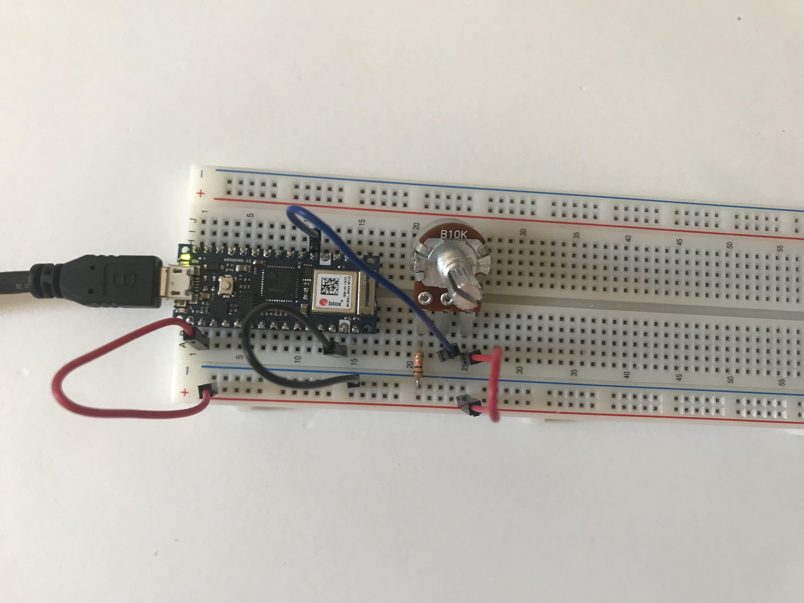

[Lab Guide](https://itp.nyu.edu/physcomp/labs/labs-serial-communication/lab-serial-input-to-the-p5-js-ide/)

In this lab I connected data gathered by an Arduino to JavaScript code running in the browser. The circuit consisted of a linear potentiometer connected to my Arduino Nano 33 IOT.


_The circuit_

After installing [P5 Serial Control](https://github.com/p5-serial/p5.serialcontrol/), I was able to read serial data coming from the microcontroller in the P5 web editor with the help of the [p5.serialport library](https://raw.githubusercontent.com/vanevery/p5.serialport/master/lib/p5.serialport.js). Once everything was connected properly I implemented a simple sketch that displays the potentiometer value.

<p>
<video autoplay loop muted name="Displaying the potentiometer value" src="IMG_6387.mp4"></video>
<em>Displaying the potentiometer value</em>
</p>

I could then write a more complex program that graphs the value over time.

<p>
<video autoplay loop muted name="Drawing a graph using physical controls" src="IMG_6388.mp4"></video>
<em>Drawing a graph using physical controls</em>
</p>

The JavaScript code:

```js
var serial;
const PORT_NAME = '/dev/tty.usbmodem142301';
var inData;
var xPos = 0;

function setup() {
  serial = new p5.SerialPort();

  serial.on('connected', serverConnected);
  serial.on('open', portOpen);
  serial.on('data', serialEvent);
  serial.on('error', serialError);
  serial.on('close', portClose);

  serial.list();
  serial.open(PORT_NAME);

  createCanvas(400, 300);
}

function graphData(newData) {
  var yPos = map(newData, 0, 255, 0, height);
  stroke(0xa8, 0xd9, 0xa7);
  line(xPos, height, xPos, height - yPos);
  if (xPos >= width) {
    xPos = 0;
    background(0x08, 0x16, 0x40);
  } else {
    xPos++;
  }
}

function draw() {
  graphData(inData);
}

function serverConnected() {
  console.log('connected to server.');
}

function portOpen() {
  console.log('the serial port opened.');
}

function serialEvent() {
  var inString = serial.readLine();
  if (inString.length > 0) {
    inData = Number(inString);
  }
}

function serialError(err) {
  console.log('Something went wrong with the serial port. ' + err);
}

function portClose() {
  console.log('The serial port closed.');
}
```

<p></p>

The Arduino code:

```cpp
void setup() {
  Serial.begin(9600);
}

void loop() {
  int potentiometer = analogRead(A0);
  int mappedPot = map(potentiometer, 0, 1023, 0, 255);
  Serial.println(mappedPot);
  delay(1);
}
```
