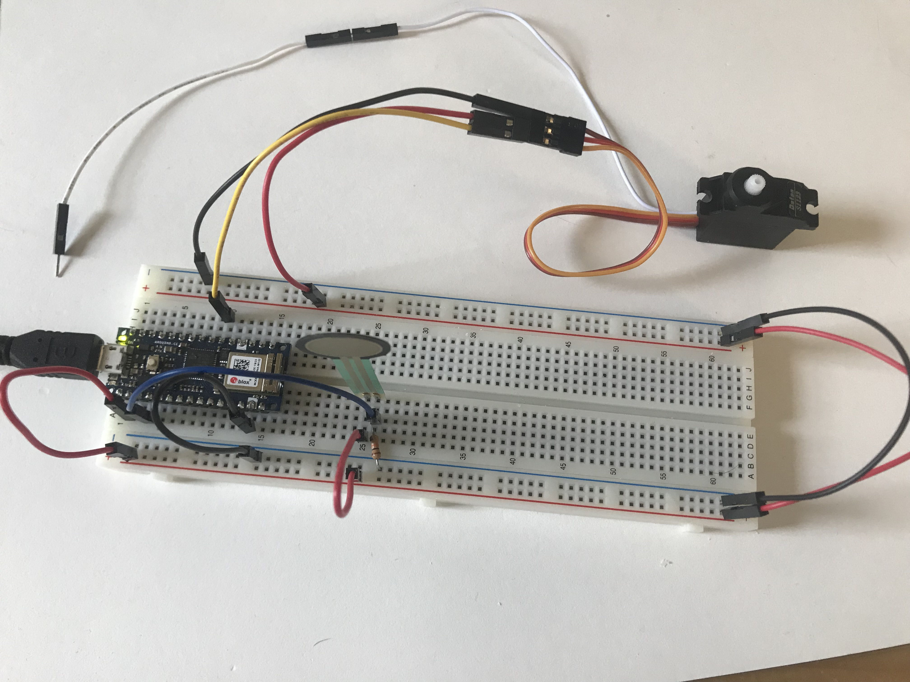

[Lab Guide](https://itp.nyu.edu/physcomp/labs/labs-arduino-digital-and-analog/servo-motor-control-with-an-arduino/)

In this lab I learned the basics of controlling a Servo Motor using analog sensors. I was able to control the motors rotation with an FSR. I wired the Arduino to connect to an FSR input and a Servo Motor output.


_Wiring the Servo Motor to the Arduino_

Using the `Servo` library, I uploaded the following code, which converts the analog FSR value into an angle that is sent to the motor.

```cpp
#include "Servo.h"      // include the servo library

Servo servoMotor;       // creates an instance of the servo object to control a servo
int servoPin = 3;       // Control pin for servo motor

void setup() {
  Serial.begin(9600);       // initialize serial communications
  servoMotor.attach(servoPin);  // attaches the servo on pin 3 to the servo object
}

void loop()
{
  int analogValue = analogRead(A0); // read the analog input

  // if your sensor's range is less than 0 to 1023, you'll need to
  // modify the map() function to use the values you discovered:
  int servoAngle = map(analogValue, 0, 1023, 0, 179);

  // move the servo using the angle from the sensor:
  servoMotor.write(servoAngle);
}
```

<p></p>

Pressing on the FSR now controlled the motor.

<p>
<video autoplay loop muted name="Controlling the motor with the FSR" src="IMG_6357.mov"></video>
<em>Controlling the motor with the FSR</em>
</p>
