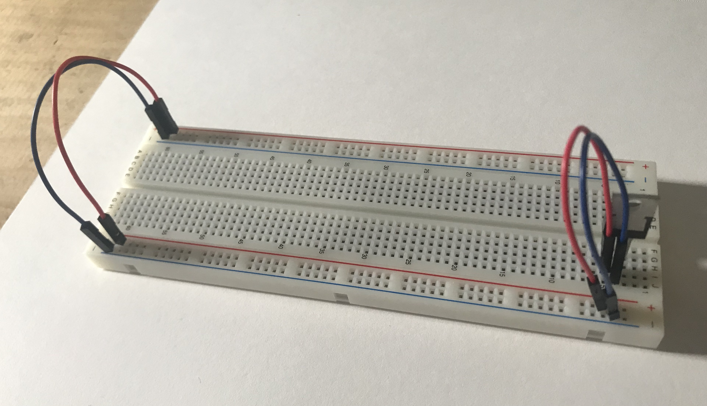

[Lab Guide](https://itp.nyu.edu/physcomp/labs/breadboard/)

In this lab I will familiarize myself with the breadboard and built a basic circuit. The circuit will
illuminate an LED when powered.

_The schematic I will be implementing_

## Will it Light?

Before starting I will test my understanding by answering the ["Will it light"](https://itp.nyu.edu/physcomp/labs/breadboard/#Will_it_Light_Test_Your_Understanding) questions posed in the Lab.

1. Yes, the circuit is complete
2. No, the resistor is not connected to ground, and the LED is not connected to the input voltage
3. Yes, the new wire connects the resistor’s output voltage to the LED’s input, putting the two components in series with each other.
4. No. The current is not ‘forced’ to go through the LED because there is conductive material connecting both of its ends (underneath the breadboard row)
5. Yes, this looks complete

## Wiring the Circuit

I began by connecting the input voltage and ground to the 5V Voltage Regulator and connecting the regulator's output voltage to the 'positive bus' using the red wires and to the 'ground bus' using the blue wires.

_Wiring the voltage regulator_

I then added a 220Ω resistor in series with a white LED going from positive voltage to ground.

_This should work, right?_

At this point I thought the circuit should work, but when I connected the power the LED did not turn on,
although the voltage regulator did heat up. My mistake was incorrectly measuring the input voltage from the DC power adapter.
I had thought that the positive voltage was coming from the inner part of the plug when it was actually coming from the outer section. This meant
that the power entering the regulator was -9V instead of 9V.

_Measuring the voltage_

Reversing the wires in my power jack configuration solved the issue, and the LED lit up!

_The working circuit_
