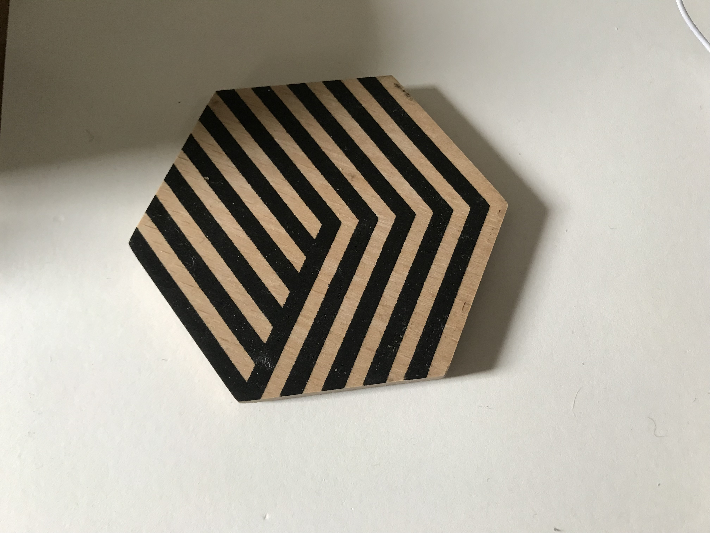
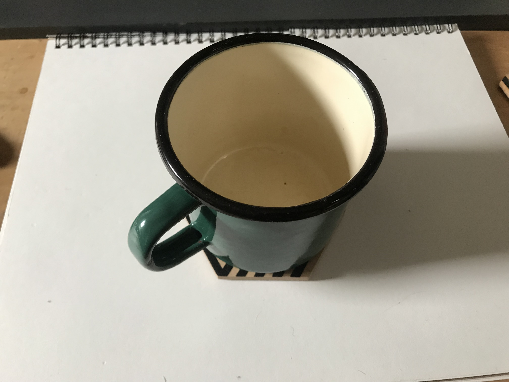
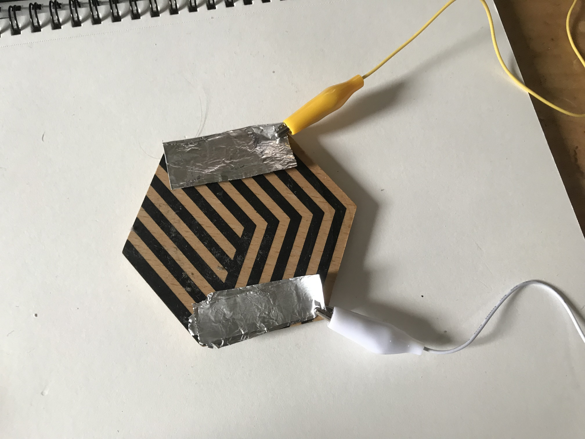
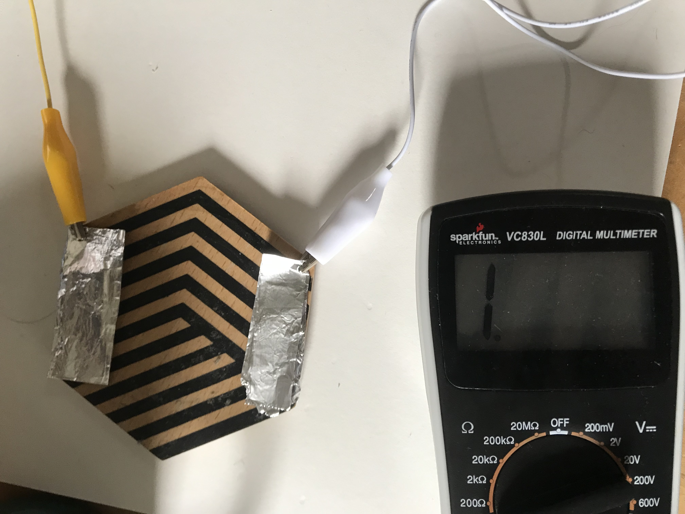
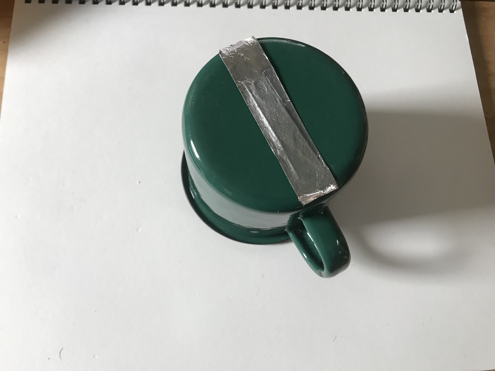
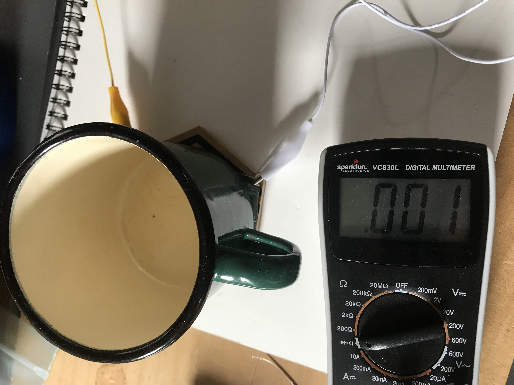
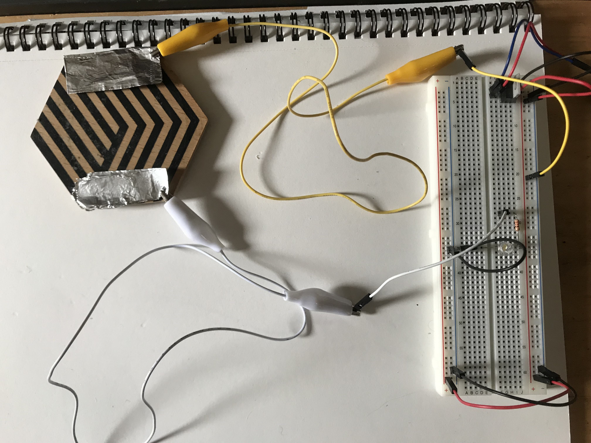
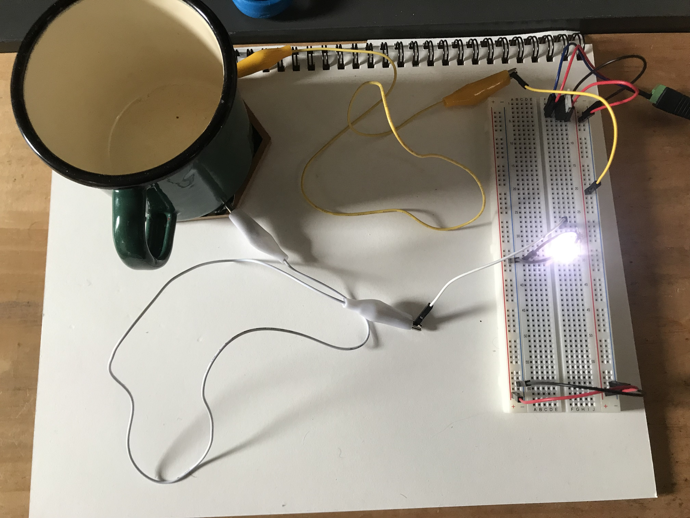

[Lab Guide](https://itp.nyu.edu/physcomp/labs/switches/)

In this lab I learned about the various types of electrical switches and created a custom switch out of a coaster.

## Making a Switch

I decided to turn a coaster into an electrical switch, so that an LED turns on when a modified mug is placed on it.

_The coaster_

The switch will be closed when the mug is on the coaster.

_The closed state_

To make this happen I used aluminum foil as a conductor, taping a pad of foil to each side of the coaster.

_Two aluminum pads on either side of the coaster_

Connecting to the foil using alligator clips, I measured for continuity. As expected, there was no continuity in the "unpressed" state.

_Measuring no continuity on the empty coaster_

I then taped a strip of foil to the bottom of the mug.

_Aluminum foil taped to the bottom of the mug_

The multimeter beeped when I placed the mug on the coaster - continuity!

<!-- 
_Measuring continuity when the mug is on the coaster_ -->

<video muted controls="controls" name="The connection becomes continuous when the mug is placed on the coaster" src="IMG_6322.mov"></video>
<em>The connection becomes continuous when the mug is placed on the coaster</em>

Now I needed to wire the switch to my breadboard. I used the same schematic introduced in the [electronics lab](/pcomp-lab-electronics/).

_Schematic view showing a pushbutton in series with a 220Ω resistor and LED_

I connected one side of my custom switch to Vin and the other side to the input of the 220Ω resistor, which is connected to the LED and then ground.

_Wiring the coaster switch to the breadboard by connecting one side to Vin and the other to the resistor's input_

Placing the mug on the coaster closes the switch, illuminating the LED. Success!

_Placing the mug on the coaster closes the switch, illuminating the LED_

  <video muted controls="controls" name="It works!" src="IMG_6325.mov"></video>
  <em>It works!</em>

One drawback to this design is that the mug must be placed at the correct rotation to close the switch. This could be avoided by creating a circular aluminum pattern on the bottom of the mug. That way the connection would occur no matter the mug's orientation.

## Other Switch Configurations

I also implemented two other switch configurations: switches in parallel and in series. With switches in parallel, pressing any one of them turns on the LED.

<video muted controls="controls" name="Video Name" src="IMG_6315.mov"></video>
<em>Switches in parallel: pressing any switch turns on the LED</em>

With switches in series, you must press all of them to complete the circuit.

<video muted controls="controls" name="Video Name" src="IMG_6316.mov"></video>
<em>Switches in series: the LED can only be activated by pressing all three buttons</em>

