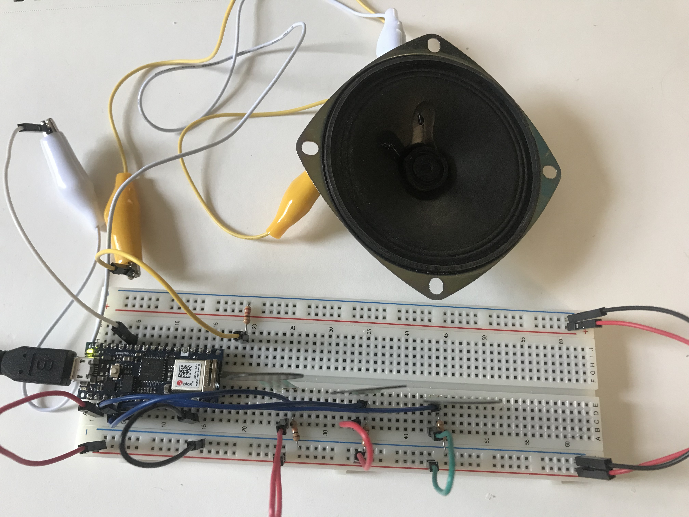

[Lab Guide](https://itp.nyu.edu/physcomp/labs/labs-arduino-digital-and-analog/tone-output-using-an-arduino/)

In this lab I learned how to program an Arduino to create sound. I began by wiring my breadboard to connect the Arduino to analog input and a speaker output.

The two FSRs wired in series creates a voltage divider, eliminating the need for any pulldown resistors. Pressing one or the other changes the resistance ratio being tracked by the Arduino code.


_Creating a voltage divider with two FSRs_

One modification I had to make to the code was to add the `delay` call which allows the tone to execute for 100 milliseconds before the next tick.

```cpp
void setup() {
  Serial.begin(9600);
}

void loop() {
  // get sensor reading:
  int sensorReading = analogRead(A0);
  // map the results to pitch range:
  float frequency = map(sensorReading, 0, 1024, 100, 1000);
  // change the pitch, play for 10 ms:
  if (frequency > 31 && frequency < 40000) {
    tone(8, frequency, 100);
  }
  delay(100);
}
```

<p></p>

Running this code, pressing the left FSR increased the pitch while pressing the right FSR decreased the pitch.

<p>
<video controls name="Controlling the pitch using the FSRs" src="IMG_6352.mov"></video>
<em>Controlling the pitch using the FSRs</em>
</p>

The next step was to upload a static melody that would play when the Arduino starts up. This code sets up the melody for _Shave and a Haircut, Two Bits_.

```cpp
#include "pitches.h"
 
// notes in the melody:
int melody[] = {
NOTE_C4, NOTE_G3,NOTE_G3, NOTE_GS3, NOTE_G3,0, NOTE_B3, NOTE_C4};
 
// note durations: 4 = quarter note, 8 = eighth note, etc.:
int noteDurations[] = {4,8,8,4,4,4,4,4 };

void setup() {
  // iterate over the notes of the melody:
  for (int thisNote = 0; thisNote < 8; thisNote++) {
    // to calculate the note duration, take one second
    // divided by the note type.
    //e.g. quarter note = 1000 / 4, eighth note = 1000/8, etc.
    int noteDuration = 1000/noteDurations[thisNote];
    tone(8, melody[thisNote],noteDuration);
 
    //pause for the note's duration plus 30 ms:
    delay(noteDuration + 30);
  }
}
 
void loop() {
  // no need to repeat the melody.
}
```

<p></p>

The melody played once on startup.

<p>
<video controls name="'Shave and a Haircut, Two Bits' melody" src="IMG_6353.mov"></video>
<em>'Shave and a Haircut, Two Bits' melody</em>
</p>

I then changed the wiring by adding a third FSR and connecting each FSR to an input pin as well as to ground with a pulldown resistor.


_Wiring three FSRs to use as note triggers_

The following code treats each FSR as a button that activates when a certain pressure threshold is reached.

```cpp
#include "pitches.h"

const int threshold = 100; // minimum reading of the sensors
const int speakerPin = 8;
const int noteDuration = 20;

// notes to play, corresponding to the 3 sensors:
int notes[] = { NOTE_A4, NOTE_B4, NOTE_C3 };
// FSR pins
int pins[] = { A0, A1, A2 };

void setup() {}

void loop() {
  for (int thisSensor = 0; thisSensor < 3; thisSensor++) {
    // get a sensor reading:
    int sensorReading = analogRead(pins[thisSensor]);
    // if the sensor is pressed hard enough:
    if (sensorReading > threshold) {
      // play the note corresponding to this sensor:
      tone(speakerPin, notes[thisSensor], 50);
      delay(50);
    }
  }
}
```

<p></p>

Each FSR is mapped to a note, making a three-key musical instrument.

<p>
<video controls name="Playing notes using FSRs" src="IMG_6354.mov"></video>
<em>Playing notes using FSRs</em>
</p>
