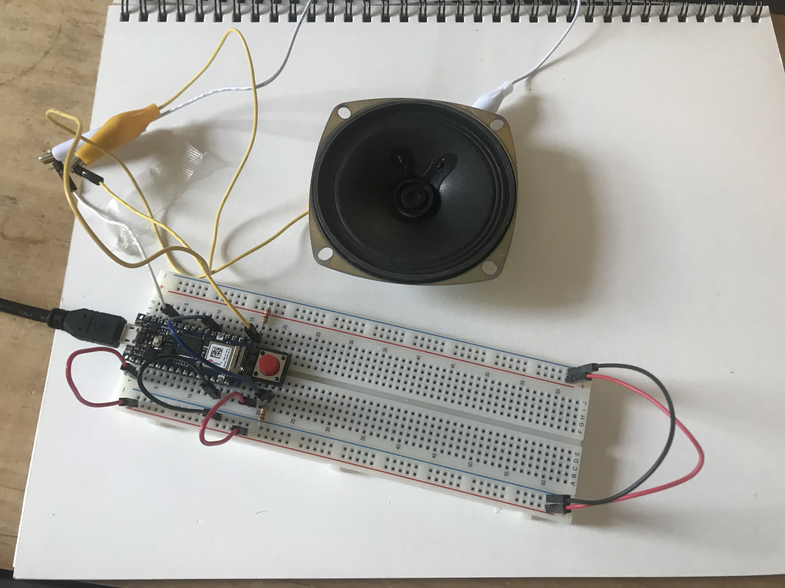

For my first project I am creating a 4 step sequencer where each step is a chord arpeggio. There will be buttons to cycle which chord each step is playing and a potentiometer to adjust the overall tempo. If I have time I also want to add a control for how fast each arpeggio repeats per step. LEDs will display the active step as the sequence plays.

I started with a single tone and an on/off button.


_Wiring the speaker and on/off button_

Since I don't have a physical toggle, I used a pushbutton along with the following code - which toggles the `isPlaying` variable whenever the button is pressed.

```cpp
const int speakerPin = 8;
const int buttonPin = 2;
bool isPlaying = false;

int toggleButtonState;
int prevToggleButtonState;

void setup() {
  Serial.begin(9600);
  pinMode(buttonPin, INPUT);
  prevToggleButtonState = digitalRead(buttonPin);
}

void loop() {
  toggleButtonState = digitalRead(buttonPin);
  if (toggleButtonState != prevToggleButtonState) {
    if (toggleButtonState == HIGH) {
      Serial.println("toggle on off");
      isPlaying = !isPlaying;
    }
  }

  prevToggleButtonState = toggleButtonState;

  if (isPlaying) {
    tone(speakerPin, 440, 50);
  }
  delay(50);
}
```

<p></p>

Now I could start and stop the tone with the button.

<p>
<video controls name="Starting and stopping the tone" src="IMG_6359.mov"></video>
<em>Starting and stopping the tone</em>
</p>

I then implemented a basic musical sequence. Referencing [this code](https://tigoe.github.io/SoundExamples/melody.html), I created a simple four-note melody that loops while `isPlaying` is true.

```cpp
#include "pitches.h"

const int speakerPin = 8;
const int buttonPin = 2;
bool isPlaying = false;

int toggleButtonState;
int prevToggleButtonState;

int bpm = 50;
// duration of a beat in ms
float beatDuration = 60.0 / bpm * 1000;
int noteCounter = 0;

int melody[] = {
  NOTE_F3, NOTE_A3, NOTE_C3, NOTE_E3
};

void setup() {
  Serial.begin(9600);
  pinMode(buttonPin, INPUT);
  prevToggleButtonState = digitalRead(buttonPin);
}

void loop() {
  // put your main code here, to run repeatedly:
  toggleButtonState = digitalRead(buttonPin);
  if (toggleButtonState != prevToggleButtonState) {
    if (toggleButtonState == HIGH) {
      Serial.println("toggle on off");
      isPlaying = !isPlaying;
    }
    delay(10);
  }

  prevToggleButtonState = toggleButtonState;

  if (isPlaying) {
    noteCounter = noteCounter % 4;
    int currentNote = melody[noteCounter];
    int noteDuration = beatDuration / 4;
    // turn the note on:
    tone(speakerPin, currentNote);
    // keep it on for the appropriate duration:
    delay(noteDuration);
    // turn the note off:
    noTone(speakerPin);
    noteCounter++;
    tone(speakerPin, 440, 50);
  }
}
```

<p></p>

Pressing the button now started the sequence.

<p>
<video controls name="A simple arpeggio" src="IMG_6360.mov"></video>
<em>A four-note sequence</em>
</p>

I then modified the code to establish a chord at each step instead of a single note. I created four chords which are each made up of three notes.

```cpp
#include "pitches.h"

const int speakerPin = 8;
const int buttonPin = 2;
bool isPlaying = false;

int toggleButtonState;
int prevToggleButtonState;

int bpm = 50;
// duration of a beat in ms
float beatDuration = 60.0 / bpm * 1000;
int stepCount = 0;

int melody[] = {
  NOTE_F3, NOTE_A3, NOTE_C3, NOTE_E3
};

int CHORDS[4][3] = {
  {NOTE_C3, NOTE_E3, NOTE_G3},
  {NOTE_D3, NOTE_F3, NOTE_A3},
  {NOTE_E3, NOTE_G3, NOTE_B3},
  {NOTE_F3, NOTE_A3, NOTE_C4},
};

void setup() {
  Serial.begin(9600);
  pinMode(buttonPin, INPUT);
  pinMode(speakerPin, OUTPUT);
  prevToggleButtonState = digitalRead(buttonPin);
}

void loop() {

  toggleButtonState = digitalRead(buttonPin);

  if (toggleButtonState != prevToggleButtonState) {
    if (toggleButtonState == HIGH) {
      Serial.println("toggle on off");
      isPlaying = !isPlaying;
    }
    delay(10);
  }

  if (isPlaying) {
    int chordDuration = beatDuration;

    for (int i = 0; i < 3; i++) {
      int note = CHORDS[stepCount][i];
      int noteDuration = chordDuration / 3;
      tone(speakerPin, note, noteDuration * 0.8);
      delay(noteDuration);
    }

    stepCount++;
    stepCount = stepCount % 4;
  }

  prevToggleButtonState = toggleButtonState;
}
```

<p></p>

Now, instead of 4 notes being played, 4 chord arpeggios are played in a loop. Each note in the chord is played for a third of the chord's duration. I eventually want to be able to control that duration so that the arpeggio can be repeated a variable number of times within the chord's set duration.

<p>
<video controls name="4 ascending arpeggios" src="IMG_6361.mov"></video>
<em>4 ascending arpeggios</em>
</p>

The first problem I encountered, as seen in the video above, is that the stop button does not always work. This is due to the `delay` calls after each note which prevent the loop from running at a constant rate. I will need to refactor the code to implement the melody logic without `delay` in order for everything to work as expected.
