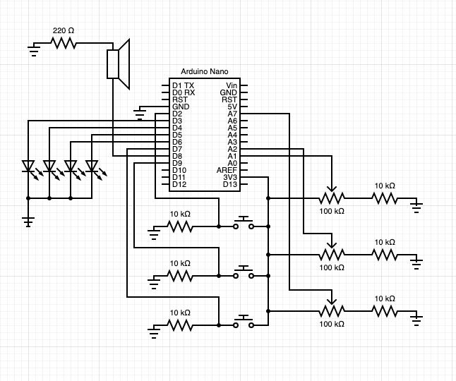

[Last update](/pcomp-project1-pt1/) I had begun to build and program a musical arpeggiator/sequencer, and had reached a point where I could start/stop a musical sequence with a button. There was still plenty of work to do to implement my vision. I needed to add LED output that shows which step is playing, and multiple inputs to control tempo, arpeggio speed and which arpeggios are playing. I also needed to eliminate `delay` from my code so that the tone output would not prevent the sensors from being read in real time.

The first thing I addressed was the `delay` issue. I incorporated a library called [Takser](https://github.com/joysfera/arduino-tasker) which exposes an API similar to JavaScript's timer functions. It allows you to set hierarchy of timers and intervals that execute independently. I refactored my `loop` function to work within this new framework by creating an interval for playing notes that executed every step and an interval to watch for the on/off button press.

Next I wired four LEDs to display which step is being played. I wrote logic to activate each LED when the corresponding step is active. Here is the code at this point:

```cpp
// #define TASKER_MAX_TASKS 32
#include <Tasker.h>
#include "pitches.h"

Tasker tasker(true);

const int speakerPin = 8;
const int buttonPin = 2;
bool isPlaying = false;

int toggleButtonState;
int prevToggleButtonState;

int bpm = 65;
// duration of a beat in ms
float beatDuration = 60.0 / bpm * 1000;
int noteDuration = beatDuration / 3;
int stepCount = 0;

int LED_STEP_PINS[] = {5, 6, 4, 3};

int CHORDS[4][3] = {
  {NOTE_C3, NOTE_E3, NOTE_G3},
  {NOTE_E3, NOTE_G3, NOTE_B2},
  {NOTE_F3, NOTE_A3, NOTE_C3},
  {NOTE_D3, NOTE_F3, NOTE_A2},
};

void handleButtonPress() {
  toggleButtonState = digitalRead(buttonPin);
  if (toggleButtonState != prevToggleButtonState) {
    if (toggleButtonState == HIGH) {
      Serial.println("toggle on off");
      isPlaying = !isPlaying;
    }
  }
  prevToggleButtonState = toggleButtonState;
}

void playNote(int note) {
  Serial.println("playing note: ");
  Serial.println(note);

  tone(speakerPin, note, noteDuration * 0.9);
}

void playStep() {
  if (isPlaying) {
    for (int i = 0; i < 4; i++) {
      if (i == stepCount) {
        digitalWrite(LED_STEP_PINS[i], HIGH);
      } else {
        digitalWrite(LED_STEP_PINS[i], LOW);
      }
    }

    for (int i = 0; i < 3; i++) {
      int note = CHORDS[stepCount][i];
      tasker.setTimeout(playNote, i * noteDuration + 1, note);
    }

    stepCount++;
    stepCount = stepCount % 4;
  }
}

void setup() {
  Serial.begin(9600);

  pinMode(buttonPin, INPUT);
  pinMode(speakerPin, OUTPUT);
  prevToggleButtonState = digitalRead(buttonPin);

  tasker.setInterval(handleButtonPress, 1);
  tasker.setInterval(playStep, beatDuration);
}

void loop() {
  tasker.loop();
}
```

The LEDs now showed the sequence.

<p>
<video controls name="LEDs in sync with the sequence" src="IMG_6366.mp4"></video>
<em>LEDs in sync with the sequence (note: very low volume)</em>
</p>

My next step was to add two buttons, one to cycle through selected steps and the other to the arpeggio at a the selected step. I also wanted to visualize this by making the LED at the selected step blink. After wiring the two buttons I added another interval that would simply blink the active step. I hard-coded an array of the seven three-note chords in the C major scale and created another array to represent which chord index was supposed to play at each of the four steps.

I added logic for the buttons to control the `activeStep` and `chords[]` variables which determine which chord to play at each step.

I also needed to change the sequencer structure. Before, each step was creating multiple intervals based on the arpeggio's divisions, which was causing timing inconsistencies and dropped notes. I solved this by executing the interval every note (instead of every step which could play multiple notes) and determining which step was active by counting notes.

```cpp
#include <Tasker.h>
#include "chords.h"

Tasker tasker(true);

const int SPEAKER_PIN = 8;
const int BUTTON_PIN = 2;
const int LED_STEP_PINS[] = {5, 6, 4, 3};
const int INCREMENT_STEP_PIN = 9;
const int INCREMENT_CHORD_PIN = 7;

const int TOTAL_CHORDS = 4;

bool isPlaying = false;

int onOffButtonState;
int prevOnOffButtonState;

int incrementStepButtonState;
int prevIncrementStepButtonState;

int incrementChordButtonState;
int prevIncrementChordButtonState;

float beatDuration;
int beatDivisions = 6;

int currentChord = 0;
int currentStep = 0;

int activeStep = 0;

int chords[] = {0, 4, 5, 3};

// ------------------------------------------------------------------

void setBpm(int bpm)
{
  // duration of a beat in ms
  beatDuration = 60.0 / bpm * 1000;
}

void stopSequence()
{
  noTone(SPEAKER_PIN);

  // reset position
  currentStep = 0;
  currentChord = 0;

  // Turn off LEDs
  for (int i = 0; i < TOTAL_CHORDS; i++)
  {
    digitalWrite(LED_STEP_PINS[i], LOW);
  }
}

void playNoteStep()
{
  if (!isPlaying)
  {
    noTone(SPEAKER_PIN);
    return;
  };

  // Turn on LED for current chord step
  for (int i = 0; i < TOTAL_CHORDS; i++)
  {
    if (i == currentChord)
    {
      digitalWrite(LED_STEP_PINS[i], HIGH);
    }
    else
    {
      digitalWrite(LED_STEP_PINS[i], LOW);
    }
  }

  // cycle through notes in the chord
  int currentNoteIndex = currentStep % 3;
  int note = C_MAJ_CHORDS[chords[currentChord]][currentNoteIndex];
  float noteDuration = beatDuration / beatDivisions;
  tone(SPEAKER_PIN, note, noteDuration * 0.8);

  currentStep++;
  currentStep = currentStep % beatDivisions;

  // increment chord when steps cycle
  if (currentStep == 0)
  {
    currentChord++;
    currentChord = currentChord % TOTAL_CHORDS;
  }
}

// ------------------------------------------------------------------

int blinkVal = LOW;
void blinkActiveStep() {
  for (int i = 0; i < TOTAL_CHORDS; i++)
  {
    if (i == activeStep)
    {
      digitalWrite(LED_STEP_PINS[i], blinkVal);
      blinkVal = !blinkVal;
    }
  }
}

// BUTTON HANDLERS ------------------------------------------------------------------

void watchForStartButtonPress()
{
  onOffButtonState = digitalRead(BUTTON_PIN);
  if (onOffButtonState != prevOnOffButtonState)
  {
    if (onOffButtonState == HIGH)
    {
      Serial.println("Toggle on/off");
      isPlaying = !isPlaying;
      if (!isPlaying)
      {
        stopSequence();
      }
    }
  }
  prevOnOffButtonState = onOffButtonState;
}

void watchForIncrementStepPress()
{
  incrementStepButtonState = digitalRead(INCREMENT_STEP_PIN);
  if (incrementStepButtonState != prevIncrementStepButtonState)
  {
    if (incrementStepButtonState == HIGH)
    {
      Serial.println("Select Next Step");
      // Clear current blink
      for (int i = 0; i < TOTAL_CHORDS; i++)
      {
        digitalWrite(LED_STEP_PINS[activeStep], LOW);
      }
      activeStep++;
      activeStep = activeStep % TOTAL_CHORDS;
    }
  }
  prevIncrementStepButtonState = incrementStepButtonState;
}

void watchForIncrementChordPress()
{
  incrementChordButtonState = digitalRead(INCREMENT_CHORD_PIN);
  if (incrementChordButtonState != prevIncrementChordButtonState)
  {
    if (incrementChordButtonState == HIGH)
    {
      Serial.println("Increment Chord");
      int nextChordIndex = chords[activeStep];
      nextChordIndex++;
      nextChordIndex = nextChordIndex % 7;
      chords[activeStep] = nextChordIndex;
    }
  }
  prevIncrementChordButtonState = incrementChordButtonState;
}

// ------------------------------------------------------------------

void setup()
{
  Serial.begin(9600);

  setBpm(70);

  pinMode(BUTTON_PIN, INPUT);
  pinMode(INCREMENT_STEP_PIN, INPUT);
  pinMode(INCREMENT_CHORD_PIN, INPUT);

  pinMode(SPEAKER_PIN, OUTPUT);

  // initialize button states
  prevOnOffButtonState = digitalRead(BUTTON_PIN);
  prevIncrementStepButtonState = digitalRead(INCREMENT_STEP_PIN);
  prevIncrementChordButtonState = digitalRead(INCREMENT_CHORD_PIN);

  tasker.setInterval(watchForStartButtonPress, 1);
  tasker.setInterval(watchForIncrementStepPress, 1);
  tasker.setInterval(watchForIncrementChordPress, 1);
  tasker.setInterval(blinkActiveStep, 100);

  float noteDuration = beatDuration / beatDivisions;
  tasker.setInterval(playNoteStep, noteDuration, 0);
}

void loop()
{
  tasker.loop();
}
```

With this code running I could cycle through each step and increment it's chord:

<p>
<video controls name="Selecting and changing the chord at different steps" src="IMG_6369.mp4"></video>
<em>Selecting and changing the chord at different steps (note: very low volume)</em>
</p>

Now it was time to add some analog input. I wanted three dials -- one to control **tempo** (how fast the steps progress), one to control **arpeggio divisions** (how many notes are played per step -- does not affect tempo), and one to control **note duration** (how long each note lasts). I wired three potentiometers to the Arduino (each with a pulldown resistor) and implemented logic to read these values.


_The final schematic of my sequencer_

You can [view the final code on GitHub](https://github.com/ejarzo/arduino-chord-sequencer/blob/master/sequencer.ino). When the tempo or step divisions are adjusted, I needed to re-initiate the sequence because its timing is based on those values -- this happens in the `resetInterval` function. I refactored the interval logic so that instead of multiple intervals firing every millisecond to read button presses and potentiometers, there is just one function to read all input.

Here is a short demonstration of the final device! I wish I had been able to create some sort of housing but I had trouble figuring out how since the buttons, LEDs, and potentiometers all have different heights.

<p>
<video controls name="The final product!" src="IMG_6370.mp4"></video>
<em>The final product! (note: very low volume)</em>
</p>
