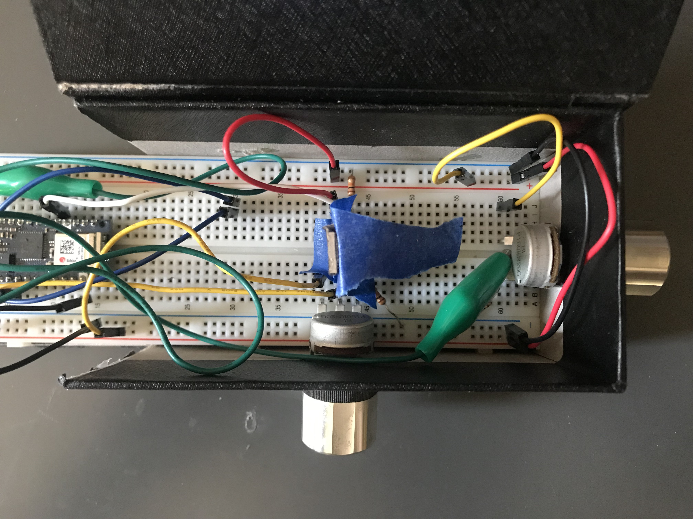
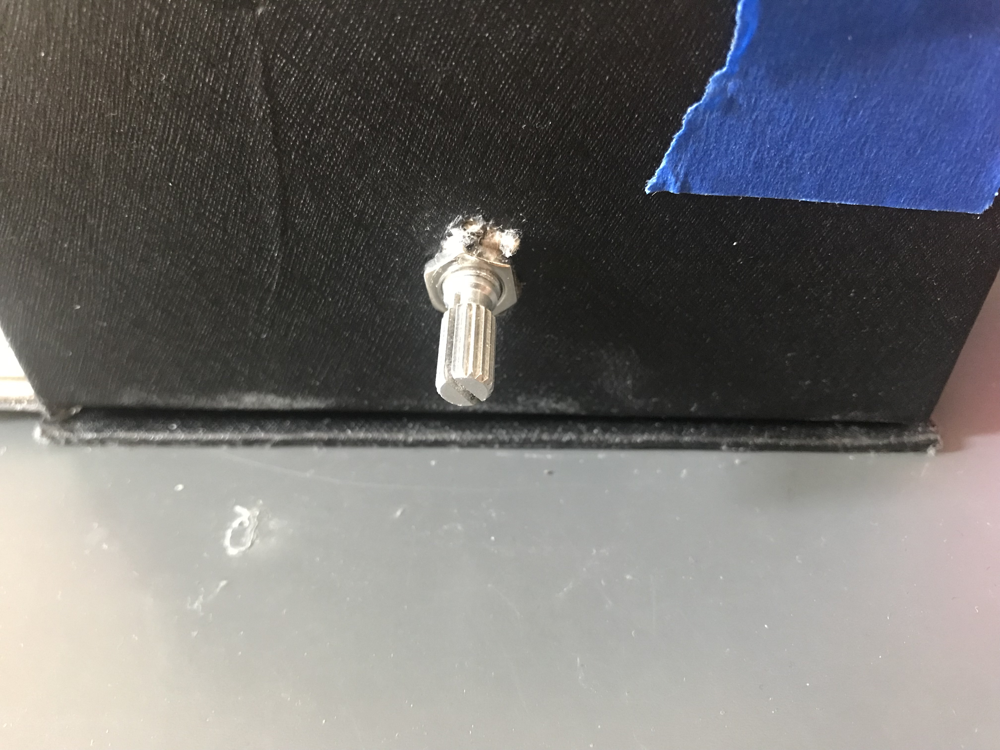
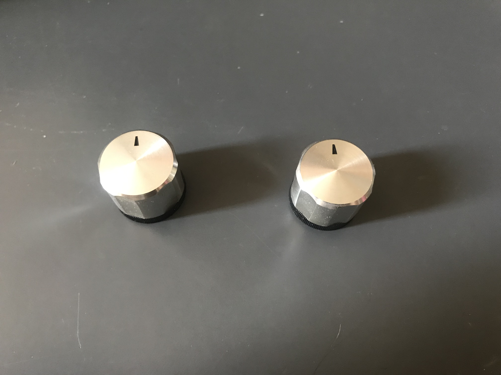
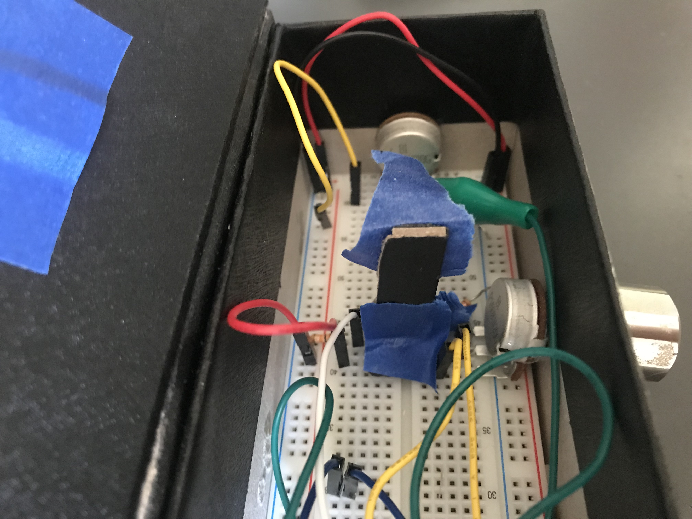
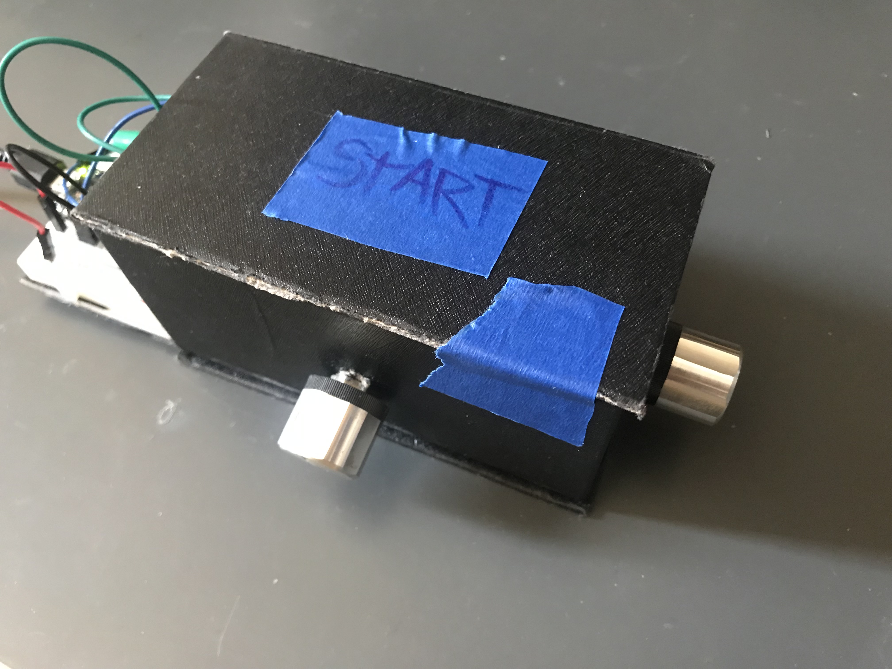
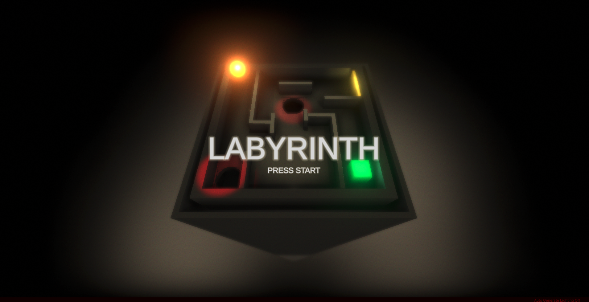
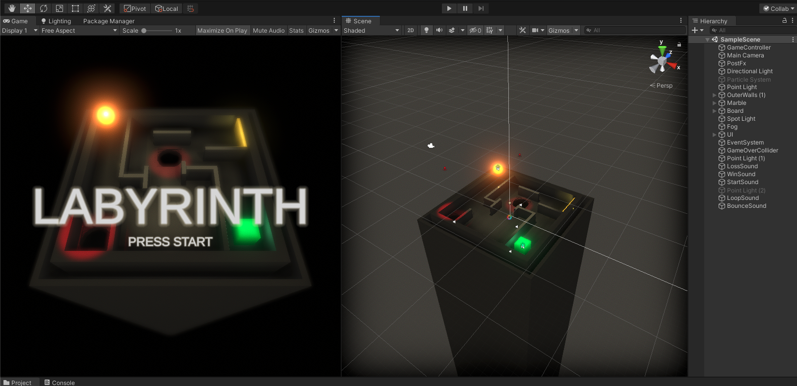
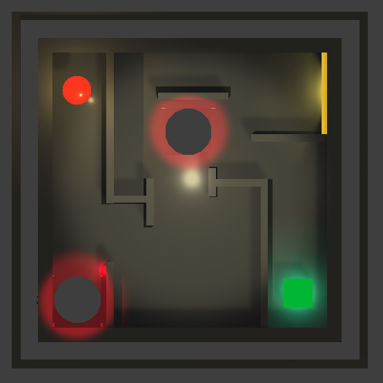

<iframe src="https://player.vimeo.com/video/475475381?color=eae6de" width="640" height="330" frameborder="0" allow="autoplay; fullscreen" allowfullscreen></iframe>

<p></p>

## Overview

_Labyrinth_ is an arcade-style puzzle game where you use a physical controller to roll a virtual marble through a maze. It consists of a table-top device that interfaces via serial communication to an app built with [Unity](https://unity.com/). It also features custom-made sounds and spacial audio (note: the video audio is pretty quiet).

## The Controller

The physical controller consists of two knobs and a button connected to an [Arduino Nano 33 IoT](https://store.arduino.cc/usa/nano-33-iot). View the [Bill of Materials](https://octopart.com/bom-tool/mzWhuRSi).

</img>
<em class="caption">The circuit diagram shows two potentiometers and a push button each connected to the Arduino and a 10kΩ pulldown resistor</em>

The wiring is relatively straightforward. Two potentiometers and a push button each connect to the input voltage, the Arduino, and a 10kΩ pulldown resistor.

### Housing

For the housing I used a small box that happened to fit the breadboard perfectly... on three sides.


_The interior_

I cut holes the box using a knife and secured the potentiometers in place with their included nuts. I also commandeered two caps from my stereo for the knobs.


_Securing the potentiometers_


_Two knobs pilfered from my stereo_

The final step was configuring the pushbutton so that pressing the top of the box would press the switch. I did this by taping a stiff piece of cardboard to the button itself and carefully lowering the lid in to place.


_The cardboard button extender_

I wanted the top to remain in place but also be easily openable so I then taped it down.


_The finished housing_

The finished housing looks a bit rough but feels solid, with both knobs securely fastened to the sides.

<p>
<video muted autoplay loop name="Pressing the top Start button" src="IMG_6414.mp4"></video>
<em>Pressing the top "Start" button</em>
</p>

<p>
<video muted autoplay loop name="The knobs feel solidly connected" src="IMG_6415.mp4"></video>
<em>The knobs feel solidly connected</em>
</p>

### The Firmware

The [hardware code](https://github.com/ejarzo/Labyrinth/blob/master/Arduino/labyrinth-sketch/labyrinth-sketch.ino) is fairly simple. It reads the values from the sensors and button, maps the analog input to a value between 0 and 100, and prints the results on one line to the serial port. It also establishes a "handshake" -- it will wait for serial input before writing output.

```cpp
const int Z_POT_PIN = A1;
const int X_POT_PIN = A2;
const int BUTTON_PIN = 2;

void setup() {
  Serial.begin(9600);
  pinMode(X_POT_PIN, INPUT);
  pinMode(Z_POT_PIN, INPUT);
  pinMode(BUTTON_PIN, INPUT);
  while (Serial.available() <= 0) {
    Serial.println("waiting...");
    delay(300);
  }
}

int clamp(int input) {
  if (input < 0) {
    return 0;
  }
  if (input > 100) {
    return 100;
  }
  return input;
}

void loop() {
  if (!Serial.available()) return;

  int zVal = analogRead(Z_POT_PIN);
  int mappedZ = clamp(map(zVal, 480, 1024, 0, 100));

  int xVal = analogRead(X_POT_PIN);
  int mappedX = clamp(map(xVal, 480, 1024, 0, 100));

  int buttonState = digitalRead(BUTTON_PIN);

  Serial.print(mappedX);
  Serial.print(',');
  Serial.print(mappedZ);
  Serial.print(',');
  Serial.print(buttonState);
  Serial.println();

  delay(50);
}
```

<p></p>

## The Game


_The title screen_

The game is built using Unity and takes advantage of the game engine's built in physics simulation.


_The Unity editor_

The game board contains two types of obstacle (three if you include the walls) -- holes marked by red lights and a yellow "spring" wall that propels the marble backwards when it makes contact. The goal is to reach the green cube in the bottom right.


_Isometric view of the game board_

### Scripting

The primary scripting occurs in the [GameController](https://github.com/ejarzo/Labyrinth/blob/master/Assets/GameController.cs) and the [MarbleController](https://github.com/ejarzo/Labyrinth/blob/master/Assets/MarbleController.cs). The GameController handles the serial port connection and applies the rotation to the game board based on the input. It also handles logic for starting and resetting the game with the physical button press. The MarbleController handles collisions with the different colliders to determine if the player has won or lost, and also applies force when the marble hits the yellow spring wall.

### Audio

I designed [several sound effects](https://github.com/ejarzo/Labyrinth/tree/master/Assets/Audio) that correspond to the different events and objects in the game. Some are spacial -- the holes and goal produce audio that gets louder as the marble approaches. There are also sounds for starting the game, winning, losing, and hitting the spring wall. The marble itself produces a looping note that increases in pitch in relation to how fast it is moving.

<audio controls>
  <source src="https://github.com/ejarzo/Labyrinth/blob/master/Assets/Audio/StartSound2.wav?raw=true" type="audio/wav">
</audio>

<em class="caption caption--left">Game Start sound</em>

<audio controls>
  <source src="https://github.com/ejarzo/Labyrinth/blob/master/Assets/Audio/LossSound.wav?raw=true" type="audio/wav">
</audio>

<em class="caption caption--left">Loss sound</em>

<audio controls>
  <source src="https://github.com/ejarzo/Labyrinth/blob/master/Assets/Audio/GoalSound.wav?raw=true" type="audio/wav">
</audio>

<em class="caption caption--left">Sound emanating from the cube</em>

<audio controls>
  <source src="https://github.com/ejarzo/Labyrinth/blob/master/Assets/Audio/WinSound.wav?raw=true" type="audio/wav">
</audio>

<em class="caption caption--left">Win sound</em>

<audio controls>
  <source src="https://github.com/ejarzo/Labyrinth/blob/master/Assets/Audio/PitSound.wav?raw=true" type="audio/wav">
</audio>

<em class="caption caption--left">Sound of the void</em>

<audio controls>
  <source src="https://github.com/ejarzo/Labyrinth/blob/master/Assets/Audio/HoleSound.wav?raw=true" type="audio/wav">
</audio>

<em class="caption caption--left">Sound emanating from the holes</em>

<audio controls>
  <source src="https://github.com/ejarzo/Labyrinth/blob/master/Assets/Audio/BounceSound.wav?raw=true" type="audio/wav">
</audio>

<em class="caption caption--left">Spring/Bounce sound</em>

<audio controls>
  <source src="https://github.com/ejarzo/Labyrinth/blob/master/Assets/Audio/LowLoop.wav?raw=true" type="audio/wav">
</audio>

<em class="caption caption--left">Marble rolling loop</em>
