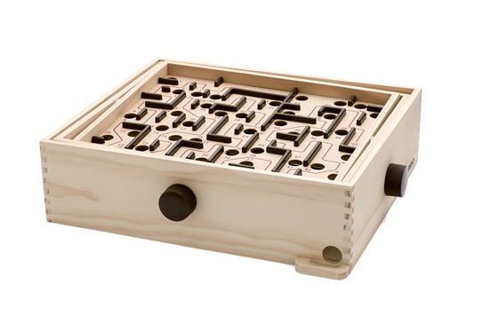
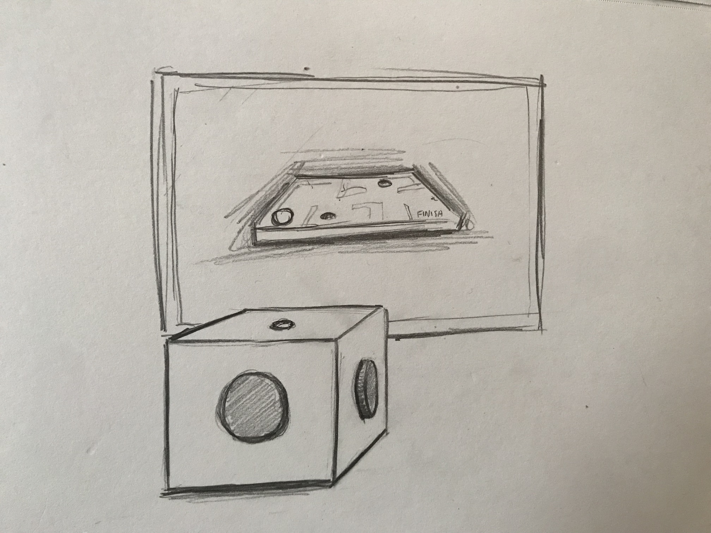

For Project 2 I am hoping to create a [labyrinth marble game](<https://en.wikipedia.org/wiki/Labyrinth_(marble_game)>) -- a 'ball-in-maze' style game where you tilt a plane in order to navigate a ball through a maze while avoiding holes. If I have the time I also want to design sound to accompany the experience.

_A [BRIO](https://www.brio.us/products/by-age/6-years-and-up/labyrinth) Marble Labyrinth_

The game board will be entirely virtual. I will create it in Unity3D to take advantage of the built-in physics simulation.

_Concept Sketch_

The physical controller will be a small box with two large knobs on adjacent sides and a button on the top. The knobs will each control an axis of rotation and the button will start or reset the game.
