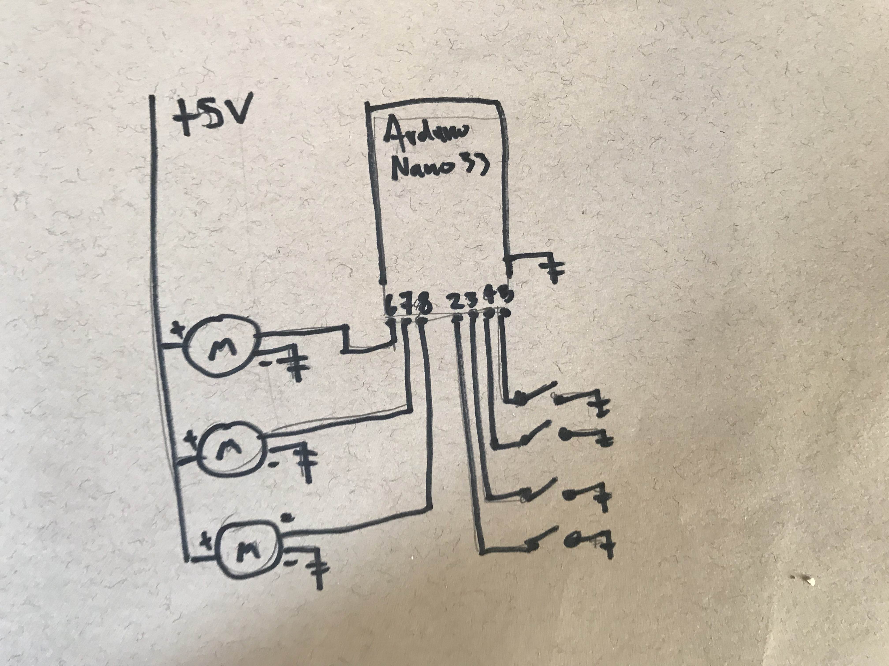
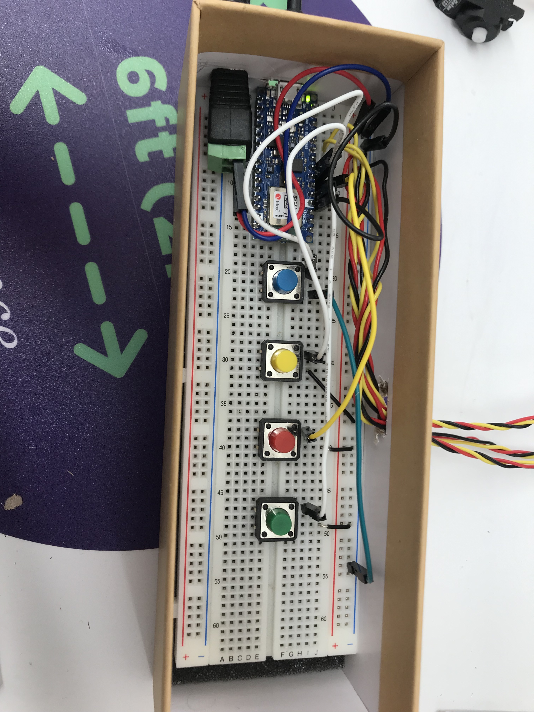
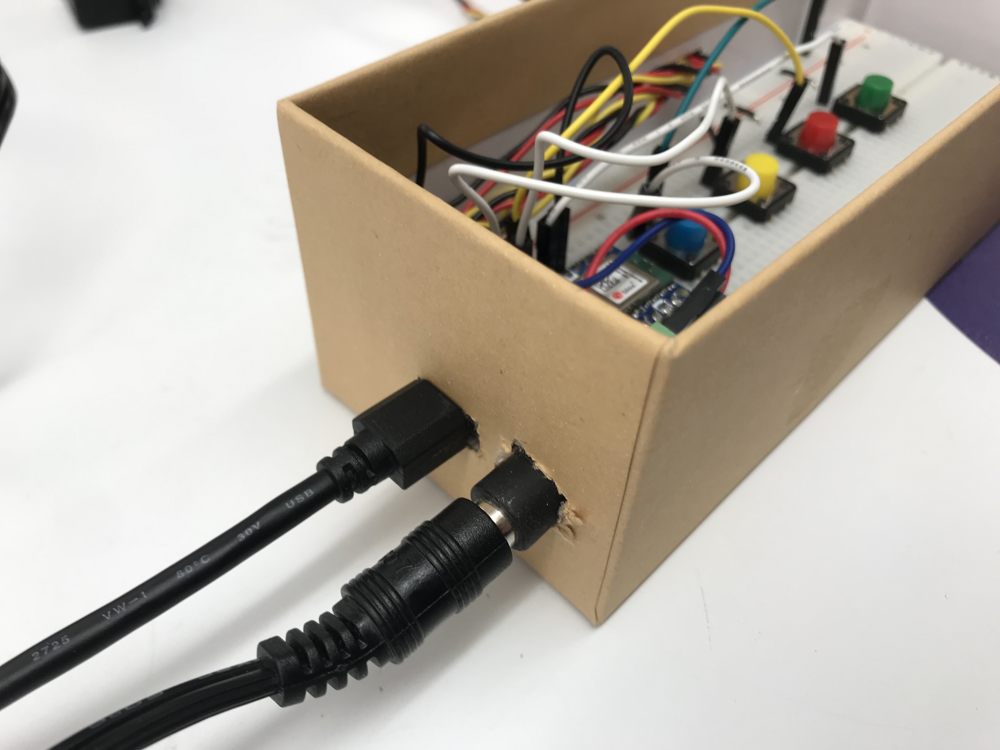
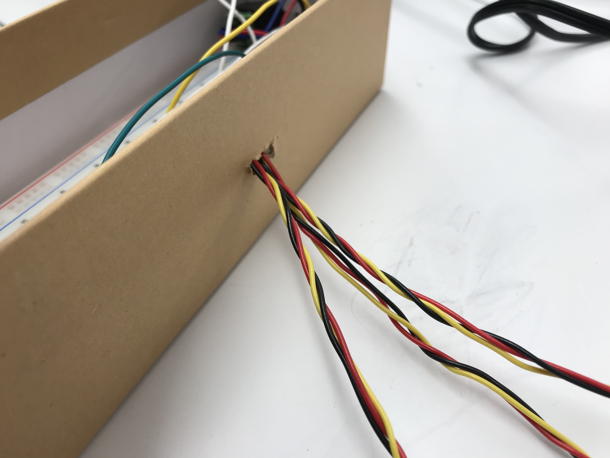
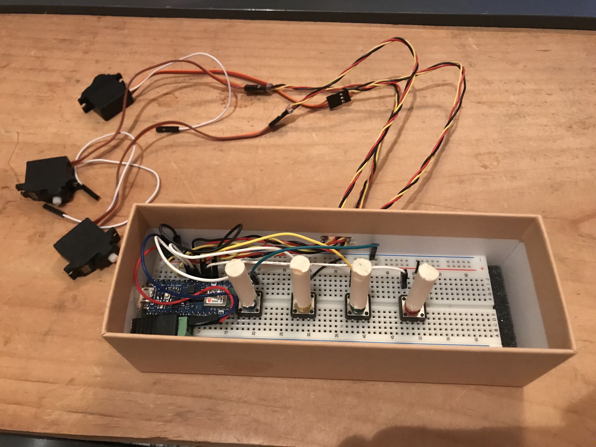
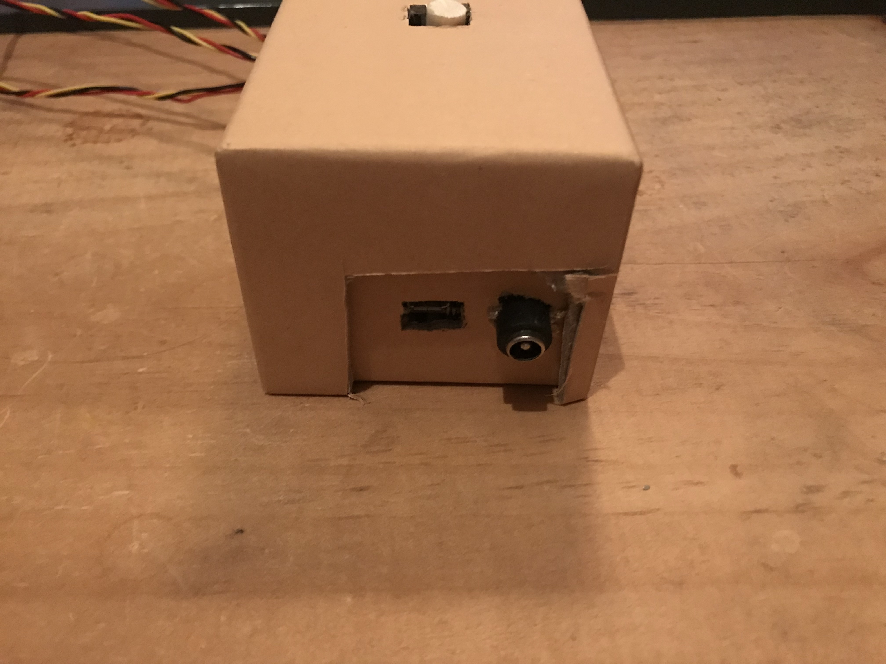
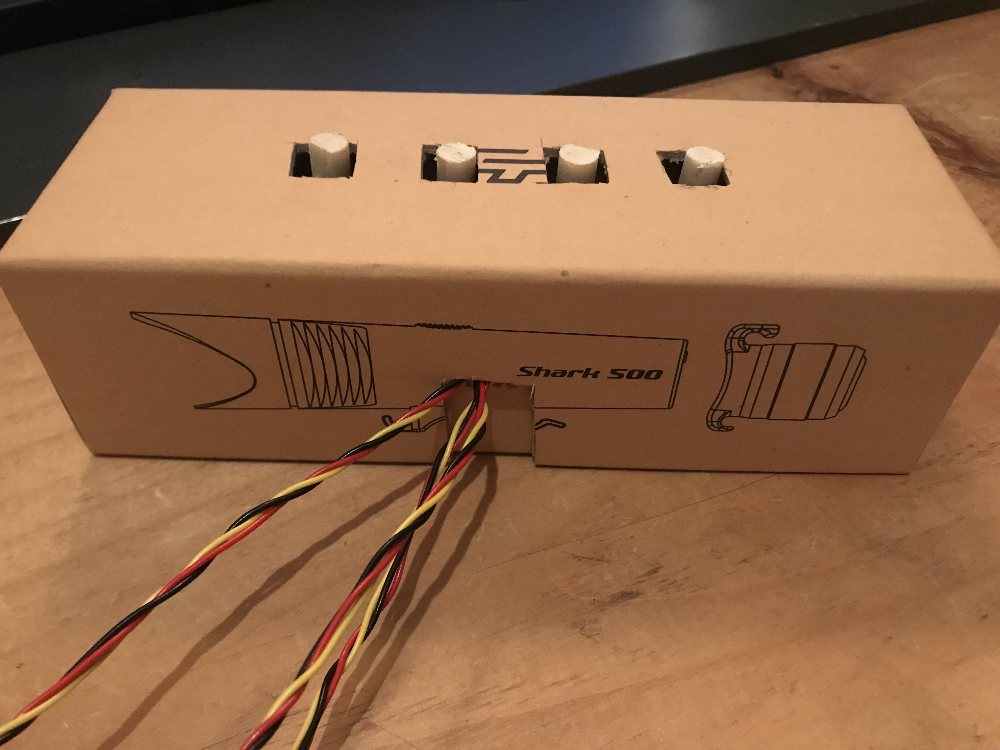

<iframe src="https://player.vimeo.com/video/489400459?color=eae6de" width="640" height="463" frameborder="0" allow="autoplay; fullscreen" allowfullscreen></iframe>

For Project three I created a physical drum looper that allows you to play rhythms with everyday objects. The device is a box with four buttons connected to three motors. Each motor is attached to a mallet. I used rubber bands to attach the motors to the bottles and pans that would act as my drums.

I [initially](/pcomp-project3-pt1/) wanted to mutate the beat over time using [DrumsRNN](https://github.com/magenta/magenta/tree/master/magenta/models/drums_rnn), an AI algorithm for generating rhythms, but ran into a snag when I damaged my arduino attempting to connect the motors and was not able to implement that aspect.

## Wiring

The wiring is straightforward. The Arduino is connected to four pushbuttons and three servo motors. The motors are powered by a +5V power supply.

_The schematic_

_The wiring: four pushbuttons and three servo motors connected to an Arduino nano_

## Housing

For the enclosure I used a bicycle light box that perfectly fit the breadboard. I cut holes in the sides for the USB connection and 5V power supply, as well as for the servo motor wires.

_Power and USB connection_

_Servo motor wires_

To make the buttons reach the top of the box I extended them with segments of wooden dowel and cut holes in the lid. This solution worked but did make the buttons a little harder to press consistently.

_Inside the finished box_

_caption_

_caption_

_The finished enclosure_
