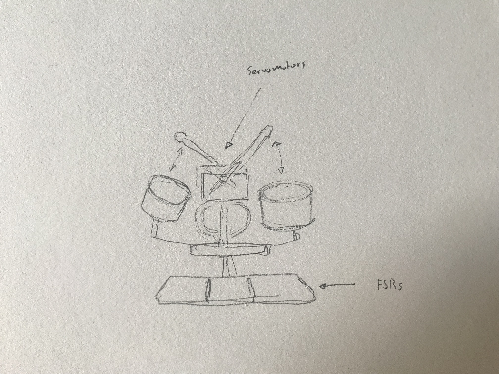

_Project 3 concept sketch_

For Project 3 I am aiming to create a miniature "finger drummer" that plays a beat on physical drums using servo motors. I hope to apply [Drums RNN](https://github.com/magenta/magenta/tree/master/magenta/models/drums_rnn), which we are learning in [Code of Music](/tags/code-of-music) to dynamically generate a rhythm. The user will tap a starting rhythm on three pads and the motors will continue to play based on the initial input. The software will be written in JavaScript and will talk via serial communication to the Arduino and the drum pads will be FSRs.
