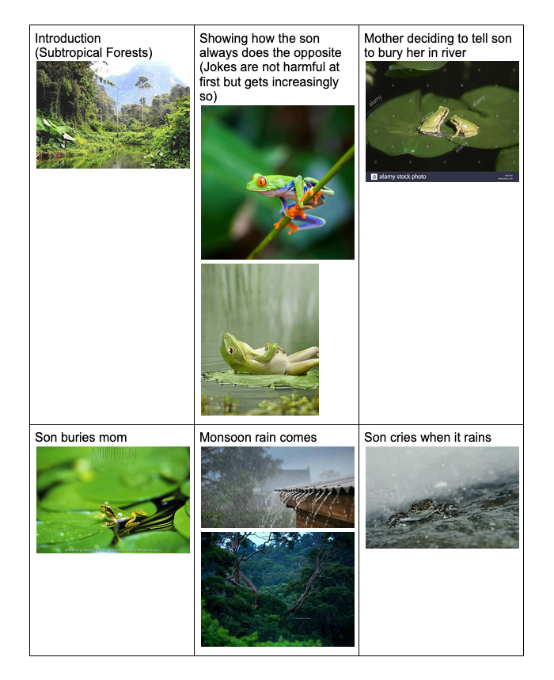

For our final project, [Chloe](https://www.chloechoi.art/) and I will be telling the Korean folk tale “The Green Frog”. You can [read the story here](http://www.sejongsociety.org/korean_theme/korean_folk_tales/green_frog.html). It is short, but here is a quick summary:

> A young frog never listens to his widowed mother -- when she tells him to do something, he always does the opposite. She scolds him but he continues to ignore her, causing her to become increasingly distressed and then ill. One day, when she knows she is about to die, she tells him to bury her on the bank of the river instead of on the mountain like she wanted, thinking he will do the opposite of what she asks. She soon passes and the son is so full of regret that he decides to make a change and follow his mother’s instructions for the first time. Though he knows that burying her on the river bank was unwise, he does so anyway. But when the monsoon rains come, the river overflows and washes his mother’s grave away, and that is why green frogs cry when it rains.

This story is ultimately about the importance of communication. The son does not obey his mother but does not tell her why. The mother scolds him and asks him to conform instead of trying to understand his motives. By the time they both reverse their course, it is too late. We want to keep the story open ended and not ascribe too much blame to any character.

### Storyboard

1. **Introduction**: Establish setting and characters (scene is light/carefree)
2. **Opposites**: The son repeatedly goes against will of mother
3. **Reversal**: The mother is about to die, decides to tell son the opposite of what she wants
4. **Burial**: The son regrets past decisions and decides to do what the mother said even though he knows it’s not a good idea
5. **Regret**: The rains wash away the grave and the son mourns (scene has transitioned to dark/mournful)

_Imagery for each section_

We are still unsure of the exact form of our experience but there are several approaches that we are considering. We want there to be an element of interactivity, whether that be controlling the characters, decisions, or an aspect of the environment. We thought that it could be effective to show how different actions lead to different outcomes.

We had also discussed starting the story from the burial scene and then revealing how we got there. Alternatively, each scene could be approachable from the start and the viewer could piece together the story.

We talked about modifying the story with different characters but since the croak or "kaegul" (see the [footnote](http://www.sejongsociety.org/korean_theme/korean_folk_tales/green_frog.html)) ties the narrative together, we thought a more literal rendition might be a good way to explore the sonic aspect of the story.

The mourning calls of the green frog:

<iframe width="560" height="315" src="https://www.youtube.com/embed/G0uGjsM_gh4" frameborder="0" allow="accelerometer; autoplay; clipboard-write; encrypted-media; gyroscope; picture-in-picture" allowfullscreen></iframe>
