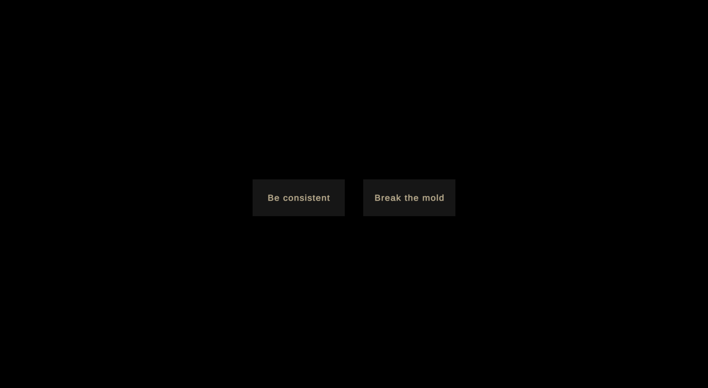

<iframe src="https://drive.google.com/file/d/1Lia_XiiTEz15szKvZ8jWXbZaR0oBvZnl/preview" width="640" height="480"></iframe>

<em>

A capture of a play-through. If the video does not load, [watch here](https://drive.google.com/file/d/1Lia_XiiTEz15szKvZ8jWXbZaR0oBvZnl/view?usp=sharing)

</em>

## Concept

For our final project, [Chloe](https://www.chloechoi.art/) and I created an interactive telling of the Korean folk tale “The Green Frog”. You can [read the story here](http://www.sejongsociety.org/korean_theme/korean_folk_tales/green_frog.html). It is short, but here is a quick summary:

> A young frog never listens to his widowed mother -- when she tells him to do something, he always does the opposite. She scolds him but he continues to ignore her, causing her to become increasingly distressed and then ill. One day, when she knows she is about to die, she tells him to bury her on the bank of the river instead of on the mountain like she wanted, thinking he will do the opposite of what she asks. She soon passes and the son is so full of regret that he decides to make a change and follow his mother’s instructions for the first time. Though he knows that burying her on the river bank was unwise, he does so anyway. But when the monsoon rains come, the river overflows and washes his mother’s grave away, and that is why green frogs cry when it rains.

This story is ultimately about the importance of communication. The son does not obey his mother but does not tell her why. The mother scolds him and asks him to conform instead of trying to understand his motives. By the time they both reverse course, it is too late. We aimed to keep the story open ended and not ascribe too much blame to any character.

## Implementation

### [Download the Mac build](https://drive.google.com/file/d/1nHjKDNJenNRfIAxYqH60eXVn7p2VSfV0/view?usp=sharing)

We interpreted the story as a never-ending time loop in which the two characters can never communicate properly no matter how hard they try. We implemented this concept as a game built with Unity3D.

In our game, the characters are humanized and you play as the son. In each scene you must choose how you respond to your mother's demands. We wanted to create scenarios where anything you do can be interpreted as being the opposite of the directive, even though one option seems like the "correct" response. _Warning: "spoilers" below!_

In this way the mother is never pleased with your decisions. From her point of view, you are always doing the opposite of what she asks.

In the final scene, the mother makes you promise to bury her the river.

You must then decide whether to "Be consistent" or "Break the mold". By this point, you may have realized that anything you do does not satisfy her, so we kept the choices vague to make the player wonder if their actions had an effect.

Both actions ultimately lead to the same result. "Be consistent" means that you never do as she truly desires, and "break the mold" means that, for the first time, you do exactly as she asks -- so either way you bury her by the river, and her grave is washed away by the rain.

<!--  -->

The experience ends how it began and you are prompted to play through again and see if different actions have different results.

## Next Steps

There are several aspects of the game we thought we could improve upon given the time. We chose a low-poly model for the mother since we wanted her to appear almost ethereal, as if she could be anyone. However she does look a bit strange in the context of the scenes, and her animations are very exaggerated, almost cartoonish.

The game could also benefit include voice acting, as well as an option to play in Korean. The speech bubbles detract a bit from the immersive and dreamy nature of the story.

We intentionally made the connection to the source story very vague. Just the title and green frog croaking sounds reference the original tale (along with the general plot). We do think it's important that the player understands the original Green Frog story in order to get the best experience out of the game, and it might be interesting to have the option to read the full story after you have played through the game once. Then in your second play-through you would have the full context.
